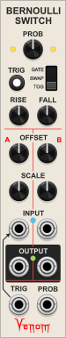
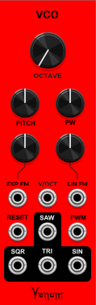

# VenomModules
Venom VCV Rack Modules
|[WINCOMP](#wincomp)|[RECURSE](#recurse)|[BERNOULLI SWITCH](#bernoulli-switch)|[Harmonic Quantizer](#harmonic-quantizer)|[VCO](#vco)|
|----|----|----|----|----|
||||||

## WINCOMP
  
A windowed comparator inspired by the VCV Fundamental COMPARE module, based on specs originally proposed at 
https://community.vcvrack.com/t/vcv-compare-gates-logic-and-process/17828/17?u=davevenom.

#### Polyphony
WINCOMP is fully polyphonic - the number of output channels is the maximum number of channels found across all three inputs.
Monophonic inputs are replicated to match the number of output channels. Polyphonic inputs that have fewer channels use 0V for missing channels.

#### Inputs with Offsets
- **A** = A input, with OFFSET knob
- **B** = B input, with OFFSET knob
- **TOL** = Tolerance, with OFFSET knob. The tolerance specifies how close A must be to B in order to be considered equal.
The absolute value of TOL is used in all computations.
The tolerance affects all outputs except MIN and MAX.

Each input is summed with the corresponding OFFSET value. The OFFSETS are bipolar +/-10V. The resultant values are unconstrained.

#### Outputs

- **MIN** = Minimum output - the instantaneous minimum of the A and B inputs. TOL does not affect MIN.
- **MAX** = Maximum output - the instantaneous maximum of the A and B inputs. TOL does not affect MAX.
- **CLAMP** = A clamped to within B +/- TOL
- **OVER** = The overflow (positive or negative) from the CLAMP operation, computed as A - CLAMP.
- **A==B** = This gate is high if A is within B +/- TOL. OVER will be 0V when A==B is high. Computed as |A-B| <= |TOL|
- **A<>B** = This gate is high if A is not within B +/- TOL. OVER will be non-zero when A<>B is high. Computed as |A-B| > |TOL|
- **A<=B** = This gate is high if A is less than or equal to B +/- TOL. Computed as A < B + |TOL|
- **A>=B** = This gate is high if A is greater than or equal to B +/- TOL. Computed as A > B - |TOL|
- **A<B** = This gate is high if A is less than B +/- TOL. Computed as A < B - |TOL|
- **A>B** = This gate is high if A is greater than B +/- TOL. Computed as A > B + |TOL|

Each gate output has a small light in the upper right corner that glows yellow when the gate is high and the ouput is monophonic.
The light glows blue if the output is polyphonic and at least one channel is high.

#### Context Menu
The context menu includes an option to specify the low and high gate values. The following options are available
- 0,1
- +/-1
- 0,5
- +/-5
- 0,10
- +/-10

The MIN, MAX, CLAMP, and OVER outputs each have independent options to take the absolute value and or invert the output.
The absolute value operation is performed prior to the inversion, so the output is guaranteed to be <=0V if both absolute value and invert are enabled.

A glowing green light in the upper left corner of the port indicates the output has the absolute value option enabled.
A glowing red light in the upper right corner indicates the output has the invert option enabled.

#### Bypass
All outputs are 0V if the module is bypassed.

## RECURSE
  
Uses polyphony to recursively process an input via SEND and RETURN up to 16 times. Polyphonic inputs may be used, which will limit the number of recursion passes available to less than 16 for each input channel. There are no limits placed on any of the input or output voltages.

#### Recursion Count knob and display

Specifies how many recursion passes should be applied to each input channel. The input channel count x recursion count must be <= 16, else some input channels will be dropped.

The display is yellow if all input channels can recurse the requested number of times. The display is red if one or more input channels is dropped.

#### Input and Output

The Input is the signal to be recursively processed, and the result is sent to the Output. The number of output channels will match the input unless channels had to be dropped due to channel count limitations during send and return.

#### Send and Return

The Send output and Return input channel count can be computed as input channels x recursion count. The maximum number of input channels is the integral division of 16 / recursion count. Input channels that exceed the computed maximum are dropped.

If there are 3 input channels and a recursion count of 5, then Send/Return channels 1-5 will be for input channel 1, 6-10 for input channel 2, and 11-15 for input channel 3. If the recursion count is bumped up to 6 while the input channel count remains 3, then Send/Return channels 1-6 are assigned to channel 1, 7-12 channel 2, and channel 3 is dropped because there are not enough channels remaining to complete 6 recursive passes.

The Return input is normalled to the Send output.

#### Internal Modulation

Inputs can be recursively scaled and offset within the RECURSE module itself.

The SCALE input and knob value are multiplied to establish the scale factor. The scale factor is then multiplied by the input value, so RECURSE can perform ring modulation.

The OFFSET input and knob value are added to establish the offset that is added to the input.

By default, the SCALE operation occurs before the OFFSET operation. A context menu option lets you choose to peform the OFFSET before SCALE. A small light glows yellow next to the operation that is performed first.

The unlabeled Modulation Mode knob determines when the SCALE and OFFSET operations take place. There are 4 values:
- **1Pre** = Once before the first Send only
- **nPre** = Before every recursive Send
- **nPost** = After every recursive Return
- **1Post** = Once after the final Return

Since the Return is normalled to the Send, it is possible to generate a polyphonic series of constant voltages using only the RECURSE module. For example, leave all inputs and the Return unpatched, set the Recursion Count to 16, the Scale to 1, the Offset to 1V, and the Mode to nPre. The SEND output will have 16 channels of integral values from 0 to 15. Change the Mode to nPost and the values will range from 1 to 16.

#### Bypass

The Input is passed unchanged to the Output when RECURSE is bypassed. The SEND will be monophonic 0V.

## BERNOULLI SWITCH
  
Randomly route two inputs to two outputs. Upon receiving a trigger or gate, a virtual coin toss determines if input A goes to output A and B to B (no-swap), or if A goes to B and B to A (swap). Each input can be attenuated and/or inverted by a bipolar SCALE knob ranging from -1 to 1, and offset by an OFFSET knob, ranging from -10 to 10. The A input is normalled to the TRIG input and the B input is normalled to 0V, so if both inputs are left unpatched, the Bernoulli Switch will function as a "traditional" Bernoulli Gate. A "latched" mode may be achieved by leaving the B input at 0V and setting the A input SCALE to 0 and the A OFFSET to 10V.

The PROB knob and PROB input determine the probability that a particular routing operation will occur. If there is no PROB input, then a fully counterclockwise PROB knob yields a 0% chance of the the routing event, and fully clockwise is 100% chance. The range is linear, with 50% at noon. The probability can be modulated by bipolar PROB input, with each volt equating to 10% chance.

The actual routing event is controlled by the unlabeled 3 position sliding switch, with the following possible values:
- **TOGGLE**: The probability is the chance that the routing will toggle from the current routing to the opposite. If currently swapped, then a positive result will switch to un-swapped. If currently unswapped, then a positive result will switch to swapped. A negative result yields no change.
- **SWAP**: The probabiliy is the chance that the routing will be set to swapped, regardless of the current routing. A positive result yields a swapped routing, a negative result yields a no-swap routing. 
- **GATE**: The routing is always in a swap configuration whenever the TRIG input is low. Upon transition to high, a positive coin toss results in a no-swap routing throughout the TRIG high state. A negative result remains in a swap configuration.

The module generally responds to a leading edge transition from low to high of the TRIG input. The RISE knob sets the threshold for a transition to high, and the FALL knob sets the threshold for a transition to low. By default the RISE is set to 1V, and the FALL to 0.1V. If currently low, then a TRIG input >= the RISE threshold transistions to HIGH. The input remains high until the input falls below the FALL threshold, upon which it returns to a low state.

If the RISE threshold is less than the FALL threshold, then the roles are reversed, and the Bernoulli Switch is triggered by a trailing transition from high to low. If using GATE mode, the routing will always have a swapped configuration whenever the input is high, and the configuration may switch to no-swap upon transition to low.

A pair of yellow lights indicate the current routing configuration. A yellow light glowing to the left of the PROB knob indicates a no-swap configuration. A glowing yellow light to the right indicates a swap configuration.

Bernoulli Switch is fully polyphonic. The number of output channels is set to the maximum channel count found across all inputs. Monophonic inputs are replicated to match the output channel count. Polyphonic inputs with fewer channels will get 0V for the missing channels. Each channel gets its own independent coin toss, even if driven by a monophonic TRIG input.

The yellow lights only monitor a single channel, channel one by default. The context menu has a Monitor Channel option to switch to a different channel. If the monitored channel is Off, or greater than the number of output channels, then the yellow lights will remain dark - no monitoring will be done.

Outputs are 0V when the module is bypassed.

## Harmonic Quantizer
  
Computes a selected harmonic or subharmonic partial relative to a fundamental root V/Oct, or quantizes an input V/Oct to the nearest partial relative to the root.

This module is fully polyphonic. The number of output channels is the maximum channel count found across all three inputs. Any monophonic input is replicated to match the output channel count. A polyphonic input with fewer channels uses 0V for any missing channels.

#### Digital Display (unlabled)
Displays the integral partial number that is currently being output for a single channel. A yellow value indicates a positive value, representing a true partial from the natural harmonic series. A red value indicates a negative value, representing a subharmonic.

By default the display monitors channel 1. A different channel may be selected via the module context menu. The display will be blank if the selected channel is Off, or greater than the number of output channels.

#### Harmonic Series switch (unlabled)
Selects one of three possible series
* A = All partials -  (default)
* O = Odd partials
* E = Even partials (includes the fundamental partial, even though it is odd)

The output will be constrained to the selected series.

#### Partial knob
Selects a single integral partial number. By default the range is from 1 (fundamental) to 16 (4 octaves above the fundamental). The context menu allows selection of any one of the following ranges:
* 1 - 16 (default
* 1 - 32
* 1 - 64
* 1 - 128
* -1 - 16
* -1 - 32
* -1 - 64
* -1 - 128
* -16 - 16
* -32 - 32
* -64 - 64
* -128 - 128

#### CV knob and input
The bipolar CV input modulates the selected partial, adding or subtracting 1 partial for every 0.1 volt. The CV input is attenuated and/or inverted by the CV knob. The resultant partial is clamped to within the currently active Partial range.

The Partial knob, CV knob, and CV input are all ignored if the IN input is patched (although the CV input can still modify the number of output channels).

#### ROOT input
Establishes the fundamental V/Oct value (1st partial)

#### IN input
If this port is patched, then the V/Oct input is quantized to the nearest harmonic or subharmonic partial relative to the ROOT input. The computation is clamped to within +/- 128 partials (+/- 7 octaves). The Partial knob, CV knob, and CV input are all ignored when quantizing IN input.

#### OUT output
The final computed partial is converted into a delta V/Oct and added to the ROOT to establish the final output V/Oct value.

#### Bypass

If HQ is bypassed, then the output is monophonic constant 0V.

## VCO
### Incomplete - Work in progress
  
A VCO derived from 21kHz Palm Loop code.

The Palm Loop is the only existing VCO I have found that can do true through zero linear FM (not phase modulation), with the negative frequencies properly reflected, and decent anti-aliasing, even with negative frequencies, all with low CPU usage. It uses an unusual (in VCV world anyway) polyBlamp method for antialiasing the triangle wave. Bogaudio and VCV VCOs can also do through zero linear FM with 0Hz carrier, except the negative frequencies are flawed - the negative frequency antialiasing is broken for both, and the Bogaudio saw becomes unipolar at negative frequencies.

The limitations I find for Palm Loop are:
- Sine and Square (and sine sub) are 1 octave down from the saw and sine. This is a result of how the signals are computed - the saw functions as a phasor to drive the other wave forms 1 octave down.
- The subs are not properly reset
- No pulse width modulation

I have adapted the code with the following improvements:
- All wave forms are at the same octave.
- Added pulse width modulation, with an attempt to eliminate DC offset
- Added a -1 octave which runs at 0Hz so the VCO can be used conveniently as a 0 Hz carrier for linear FM. In this mode, the Pitch knob and V/Oct input serve to bias the 0 Hz carrier, giving motion to the FM
- Modified the phase relationships between the waveforms to better suit some of my patching needs.
- Not an improvement - but I swapped in stock components for the 21kHz knobs and ports. I still need to work on the faceplate layout. For example, I need to add a PWM attenuverter.

Current Bugs:
- Triangle antialising works just fine until it reaches ~1/4 the Nyquist frequency, at which point all hell breaks loose. I've tested at multiple sample rates, and there is definitely something going on with the math, but I do not understand the polyBLAMP, so I don't know how to fix it. The breakdowns occur at:
  - 48 kHz at around 6,040 Hz
  - 96 kHz at around 12,080 Hz
  - 192 kHz at around 24,160 Hz
- Square wave antialiasing works just fine as long as PW is at 50%. But the moment PW deviates the antialiasing goes to hell, which I think also introduces DC offset. I am pretty sure the DC offset problem will be eliminated if I can figure out the anti-aliasing problem. Again, I don't understand the math, so I don't know how to fix it.

Assuming I can resolve the aliasing problems, I would like to add the following features:
- polyphony - I will need to start using simd to maintain decent performance
- If possible, I would like to add independent phase control for each waveform
- I may also add a mixer with inversion capabilities to simplify creation of complex waveforms.

The last two options could be build in, added through an expander, or possibly another module.
