# Venom
Venom modules [version 2.16.0](changelog.md) for VCV Rack 2 are copyright 2023, 2024, 2025, 2026 Dave Benham and licensed under GNU General Public License version 3.

This is the documentation for all free Venom modules. Check out the [Venom Premium site](https://github.com/DaveBenham/VenomPremium/blob/main/README.md) for documentation about commercial Venom modules.

[Color Coded Ports](#color-coded-ports)  
[Themes](#themes)  
[Custom Names](#custom-names)  
[Parameter Locks and Custom Defaults](#parameter-locks-and-custom-defaults)  
[Venom Expander Modules](#venom-expander-modules)  
[Anti-aliasing via oversampling](#anti-aliasing-via-oversampling)  
[Acknowledgments](#acknowledgments)

#### Module Categories

- [Controllers](doc/Controllers.md)  
- [Envelope Generators](doc/EnvelopeGenerators.md)
- [Logic, Random, and/or Routing Modules](doc/LogicRandomRouting.md)
- [Mixers](doc/Mixers.md)
- [Modulation](doc/Modulation.md)
- [Oscillators](doc/Oscillators.md)
- [Patch Management](doc/PatchManagement.md)
- [Polyphony Management](doc/PolyphonyManagement.md)
- [Quantizers](doc/Quantizers.md)
- [Sequencers](doc/Sequencers.md)

#### Module Index
|[AD/ASR ENVELOPE GENERATOR](doc/EnvelopeGenerators.md#adasr-envelope-generator)|[AUXILLIARY CLONE EXPANDER](doc/PolyphonyManagement.md#auxilliary-clone-expander)|[BAY MODULES](doc/PatchManagement.md#bay-modules)|[BENJOLIN OSCILLATOR](doc/Oscillators.md#benjolin-oscillator)|[BENJOLIN GATES EXPANDER](doc/Oscillators.md#benjolin-gates-expander)|[BENJOLIN VOLTS EXPANDER](doc/Oscillators.md#benjolin-volts-expander)|
|----|----|----|----|----|----|
||| &nbsp; &nbsp;|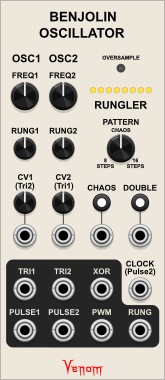|||

|[BERNOULLI SWITCH](doc/LogicRandomRouting.md#bernoulli-switch)|[BERNOULLI SWITCH EXPANDER](doc/LogicRandomRouting.md#bernoulli-switch-expander)|[BLOCKER](doc/PatchManagement.md#blocker)|[BOUNDED VCO](doc/Oscillators.md#bounded-vco)|[BYPASS MODULE](doc/PatchManagement.md#bypass-module)|[CLONE MERGE](doc/PolyphonyManagement.md#clone-merge)|[CROSS FADE 3D](doc/Mixers.md#cross-fade-3d)|[DYNAMIC AMPLIFYING SHAPING ENVELOPE](doc/EnvelopeGenerators.md#dynamic-amplifying-shaping-envelope)|
|----|----|----|----|----|----|----|----|
|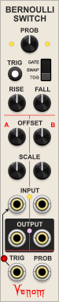|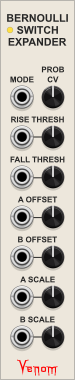||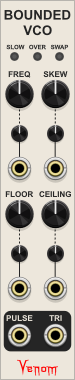|||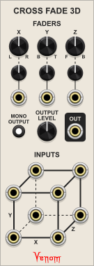||

|[ENVELOPE FACTORY](doc/EnvelopeGenerators.md#envelope-factory)|[HARMONIC QUANTIZER](doc/Quantizers.md#harmonic-quantizer)|[KNOB 5](doc/Controllers.md#knob-5)|[LINEAR BEATS](doc/Sequencers.md#linear-beats)|[LINEAR BEATS EXPANDER](doc/Sequencers.md#linear-beats-expander)|[LINEAR MERGE](doc/Sequencers.md#linear-merge)|[LINEAR MERGE EXPANDER](doc/Sequencers.md#linear-merge-expander)|
|----|----|----|----|----|----|----|
|||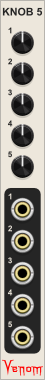|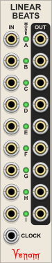|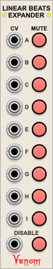|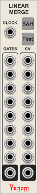|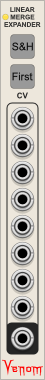|

|[LOGIC](doc/LogicRandomRouting.md#logic)|[MERGE 4x2](doc/PolyphonyManagement.md#merge-4x2)|[MERGE SPLIT](doc/PolyphonyManagement.md#merge-split)|[MIX 4](doc/Mixers.md#mix-4)|[MIX 4 STEREO](doc/Mixers.md#mix-4-stereo)|[MIX EXPANDERS](doc/Mixers.md#mix-expanders)|
|----|----|----|----|----|----|
|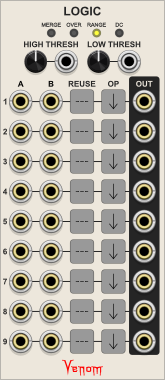|||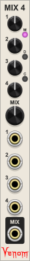|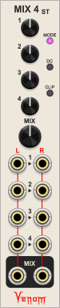|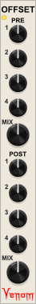 &nbsp;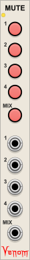 &nbsp;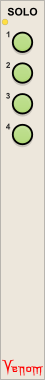 &nbsp;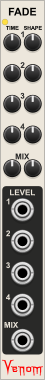 &nbsp;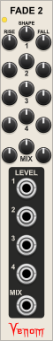 &nbsp;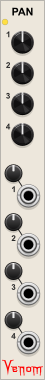 &nbsp;|

|[MOUSE PAD](doc/Controllers.md#mouse-pad)|[MULTI MERGE](doc/PolyphonyManagement.md#multi-merge)|[MULTI SPLIT](doc/PolyphonyManagement.md#multi-split)|[MULTIMODE FILTER](doc/Modulation.md#multimode-filter)|[NON-OCTAVE REPEATING SCALE INTERVALLIC QUANTIZER](doc/Quantizers.md#non-octave-repeating-scale-intervallic-quantizer)|[NORSIQ CHORD TO SCALE](doc/Quantizers.md#norsiq-chord-to-scale)|
|----|----|----|----|----|----|
||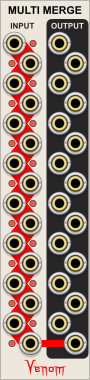|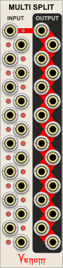|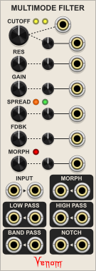|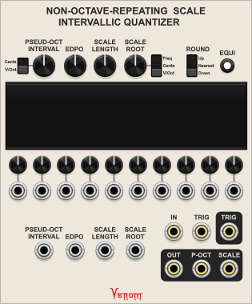|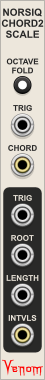|

|[NULL CABLE](doc/PatchManagement.md#null-cable)|[OCTAVER](doc/Modulation.md#octaver)|[PAN 3D](doc/LogicRandomRouting.md#pan-3d)|[POLY CLONE](doc/PolyphonyManagement.md#poly-clone)|[POLY FADE](doc/Mixers.md#poly-fade)|[POLY MUTE](doc/Controllers.md#poly-mute)|[POLY OFFSET](doc/Controllers.md#poly-offset)|[POLY PRUNE](doc/PolyphonyManagement.md#poly-prune)|
|----|----|----|----|----|----|----|----|
||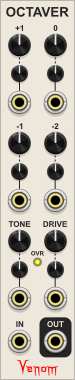|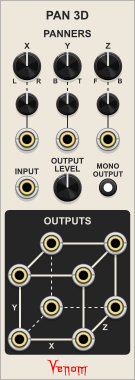||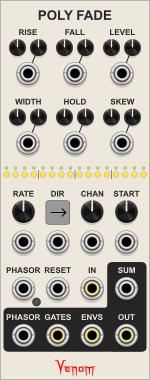|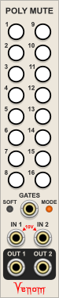|||

|[POLY SAMPLE & HOLD ANALOG SHIFT REGISTER](doc/LogicRandomRouting.md#poly-sample--hold-analog-shift-register)|[POLY SCALE](doc/Modulation.md#poly-scale)|[POLY UNISON](doc/PolyphonyManagement.md#poly-unison)|[PUSH 5](doc/Controllers.md#push-5)|[QUAD VC POLARIZER](doc/Mixers.md#quad-vc-polarizer)|[RATIO](doc/Quantizers.md#ratio)|[RECURSE](doc/PolyphonyManagement.md#recurse)|[RECURSE STEREO](doc/PolyphonyManagement.md#recurse-stereo)|
|----|----|----|----|----|----|----|----|
|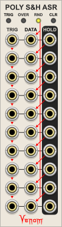|||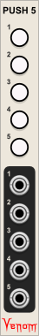|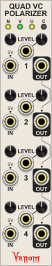|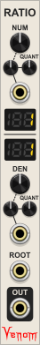|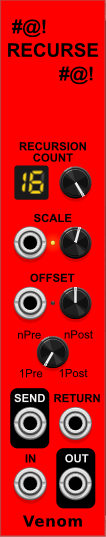|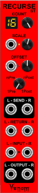|

|[REFORMATION](doc/Modulation.md#reformation)|[RHYTHM EXPLORER](doc/Sequencers.md#rhythm-explorer)|[RHYTHM EXPLORER CV EXPANDER](doc/Sequencers.md#rhythm-explorer-cv-expander)|[SHAPED VCA](doc/Modulation.md#shaped-vca)|
|----|----|----|----|
|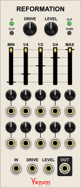|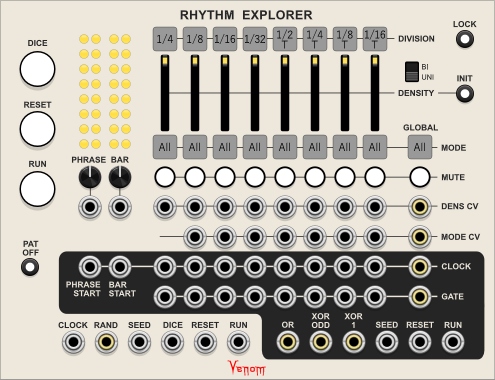|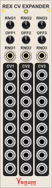|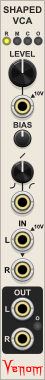|

|[SLEW](doc/Modulation.md#slew)|[SPHERE TO XYZ](doc/Modulation.md#sphere-to-xyz)|[SPLIT 4x2](doc/PolyphonyManagement.md#split-4x2)|[SPREAD MERGE](doc/PolyphonyManagement.md#spread-merge)|[SPREAD MERGE EXPANDER](doc/PolyphonyManagement.md#spread-merge-expander)|[STEREO MERGE SPLIT](doc/PolyphonyManagement.md#stereo-merge-split)|[THRU](doc/PatchManagement.md#thru)|[VCA MIX 4](doc/Mixers.md#vca-mix-4)|[VCA MIX 4 STEREO](doc/Mixers.md#vca-mix-4-stereo)|
|----|----|----|----|----|----|----|----|----|
|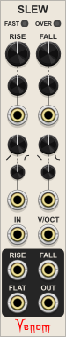|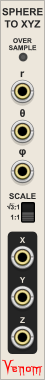|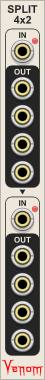|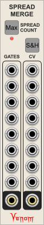||||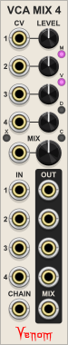|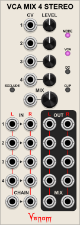|

|[VCO LAB](doc/Oscillators.md#vco-lab)|[VCO UNIT](doc/Oscillators.md#vco-unit)|[VENOM BLANK](doc/PatchManagement.md#venom-blank)|[WAVE FOLDER](doc/Modulation.md#wave-folder)|[WAVE MANGLER](doc/Modulation.md#wave-mangler)|
|----|----|----|----|----|
|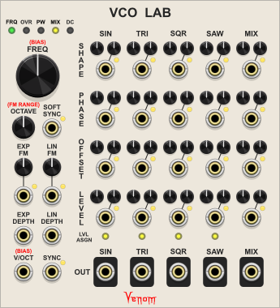|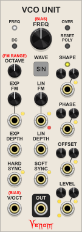||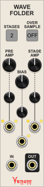|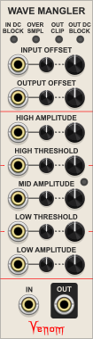|

|[WAVE MULTIPLIER](doc/Modulation.md#wave-multiplier)|[WIDGET MENU EXTENDER](doc/PatchManagement.md#widget-menu-extender)|[WINCOMP](doc/LogicRandomRouting.md#wincomp)|[WINCOMP 2 + LOGIC](doc/LogicRandomRouting.md#wincomp-2--logic)|[XM-OP](doc/Oscillators.md#xm-op)|
|----|----|----|----|----|
|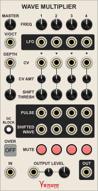||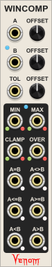|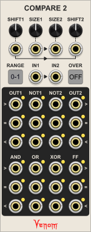|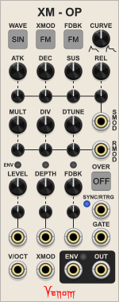|

## Color Coded Ports
All polyphonic ports use brass cores, while monophonic ports use steel cores.

Input ports are on the base faceplate color, and output ports are on a contrasting background color.

[Return to Table Of Contents](#venom)

## Themes
The context menu of every module includes options to set the default theme and default dark theme for the Venom plugin, as well as a theme override for each module instance.

There are 4 themes to choose from.

|Ivory|Coal|Earth|Danger|
|---|---|---|---|
|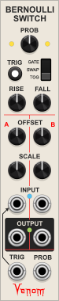|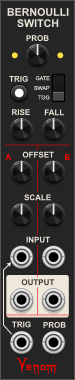|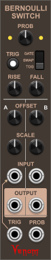|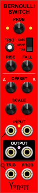|

If a module instance is set to use a specific theme, then that theme will be used regardless whether VCV Rack is set to use dark panels or not. If a module is set to use the default theme, then the VCV Rack "Use dark panels if available" setting controls which default is used. If not enabled, then the default theme is used. If enabled then the default dark theme is used.

If you want the default theme to disregard the VCV Rack dark panel setting, then simply set both defaults to the same theme.

The factory default theme is ivory, and the factory default dark theme is coal.

[Return to Table Of Contents](#venom)

## Custom Names
Nearly every port (input or output), and every parameter (module knob, switch, or button etc.) within the Venom plugin has its own context menu option to set a custom name. Custom names only appear in context menus and hover text - they do not change the faceplate graphics.

If a parameter or port is given a custom name, then an additional option is added to restore the factory default name.

Custom names are saved with the patch and with presets, and restored upon patch or preset load. Custom names are also preserved when duplicating a module.

## Parameter Locks and Custom Defaults
Nearly every parameter (module knob, switch, or button etc.) within the Venom plugin has its own parameter context menu options to lock the paramenter as well as set a custom default value. In addition, most modules have module context menu options to lock and unlock all parameters within that instance of the module. Likewise there is a "Restore all factory names" context menu option that restors factory names for all parameters and ports within that instance of the module.

Parameter lock and custom default settings are saved with the patch and with presets, and restored upon patch or preset load. Parameter lock and custom default settings are also preserved when duplicating a module.

### Parameter Locks
The parameter tooltip includes the word "locked" below the parameter name when hovering over a locked parameter.

The parameter value cannot be changed by any means while the parameter is locked. All of the normal means of changing a parameter value are blocked:
- The parameter cannot be dragged or pushed
- Context menu value keyins are ignored
- Double click and context menu initialization are ignored
- Randomization requests are ignored

### Custom Defaults
A custom default value overrides the factory default whenever a parameter is initialized. An additional parameter menu option is added to restore the factory default whenever a custom default is in effect.

[Return to Table Of Contents](#venom)

## Venom Expander Modules
A number of Venom modules do not do anything on their own, but rather augment the functionality of a compatible base module when placed beside it. Each Venom base module that supports expanders has module context menu options to add expanders without having to open the module browser.

VCV Rack supports two different mechanisms for implementinig expander modules:
- Both the parent (base) module and the expander perform work, and they communicate with each other via messages that introduce sample delays, much as cables do in VCV Rack.
- The base module does all the work, accessing the expander inputs, outputs, and controls directly. This does not introduce any sample delays.

All Venom expanders are implemented using the second method where the base module directly accesses the expander, so Venom expanders do not introduce sample delays.

[Return to Table Of Contents](#venom)

## Anti-aliasing via oversampling
All digital synthesis techniques must deal with anti-aliasing to get the best possible audio output. Frequencies above 50% of the sample rate (the Nyquist frequency) cannot be represented, and instead are reflected back below the Nyquist frequency. Harmonically rich wave forms like a saw wave can have harmonics above the Nyquist frequency that create inharmonic audible tones when reflected, called aliasing. These reflections are typically not wanted, so most digital systems use one or more techniques to greatly reduce the amplitude of aliased harmonics so as to make them inaudible.

Venom uses oversampling as the primary anti-alias technique. Incoming signals are upsampled by factors of 2 with interpolation to get an effective sample rate with a much higher Nyquist frequency. All the digital computations are done at this higher frequency. The end result is filtered by a low pass filter with a cutoff below the true sample rate Nyquist frequency. This process removes the high frequency content before it can be aliased, and then it is downsampled to return to the actual sample rate. Note that any pre-existing aliasing at the inputs cannot be removed - high frequency content must be removed before it is ever aliased.

The higher the degree of oversampling, the better the result, but at the cost of higer CPU usage. Another factor is the slope of the low pass filters that are used for both the upsampling interpolation and the bandlimited downsampling. The higer the filter order, the steeper the slope, which allows for preservation of more high frequency content below the Nyquist frequency. But the higher filter orders also require more CPU. So it is a balancing act to select the minimum oversampling rate and filter order that gives good results.

Most Venom modules that use oversampling have parameters on the faceplate to chose the oversample rate. A few modules have context menu options instead. For most applications, an oversample rate of 4x or 8x gives good results, without using excessive CPU. But don't be afraid to try out more or less. In some cases you may be able to turn off oversampling entirely, and still get good results, thus saving considerable CPU.

All of the Venom modules with oversampling also have a context menu option to specify the quality of the filter used. There are three options available:
- 10th order with a cutoff at 80% of the Nyquist frequency. This is the default value used by all Venom modules.
- 8th order with a cutoff at 80% of the Nyquist frequency.
- 6th order with a cutoff at 50% of the Nyquist frequency.

Again, feel free to experiment to find what works best for you.

[Return to Table Of Contents](#venom)

## Acknowledgments
Special thanks to Andrew Hanson of [PathSet modules](https://library.vcvrack.com/?brand=Path%20Set) for setting up my GitHub repository, providing advice and ideas for the Rhythm Explorer and plugins in general, and for writing the initial prototype code for the Rhythm Explorer.

Also a hearty thanks to Squinky Labs for their [VCV Rack Demo project](https://github.com/squinkylabs/Demo), which showed me how to implement oversampling, and also got my foot in the door to understanding how to use SIMD with plugin development.

Thanks to Jacky Ligon and Andreya Ek Frisk over on the Surge Discord server for advice on the NonOctave Repeating Scale Intervallic Quantizer, as well as help with compiling a representative set of scale presets.

Super thanks to Benjamin Dill for his open source Stoermelder PackOne plugin. I could never have developed the Widget Menu Extender module or the Bypass module without his tips and source code to study.

Thanks to Paul Dempsey for his MenuTextField struct from the pachde1 plugin that allows text entry in a menu. In turn that was developed using code/ideas from the SubmarineFree plugin by David O'Rourke.

Finally thanks to Ewan Hemingway. Through discussions and studying the Befaco Even VCO source code I was able to improve the sound quality of VCO Lab and VCO Unit by adding DPW alias suppression to supplement oversampling.

[Return to Table Of Contents](#venom)

