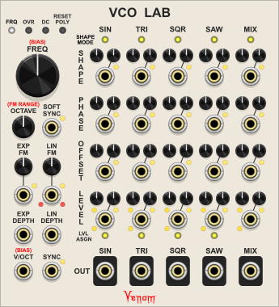

# Venom
Venom modules version 2.8.0 for VCV Rack 2 are copyright 2023, 2024 Dave Benham and licensed under GNU General Public License version 3.

[Color Coded Ports](#color-coded-ports)  
[Themes](#themes)  
[Custom Names](#custom-names)  
[Parameter Locks and Custom Defaults](#parameter-locks-and-custom-defaults)  
[Venom Expander Modules](#venom-expander-modules)  
[Acknowledgments](#acknowledgments)  

|[AUXILLIARY CLONE EXPANDER](#auxilliary-clone-expander)|[BAY MODULES](#bay-modules)|[BENJOLIN OSCILLATOR](#benjolin-oscillator)|[BERNOULLI SWITCH](#bernoulli-switch)|[BERNOULLI SWITCH EXPANDER](#bernoulli-switch-expander)|
|----|----|----|----|----|
|| &nbsp; &nbsp;||||

|[BLOCKER](#blocker)|[BYPASS MODULE](#bypass-module)|[CLONE MERGE](#clone-merge)|[HARMONIC QUANTIZER](#harmonic-quantizer)|[KNOB 5](#knob-5)|[LINEAR BEATS](#linear-beats)|[LINEAR BEATS EXPANDER](#linear-beats-expander)|[LOGIC](#logic)|
|----|----|----|----|----|----|----|----|
|||||||||

|[MIX 4](#mix-4)|[MIX 4 STEREO](#mix-4-stereo)|[MIX EXPANDERS](#mix-expanders)|[MULTI MERGE](#multi-merge)|[MULTI SPLIT](#multi-split)|
|----|----|----|----|----|
||| &nbsp; &nbsp; &nbsp; &nbsp; &nbsp; &nbsp;|||

|[NON-OCTAVE REPEATING SCALE INTERVALLIC QUANTIZER](#non-octave-repeating-scale-intervallic-quantizer)|[NORSIQ CHORD TO SCALE](#norsiq-chord-to-scale)|[POLY CLONE](#poly-clone)|[POLY OFFSET](#poly-offset)|[POLY SAMPLE & HOLD ANALOG SHIFT REGISTER](#poly-sample--hold-analog-shift-register)|
|----|----|----|----|----|
||||||

|[POLY SCALE](#poly-scale)|[POLY UNISON](#poly-unison)|[PUSH 5](#push-5)|[RECURSE](#recurse)|[RECURSE STEREO](#recurse-stereo)|[REFORMATION](#reformation)|
|----|----|----|----|----|----|
|||||||

|[RHYTHM EXPLORER](#rhythm-explorer)|[SHAPED VCA](#shaped-vca)|[VCA MIX 4](#vca-mix-4)|[VCA MIX 4 STEREO](#vca-mix-4-stereo)|
|----|----|----|----|
|||||

|[VCO LAB](#vco-lab)|[VENOM BLANK](#venom-blank)|[WIDGET MENU EXTENDER](#widget-menu-extender)|[WINCOMP](#wincomp)|
|----|----|----|----|
|||||

## Color Coded Ports
All polyphonic ports use brass cores, while monophonic ports use steel cores.

Input ports are on the base faceplate color, and output ports are on a contrasting background color.

[Return to Table Of Contents](#venom)

## Themes
The context menu of every module includes options to set the default theme and default dark theme for the Venom plugin, as well as a theme override for each module instance.

There are 4 themes to choose from.

|Ivory|Coal|Earth|Danger|
|---|---|---|---|
|||||

If a module instance is set to use a specific theme, then that theme will be used regardless whether VCV Rack is set to use dark panels or not. If a module is set to use the default theme, then the VCV Rack "Use dark panels if available" setting controls which default is used. If not enabled, then the default theme is used. If enabled then the default dark theme is used.

If you want the default theme to disregard the VCV Rack dark panel setting, then simply set both defaults to the same theme.

The factory default theme is ivory, and the factory default dark theme is coal.

[Return to Table Of Contents](#venom)

## Custom Names
Nearly every port (input or output), and every parameter (module knob, switch, or button etc.) within the Venom plugin has its own context menu option to set a custom name. Custom names only appear in context menus and hover text - they do not change the faceplate graphics.

If a parameter or port is given a custom name, then an additional option is added to restore the factory default name.

Custom names are saved with the patch and with presets, and restored upon patch or preset load. Custom names are also preserved when duplicating a module.

## Parameter Locks and Custom Defaults
Nearly every parameter (module knob, switch, or button etc.) within the Venom plugin has its own parameter context menu options to lock the paramenter as well as set a custom default value. In addition, most modules have module context menu options to lock and unlock all parameters within that instance of the module.

Parameter lock and custom default settings are saved with the patch and with presets, and restored upon patch or preset load. Parameter lock and custom default settings are also preserved when duplicating a module.

### Parameter Locks
The parameter tooltip includes the word "locked" below the parameter name when hovering over a locked parameter.

The parameter value cannot be changed by any means while the parameter is locked. All of the normal means of changing a parameter value are blocked:
- The parameter cannot be dragged or pushed
- Context menu value keyins are ignored
- Double click and context menu initialization are ignored
- Randomization requests are ignored

### Custom Defaults
A custom default value overrides the factory default whenever a parameter is initialized. An additional parameter menu option is added to restore the factory default whenever a custom default is in effect.

[Return to Table Of Contents](#venom)

## Venom Expander Modules
A number of Venom modules do not do anything on their own, but rather augment the functionality of another module when placed beside it.

VCV Rack supports two different mechanisms for implementinig expander modules:
- Both the parent (base) module and the expander perform work, and they communicate with each other via messages that introduce sample delays, much as cables do in VCV Rack.
- The base module does all the work, accessing the expander inputs, outputs, and controls directly. This does not introduce any sample delays.

All Venom expanders are implemented using the second method where the base module directly accesses the expander, so Venom expanders do not introduce sample delays.

## Acknowledgments
Special thanks to Andrew Hanson of [PathSet modules](https://library.vcvrack.com/?brand=Path%20Set) for setting up my GitHub repository, providing advice and ideas for the Rhythm Explorer and plugins in general, and for writing the initial prototype code for the Rhythm Explorer.

Also a hearty thanks to Squinky Labs for their [VCV Rack Demo project](https://github.com/squinkylabs/Demo), which showed me how to implement oversampling, and also got my foot in the door to understanding how to use SIMD with plugin development.

Thanks to Jacky Ligon and Andreya Ek Frisk over on the Surge Discord server for advice on the NonOctave Repeating Scale Intervallic Quantizer, as well as help with compiling a representative set of scale presets.

Super thanks to Benjamin Dill for his open source Stoermelder PackOne plugin. I could never have developed the Widget Menu Extender module without his tips and source code to study.

Finally a thanks to Paul Dempsey for his MenuTextField struct from the pachde1 plugin that allows text entry in a menu. In turn that was developed using code/ideas from the SubmarineFree plugin by David O'Rourke.

[Return to Table Of Contents](#venom)

## AUXILLIARY CLONE EXPANDER
  
This expander module adds additional cloned poly input/output pairs to [Clone Merge](#clone-merge), [Poly Clone](#poly-clone), or [Poly Unison](#poly-unison).

The expander must be placed immediately to the right of a Clone Merge, Poly Merge, or Poly Unison. The yellow LED in the upper left indicates whether the expander has successfully connected to a parent module.

Each set of polyphonic input channels is cloned to match the clone count of the parent module, and sent to the output. The number of polyphonic channels at the input should either match the number of input channels at the parent, or else 1. If the input is unpatched it is treated as a mono input with a single chanel at constant 0 volts.

The number of polyphonic channels at each output will always match the number of poly output channels at the parent. The LED to the right of each output indicates whether the output was able to properly clone all input channels.

If the input poly count matches the parent, then each of the input channels is cloned as per the parent, and the LED is yellow.

If the input poly count is 1, then the input is replicated to match the parent input channel count, and then each of those channels is cloned. The LED is yellow.

If the input poly count is less than the parent and greater than 1, then the missing channels are treated as constant 0V, and the LED is orange.

If the input poly count is greater than the parent, then excess channels are ignored, and the LED is red.

All outputs will be constant 0V and all port LEDS will be black under any of the following conditions:
- The expander is not connected to a parent.
- The expander is bypassed.
- The parent module is bypassed.

The names of each input/output pair are linked. Changing the name of one will automatically change the name of the other.

[Return to Table Of Contents](#venom)

## BAY MODULES
 &nbsp; &nbsp;  
Bay Input, Bay Norm, and Bay Output are polyphonic transmitter and receiver modules with user defined labels for making clean, self documenting patch bays. They are a great companion for the MindMeld PatchMaster user interface modules.

None of the Bay modules are particularly useful on their own - Each Bay Input should be paired with at least one Bay Output and/or Bay Norm. Each input on a Bay Input is transmitted to the corresponding output on the Bay Output or Bay Norm. Each Bay Norm output has a corresponding Normal input that is used when the source Bay Input is not patched.

Signal Transmission is instantaneous - there is no sample delay introduced between a Bay Input and the linked Bay Output/Norm.

### Module Name / Label
Each Bay module has a context menu option to specify a unique name for the module instance that appears as a label at the top of the module.

### Output Source
Bay Output and Bay Norm each have a context menu option to specify the Bay Input source for that instance. A Bay Output or Bay Norm can only have a single source. But a Bay Input can be the source for multiple Bay Outputs/Norms

The Bay Input source is identified by the numeric VCV module instance ID, shown within parentheses in the context menu. The user defined Bay Input name is displayed before the numeric ID, and makes it easier to keep track of which Input is linked to which Output/Norm. Changing the name of a Bay Input does not break the link.

### Port Names / Labels
Each port on a Bay Input/Output/Norm can be given a user defined name via the [standard Venom port context menu](#custom-names). The port name is displayed as a label above the port. The label for a Bay Norm output is taken from the output port. The normal input port name only appears in the hover text - it does not appear as a label.

#### Bay Input default port names
The factory default input port name is always "Port " followed by the port number.

#### Bay Output, Bay Norm default output port names
The factory default output port name depends on whether the module has been linked to a source:
- Linked default: Inherits the current name from the source Bay Input port
- Unlinked default: "Port " followed by the port number

#### Bay Norm default normal input port names
The factory default is always the current output port name with "normal" appended.

### 0 Channel outputs
Bay Output and Bay Norm have an "Enable 0 Channel output" context menu option. If this option is enabled, then a Bay Output output will have 0 channels if the source Bay Input is not patched or there is no link. A Bay Norm output will have 0 channels if both the source input and the normal input are not patched or if there is no link.

If the option is not enabled then the output would be constant monophonic 0 volt instead.

Cables with 0 channels act as though there is no patch cable at all, so normalled inputs at the destination input are preserved.

### VCV Rack Pro within a DAW
The Bay modules work fine when used with Rack Pro running as a plugin within a DAW. However, Bay Output and Bay Normal can only link to Bay Input sources within the same plugin instance. They cannot link across multiple plugin instances, whether they be in the same or different tracks.

### Recommended configuration
#### Patch Bay Input
Place the Bay Input in your patch bay with a name of "Input n" where n is a sequential number.

Give each of the Bay Input ports a descriptive name designating the use for the port.

Place the destination Bay Norm in the "operational guts" of your patch, and give it a name of "Target n".

Map the Target n source to the corresponding "Input n" in your patch bay.

Leave all Bay Norm ports with factory default names so the labels are automatically inherited from the source.

Patch the output ports to the correct inputs in your operational patch. Patch the default values to the normal inputs.

#### Patch Bay Output
Place a Bay Input near the operational guts of your patch and give it a name of "Source n", where n is a sequential number.

Give each of the "Source n" ports a descriptive name designating the use of the patch bay output.

Patch each signal source in your operational patch to the appropriate input port in your "Source n"

Place a Bay Output in your patch bay and give it a name of "Output n" where n matches the number of the source.

Map the output to the corresponding "Source n" in your operational patch.

Leave all patch bay output ports with their factory default names so they inherit the name from the source.

### Selection paste/import behavior

Custom module and port names are always preserved when pasting or importing a selection set.

Paired Bay Inputs and Bay Outputs/Norms within the selection set preserve their link when pasting or importing. If a Bay Input, Bay Output, or Bay Norm is included within a selection set without the corresponding linked module, then the copied/imported module will not be linked.

### Bypass Behavior

No values are teleported from a Bay Input to a Bay Output/Norm if either module is bypassed.

All Bay Output ports will be constant monophonic 0 volts if the Bay Output is bypassed or the source Bay Input is bypassed.

The Bay Norm output will be the normal input if the source Bay Input is bypassed. The Bay Norm output will be monophonic constant 0 volts if the Bay Norm is bypassed.

[Return to Table Of Contents](#venom)

## BENJOLIN OSCILLATOR
  
A complex chaotic oscillator emulating the oscillator and rungler components of a Benjolin. It produces 7 outputs: two pairs of triangle and pulse waves with exponential FM, two varying width pulse outputs, and a stepped voltage output similar to a random sample & hold. Frequency range is very wide, from slow LFO rates to high audio rates. Connect a resonant filter with excellent ping characteristics, and you have a complete functional Benjolin.

The Benjolin was invented by Rob Horkijk in 2009. It is a non-traditional / experimental electronic musical instrument that uses a small number of simple circuits and a minimal number of knobs to create an astonishing range of sounds and patterns. Extensive use of feedback and cross-modulation makes the Benjolin a chaotic sound source, with the ability to create stable patterns as well.

There have been many variations of the Benjolin, but the basic functional architecture is always the same - two oscillators, a specialized shift register construct called the Rungler, and a resonant state variable filter. This module is based on the Eurorack version 2 of the Benjolin created by After Later Audio in collaboration with Rob Hordijk.

Some day I would like to create a complete Benjolin module, but I do not yet have the kowledge to program a resonant filter worthy of the Benjolin. So this module only includes the two oscillators and the Rungler. A complete fully functioning Benjolin patch can be created by pairing the Benjolin Oscillator with a resonant filter module.

The module is arranged in three vertical sections: OSC1, OSC2, and RUNGLER.

The oscillators are digital with triangle and pulse outputs. They are intentionally not exactly 1V/Octave.

### OSC1 (Oscillator 1)
#### FREQ1 knob
Sets the base frequency of oscillator one. Fully counterclockwise is roughly 0.03 Hz (30 seconds per cycle). The oscillator cannot be modulated below this minimum frequency. The oscillator remains in LFO territory up through noon at about 15 Hz. A bit above that and it transitions to audio rates, with a maximum fully clockwise frequency of around 7.8 kHz without any modulation. With modulation the oscillator maximum frequency is about 12.5 kHz.

#### RUNG1 (Rungler 1) knob
Controls how much the rungler signal modulates oscillator 1 frequency. The knob is a bipolar attenuverter ranging from -1 (100% inverted) to 1 (100%), with the default noon value of 0 (no modulation).

#### CV1 (Control Voltage 1) knob and input
Bipolar input with a bipolar attenuverter to modulate oscillator 1 frequency. The attenuverter ranges from -1 (100% inverted) to 1 (100%), with the default noon value of 0 (no modulation).

The CV1 input is normalled to the Oscillator 2 triangle output.

#### TRI1 (Triangle 1) output
Triangle waveform bipolar output for oscillator one, ranging from -5 to 5 volts.

#### PULSE1 output
Pulse waveform bipolar output for oscillator one, ranging from -5 to 5 volts.

### OSC2 (Oscillator 2)
#### FREQ2 (Oscillator 2 Frequency) knob
Sets the base frequency of oscillator two. Fully counterclockwise is roughly 0.03 Hz (around 30 seconds per cycle). The oscillator cannot be modulated below this minimum frequency. The oscillator remains in LFO territory up through noon at about 15 Hz. A bit above that and it transitions to audio rates, with a maximum fully clockwise frequency of around 7.8 kHz without any modulation. With modulation the oscillator maximum frequency is about 12.5 kHz.

#### RUNG2 (Rungler 2) knob
Controls how much the rungler signal modulates oscillator 2 frequency. The knob is a bipolar attenuverter ranging from -1 (100% inverted) to 1 (100%), with the default noon value of 0 (no modulation).

#### CV2 (Control Voltage 2) knob and input
Bipolar input with a bipolar attenuverter to modulate oscillator 2 frequency. The attenuverter ranges from -1 (100% inverted) to 1 (100%), with the default noon value of 0 (no modulation).

The CV2 input is normalled to the Oscillator 1 triangle output.

#### TRI2 (Triangle 2) output
Triangle waveform bipolar output for oscillator two, ranging from -5 to 5 volts.

#### PULSE2 output
Pulse waveform bipolar output for oscillator two, ranging from -5 to 5 volts.

### OVERSAMPLE switch
This small color coded switch controls how much oversampling is applied to reduce aliasing artifacts in the outputs.
- Off (gray)
- x2 (yellow)
- x4 (green)
- x8 (light blue - default)
- x16 (dark blue)
- x32 (purple)

Aliasing might not be noticeable with chaotic and/or low frequency outputs. But the aliasing can become painfully obvious when producing high frequency coherent output unless oversampling is used. But oversampling is rather CPU intensive, so you want to use the minimum amount that gives good results. An oversample value of x8 uses reasonable CPU with VCV running at 48 kHz, and provides clean output in all but the most extreme cases.

Due to float arithmetic limitations, the oscillators would stall at the lowest frequency if the VCV sample rate is set above 48 kHz and high oversample rates are used. To compensate, the maximum allowed oversampling is reduced as the VCV sample rate increases. This enables the oscillators to cover their full range regardless what VCV sample rate is used.

### RUNGLER
The Rungler consists of an eight step shift register driven by a clock and a data input, along with comparators, logic gates, and a digital to analog converter. The rungler data input is always derived from the oscillator 1 triangle output. The clock input defaults to the oscillator 2 pulse output, but may be overridden at the clock input. When a bit shifts out of the shift register, it is XORed with the data input and fed back into the low bit of the ASR. The Rungler produces multiple output signals. Depending on configuration and the incoming data, the rungler output may be chaotic, or it may have a readily recognized pattern.

#### PATTERN knob
Controls whether the Rungler repeats a pattern or is chaotic. When fully anticlockwise, the Rungler produces an 8 step pattern. When fully clockwise it produces a 16 step pattern, with the first 8 steps being a mirror image of the second 8 steps. At noon the rungler output is chaotic.

Below is a technical discussion of how it works.

The Pattern knob range is from -1 to 1, with a default of 0 at noon. The raw internal triangle signal also ranges from -1 to 1. If the Pattern value is greater than the instantaneous incoming triangle value, then the rungler input is high (1), else the input is low (0). The input is XORed with the recycled shift register bit. So a high input inverts the recycled bit, and a low input preserves the recycled bit.

When the Pattern knob is fully counterclockwise, the input is guaranteed to be zero, the recycled bit is preserved, and an 8 step pattern is established.

When the Pattern knob is fully clockwise, the input is guaranteed to be 1, the recycled bit is inverted, and a 16 step pattern is established.

At noon there is a roughly 50-50 chance of 0 or 1, so the rungler output is at its most chaotic, typically with no recognizeable pattern.

#### CHAOS button and input
If enabled, the Pattern knob is ignored, and the rungler output is always chaotic. Each press of the button toggles the state of the chaos button. The leading edge of a trigger at the input will also toggle the button state.

The Chaos button works by converting the 8 step shift register into a 127 step linear feedback shift register, and by ignoring the Pattern knob and always comparing against 0, so there is always a 50% chance of inversion of the recycled bit.

If Chaos is off, then the rungler may fall into a pattern over time, even if the Pattern knob is at noon. The Chaos button is useful for re-introducing chaos into the output.

#### DOUBLE button and input
If enabled, the Rungler is triggered at double the rate. Normally the Rungler is triggered by the leading edge of a clock gate. When in Double mode the Rungler is triggered by both the leading and trailing edges of a clock gate.

Each press of the Double button toggles the state of the button. The leading edge of a trigger at the input will also toggle the button state.

#### CLOCK input

This is the input that triggers the Rungler. It expects a bipolar clock input, with a high state detected above +1V, and a low state below -1V.

The Clock input is normaled to the Oscillator 2 pulse output.

#### XOR output

This is simply the first bit of the Rungler shift register, scaled and offset to be bipolar +/-5V.

#### PWM output

Although this is under the Rungler section, it actually has nothing to do with the Rungler. This bipolar +/-5V output is produced by a comparator that outputs 5V when the TRI2 signal is greater than TRI1, and -5V otherwise. This is the signal that traditionally gets sent to the Benjolin filter input. It was called PWM by Rob Hordijk because it produces a series of variable width pulses, reminiscent of a pulse wave with pulse width modulation.

#### RUNG (Rungler) output

This output is also bipolar varying between +/-5V. It is a stepped voltage signal with 8 possible values created by the digital to analog converter in the Rungler.

### Module Context Menu
The original release of the Benjolin Oscillator had CV1, CV2, and Clock normalled values that were 20% of what they should have been. This bug has been fixed, but just in case there are existing patches that depended on the original normalled values, there is a module context menu option "Original release normalled values" that uses the old values when enabled. Patches with the Benjolin Oscillator that were created using the original release will default to having this option enabled.

### Patching a Complete Benjolin
A minimal complete Benjolin can be patched simply by pairing the Benjolin Oscillator with a resonant filter with good ping characteristics. I find the Vult Unstabile filter works extremely well. Simply patch the PWM output to the filter input, and the Rungler output to the filter cuttoff input.

A Benjolin should not self oscillate unless given feedback from the filter band pass output. So ideally the cutoff frequency and resonance amount should be constrained so as to prevent self oscillation. Other things to consider are a crossfade module to allow a mix of PWM and external CV (or self patched CV) as input to the filter. Also a mixer would be good to allow a mix of external (or self patched) CV and Rungler input to the Cutoff frequency.

The patch below closely emulates the features of the Benjolin version 2 from After Later Audio, and is available at https://patchstorage.com/complete-benjolin-using-the-venom-benjolin-oscillator/

### Standard Venom Context Menus
[Venom Themes](#themes), [Custom Names](#custom-names), and [Parameter Locks and Custom Defaults](#parameter-locks-and-custom-defaults) are available via standard Venom context menus.

### Bypass

All outputs are constant monophonic 0V when the Benjolin Oscillator is bypassed.

[Return to Table Of Contents](#venom)

## BERNOULLI SWITCH
  
The Bernoulli Switch randomly routes two inputs to two outputs.

### General Operation
Upon receiving a trigger or gate, a virtual coin toss determines if input A goes to output A and B to B (no-swap), or if A goes to B and B to A (swap). Each input can be attenuated and/or inverted by a bipolar SCALE knob ranging from -1 to 1, and offset by an OFFSET knob, ranging from -10 to 10. The A input is normalled to the TRIG input and the B input is normalled to 0V, so if both inputs are left unpatched, the Bernoulli Switch will function as a "traditional" Bernoulli Gate. A "latched" mode may be achieved by leaving the B input at 0V and setting the A input SCALE to 0 and the A OFFSET to 10V.

### Probability
The PROB knob and PROB input determine the probability that a particular routing operation will occur. If there is no PROB input, then a fully counterclockwise PROB knob yields a 0% chance of the the routing operation, and fully clockwise is 100% chance. The range is linear, with 50% at noon. The probability can be modulated by bipolar PROB input, with each volt equating to 10% chance.

### Routing Operation or Mode
The actual routing operation is controlled by the unlabeled 3 position sliding switch, with the following possible values:
- **TOGGLE**: The probability is the chance that the routing will toggle from the current routing to the opposite. If currently swapped, then a positive result will switch to un-swapped. If currently unswapped, then a positive result will switch to swapped. A negative result yields no change.
- **SWAP**: The probabiliy is the chance that the routing will be set to swapped, regardless of the current routing. A positive result yields a swapped routing, a negative result yields a no-swap routing. 
- **GATE**: The routing is always in a swap configuration whenever the TRIG input is low. Upon transition to high, a positive coin toss results in a no-swap routing throughout the TRIG high state. A negative result remains in a swap configuration.

### Triggers
The module generally responds to a leading edge transition from low to high of the TRIG input or the manual TRIG button. The TRIG button works by adding 10V to the TRIG input.

Bernoulli Switch uses Schmitt trigger logic to determine when a trigger starts and stops. The RISE knob sets the threshold for a trigger transition to high, and the FALL knob sets the threshold for a transition to low. By default the RISE is set to 1V, and the FALL to 0.1V. If currently low, then a TRIG input >= the RISE threshold transistions to HIGH. The input remains high until the input falls below the FALL threshold, upon which it returns to a low state.

If the RISE threshold is less than the FALL threshold, then the roles are reversed, and the Bernoulli Switch is triggered by a trailing transition from high to low. If using GATE mode, the routing will always have a swap configuration whenever the input is high, and the configuration may switch to no-swap upon transition to low.

The TRIG button is not guaranteed to always trigger a coin toss - it depends on how the RISE and FALL are configured, as well as the current TRIG input value.

### Normal value button
The small color coded button next to the Trig input determines exactly what value is normalled to the A input.
 - **Raw trigger input - red (default)**: The trigger input is passed unmodified
 - **Schmitt trigger result - blue**: The Schmitt trigger gate is sent instead of the raw input. A low state is always 0V. Normally a high state is 10V. But the "high" gate will be -10V if the rise threshold is below the fall threshold.

### Polyphony
Bernoulli Switch is fully polyphonic. There are two modes available from the context menu that determine how many virtual coin tosses are performed based on the number of channels on each input:
- **TRIG and PROB only** (default)

  The number of coin flips is the maximum channel count found across the TRIG and PROB inputs. If one of the inputs is monophonic, and the other polyphonic, then the monophonic input is replicated to match the channel count of the polyphonic input. If a polyphonic input is missing channels, then the missing channels are treated as 0V.

  If the coin flip count is 1 (both TRIG and PROB are mono), then polyphonic inputs to A and/or B are treated as a whole - all of the channels on the A input are directed to either the A or B output. The same for the B input. If either A or B input has fewer channels than the other, then the missing channels are made up with 0V so that A and B always send the same number of channels.

  But if either of TRIG or PROB are poly, resulting in multiple coin flips, then each coin flip is applied to the appropriate channels in A and B inputs. This can result in A and B input channels being scrambled across the A and B outputs. Monophonic A and/or B inputs are replicated to match the coin flip channel count. Missing channels in polyphonic A and/or B are treated as 0V. Extra input channels in A or B are ignored.

- **All inputs**

  The number of coin flips is the maximum channel count found across all four inputs - TRIG, PROB, A, and B. Monophonic inputs are replicated to match the maximum channel count. Polyphonic channels with missing channels treat the missing channel as 0V.

  Polphonic inputs in A and/or B can always be scrambled across A and B outputs.

A small LED between the INPUT ports glows yellow when polyphony detection is configured for "All inputs". The LED is off (black) when configured for "TRIG and PROB only".

### Active Route Monitoring
A pair of yellow lights indicate the current routing configuration. A yellow light glowing to the left of the PROB knob indicates a no-swap configuration. A glowing yellow light to the right indicates a swap configuration.

The yellow lights only monitor a single channel - by default they monitor channel one. The context menu has a Monitor Channel option to switch to a different channel. If the monitored channel is Off, or greater than the number of coin flip channels, then the yellow lights will remain dark - no monitoring will be done.

### Audio Processing
By default Bernoulli Switch is configured for switching gates or CV signals, but it can also process audio signals. If you switch audio at slow rates you may get unwanted pops. If you switch audio at audio rates then you may get unwanted aliasing. The module context menu has Audio Process options to reduce or eliminate these artifacts: Antipop crossfade for slow switching, and various oversampling options for audio rate switching. A small LED between the OUTPUT ports glows red when Anti-Pop Switching is in effect, and blue when any of the oversampling options is enabled. The LED is off (black) when the Audio Process is set to Off (the default).

### Factory Presets
The following factory presets are available that emulate the four configurations available to the Mutable Instruments Branches module:
- Bernoulli Gate - Sends 10V Schmitt trigger gate to A or B
- Latched Bernoulli Gate - Sends constant 10V to either A or B
- Latched Toggled Bernoulli Gate - Toggles constant 10V between A and B
- Toggled Bernoulli Gate - Toggles 10V Schmitt trigger gate between A and B

### Standard Venom Context Menus
[Venom Themes](#themes), [Custom Names](#custom-names), and [Parameter Locks and Custom Defaults](#parameter-locks-and-custom-defaults) are available via standard Venom context menus.

### Bypass Behavior
If Bernoulli Switch is bypassed then the A input is passed unchanged to the A output, and likewise the B input to the B output. The B input is still normalled to the A input while bypassed.

[Return to Table Of Contents](#venom)

## BERNOULLI SWITCH EXPANDER
  
Adds CV inputs with attenuverters for all of the Bernoulli Switch parameters, all of which can be driven at audio rates.

The expander must be placed to the right of the Bernoulli Switch. The LED near the top glows yellow when a successful connection is made.

All the expander inputs are additive with their associated Bernoulli Switch parameters, with one exception. The mode input supersedes the mode parameter when patched. 
- Toggle mode <= -1V
- Swap mode >-1V and <1V
- Gate mode >= 1V

An attenuator for the Bernoulli Switch Probability CV was added rather than an attenuator for the expander mode CV.

All expander CV inputs are monophonic, with the signal applied equally to any polyphony found at the Bernoulli Switch.

None of the expander inputs are oversampled, even if the Bernoulli Switch has oversampling enabled.

All expander inputs as well as the probability CV attenuator are ignored when the expander is bypassed.

[Watch this video](https://www.youtube.com/watch?v=VRERXi6RuPE) to see how the Bernoulli Switch coupled with the Bernoulli Switch Expander can transform a simple sine wave into a dynamic complex stereo sound.

[Return to Table Of Contents](#venom)

## BLOCKER
  
Blocks expander chains for modules like Venom Bypass and Stoermelder Strip.

Both Venom Bypass and Stoermelder Strip can operate on contiguous neighbor modules to the left and/or right, up until there is a gap. They locate neighbors via the VCV expander mechanism. Blocker works by hiding itself from the expander mechanism, so Bypass and Strip think there is a gap. Even when Blocker is bypassed, it still blocks expansion.

Blocker uses virtually no CPU, so it also works well as a 1hp blank.

[Return to Table Of Contents](#venom)

## BYPASS MODULE
  
Bypass (disable) one or more modules at the end of patched cables via CV control or a manual button press.

The Bypass module has input/output pairs that simply pass through all channels appearing at the input. However, the Bypass module also has the ability to virtually transmit a message through each cable to bypass the module (or group of modules) at the end of the cable.

The Bypass module maintains its own state, indicating whether it thinks remote modules are bypassed or not. The actual bypass state of the remote module may or may not match the Bypass state because users can directly change the remote module bypass state without using the Bypass module. The Bypass module only changes the remote module bypass state when the Bypass module state changes.

### G (Gate mode) button
This color coded button controls whether trigger CV input acts as a gate or a toggle trigger.
- **Off (gray)** (default) - Input is a trigger
- **On (green)** - Input is a gate
- **Invert (red)** - Input is an inverted gate

### TRIG (Trigger) button and CV input

Every time the Trig button is pressed, the bypass state is toggled on or off. The button glows red whenever the bypass state is active (meaning the modules are disabled)

If the Gate mode is Off, then the leading edge of a trigger at the CV input will toggle the bypass state on or off.

If the Gate mode is On, then a high gate at the input turns the bypass on, and a low gate turns the bypass off. The gate functions as a Schmitt trigger, going high at 2V, and low at 0.1V. Regardless whether the CV gate is high or low, the Trig button will always toggle the Bypass state.

If the Gate mode is Invert, then a high gate at the input turns the bypass off, and a low gate turns the bypass on. The gate functions as a Schmitt trigger, going high at 2V, and low at 0.1V. Regardless whether the CV gate is high or low, the Trig button will always toggle the Bypass state.

### Pass Thru input/output pairs

There are three input/output pairs that simply pass any input values through to the output, with full support for polyphonic cables.

Each output port is a bit unusual in that any patched cable will have 0 channels if the corresponding Bypass input port is unpatched. This allows for Bypass to control the bypass state of remote modules, without disturbing any normal value for the remote module input port. The remote module will act as though the cable is not there, yet Bypass will still be able to bypass the remote module.

### Port Bypass mode buttons
Each input port has a Bypass mode button above it, and each output port has a Bypass mode button below it. The Bypass mode dictates whether the Bypass module controls the bypass state of the module(s) at the end of patched cables at either port. The Bypass mode buttons are color coded. 

Each input Bypass mode button has the following available options:
- **Dark gray** (default) - Off  (no modules are bypassed)
- **Purple** - Source (Only the input source modules are bypassed)
- **Blue** - Source and left neighbors (The input source modules and all contiguous neighbors to the left are bypassed)
- **Yellow** - Source and right neighbors (The input source modules and all contiguous neighbors to the right are bypassed)
- **Green** - Source and all neighbors (The input source modules and all contiguous neighbors on both sides are bypassed)

Each output Bypass mode button has the following options:
- **Dark gray** - Off  (no modules are bypassed)
- **Purple** (default) - Target (Only the output target modules are bypassed)
- **Blue** - Target and left neighbors (The output target modules and all contiguous neighbors to the left are bypassed)
- **Yellow** - Target and right neighbors (The output target modules and all contiguous neighbors to the right are bypassed)
- **Green** - Target and all neighbors (The output target modules and all contiguous neighbors on both sides are bypassed)

Every time the Bypass changes state, the relevant remote modules at the end of each cable are set appropriately.

### Limiting neighbor chains
A neighbor chain always terminates at any one of the following
- A gap in the chain
- A Bypass module. The Bypass is not part of the chain.
- A Venom [Blocker](#blocker). The Blocker is not part of the chain.

### Standard Venom Context Menus
[Venom Themes](#themes), [Custom Names](#custom-names), and [Parameter Locks and Custom Defaults](#parameter-locks-and-custom-defaults) are available via standard Venom context menus.

[Return to Table Of Contents](#venom)

## CLONE MERGE
  
Clone Merge clones up to 8 monophonic inputs and merges the resultant channels into a single polyphonic output. It is especially useful with the Recurse modules when using polyphonic inputs. Clone Merge provides a convenient way to replicate CV inputs to match the recursion count.

Up to four auxilliary poly inputs may also be cloned via the [Auxilliary Clone Expander](#auxilliary-clone-expander).

### CLONE knob
Selects the number of times to clone or replicate each input. Possible values range from 1 to 16.

### MONO inputs
The 8 monophonic inputs should be populated from top to bottom. Each input is replicated based on the Clone count as long as the total channel count across all replicated inputs does not exceed 16. Inputs that cannot be replicated the full amount are ignored.

An LED glows yellow for each input that is successfully replicated. The LED glows red if the input cannot be replicated. Unpatched inputs below the last patched input are ignored and the corresponding LED is off (black).

### POLY output
All of the replicated inputs are merged into the single polyphonic output. The poly output starts with all clones from input 1, followed by clones from input 2, etc.

### Standard Venom Context Menus
[Venom Themes](#themes), [Custom Names](#custom-names), and [Parameter Locks and Custom Defaults](#parameter-locks-and-custom-defaults) are available via standard Venom context menus.

### Bypass

If Clone Merge is bypassed then the output is constant monophonic 0V.

[Return to Table Of Contents](#venom)

## Harmonic Quantizer
  
Computes a selected harmonic or subharmonic partial relative to a fundamental root V/Oct, or quantizes an input V/Oct to the nearest partial relative to the root.

This module is fully polyphonic. The number of output channels is the maximum channel count found across all three inputs. Any monophonic input is replicated to match the output channel count. A polyphonic input with fewer channels uses 0V for any missing channels.

### Digital Display (unlabled)
Displays the integral partial number that is currently being output for a single channel. A yellow value indicates a positive value, representing a true partial from the natural harmonic series. A red value indicates a negative value, representing a subharmonic.

By default the display monitors channel 1. A different channel may be selected via the module context menu. The display will be blank if the selected channel is Off, or greater than the number of output channels.

### Harmonic Series switch (unlabled)
Selects one of three possible series
- **A** = All partials -  (default)
- **O** = Odd partials
- **E** = Even partials (includes the fundamental partial, even though it is odd)

The output will be constrained to the selected series.

### Partial knob
Selects a single integral partial number. By default the range is from 1 (fundamental) to 16 (4 octaves above the fundamental). The context menu allows selection of any one of the following ranges:
- 1 to 16 (default)
- 1 to 32
- 1 to 64
- 1 to 128
- -16 to 1
- -32 to 1
- -64 to 1
- -128 to 1
- -16 to 16
- -32 to 32
- -64 to 64
- -128 to 128

Negative values refer to subharmonics. There is no 0 partial, and both -1 and 1 refer to the same fundamental root. So both 0 and -1 are skipped within the sequence of allowable values. 

### CV knob and input
The bipolar CV input modulates the selected partial, adding or subtracting 1 partial for every 0.1 volt. The CV input is attenuated and/or inverted by the CV knob. The resultant partial is clamped to within the currently active Partial range. Keep in mind that 0 and -1 are skipped when computing the end result, so a knob value of -2 + 0.1 volt modulation yields 1, not -1.

The Partial knob, CV knob, and CV input are all ignored if the IN input is patched (although the CV input can still modify the number of output channels).

### DETUNE
Harmonics (integral ratios) are often used to create harmonious results with things like frequency modulation, phase modulation, and ring modulation. But if the harmonic is detuned slightly, it can give a richer sound, much like detuned unison voises. The result often has a beat tone. If the amount of detune (measured in cents) remains constant, the beat tone frequency increases as the pitch rises. If the degree of detuning is halved for every rise of one octave, then the beat tone rate remains constant across all frequencies.

#### AMT (Detune Amount) knob
This bipolar knob sets the base amount of detuning. The default at noon gives no detuning. Turning to the left (counterclockwise) detunes to lower frequencies, and to the right (clockwise) detunes to higher frequencies.

#### COMP (Detune Frequency Compensation) knob
This unipolar knob controls how much compensation is applied to keep the detuned beat tone rate more constant as frequency changes. The fully counterclockwise value of 0 applies no compensation - the detune amount remains constant at all frequencies, and the beat tone rates vary the most. The fully clockwise value of 1 decreases the detune amount by 1/2 for every octave rise, and the beat tone rate remains constant at all frequencies.

### ROOT input
Establishes the fundamental V/Oct value (1st partial)

### IN input
If this port is patched, then the V/Oct input is quantized to the nearest harmonic or subharmonic partial relative to the ROOT input. The computation is clamped to within +/- 128 partials (+/- 7 octaves). The Partial knob, CV knob, and CV input are all ignored when quantizing IN input.

### OUT output
The final computed partial is converted into a delta V/Oct and added to the ROOT to establish the final output V/Oct value.

### Standard Venom Context Menus
[Venom Themes](#themes), [Custom Names](#custom-names), and [Parameter Locks and Custom Defaults](#parameter-locks-and-custom-defaults) are available via standard Venom context menus.

### Bypass

The IN input is passed unchanged to the OUT output when the Harmonic Quantizer is bypassed.

[Return to Table Of Contents](#venom)

## KNOB 5
  
Five independently configurable constant voltage knobs.

### Individual Knob configuration
Each knob has custom menu options to tailor the knob to your needs.

#### Knob Range
Determines the minimum and maximum voltage of the knob.
- **0-1 V**
- **0-2 V**
- **0-5 V**
- **0-10 V**
- **+/- 1 V**
- **+/- 2 V**
- **+/- 5 V**
- **+/- 10 V** (default)

#### Quantize
Determines how output values are quantized.
- **Off (continuous)** (default)
- **Integers (octaves)**
- **1/12 V (semitones)**

#### Display unit
Determines how knob values are displaed and entered in knob context menu and hover text. Output values are always in Volts.
- **Volts (V)** (default)
- **Cents (&cent;)**

#### Polyphony channels
Determines the number of polyphonic channels to output. All channels will be identical. The default is 1 (mono).

 
### Global Knob configuration
The module context menu include an option to configure all buttons simultaneously. The option values are the same as for individual knobs.

If all knobs currently share the same value, then the current value is displayed in the menu. If at least one button is different, then the current value is empty.

### Standard Venom Context Menus
[Venom Themes](#themes), [Custom Names](#custom-names), and [Parameter Locks and Custom Defaults](#parameter-locks-and-custom-defaults) are available via standard Venom context menus. However, the rename function is modified slightly. Renameing a knob will automatically rename the corresponding output port, and vice versa.

### Bypass

All outputs are constant monophonic 0 V when KNOB 5 is bypassed.

[Return to Table Of Contents](#venom)

## LINEAR BEATS
  
Only allow one trigger/gate to strike at a time across multiple incoming trigger/gate channels, thus converting coincident drum triggers into a linear drumming pattern.

Lower lettered inputs (toward the top) take precedence over higher lettered inputs (toward the bottom). Linear Beats is polyphonic, and lower numbered polyphonic channels take precedence over higher numbered channels.

A gate/trigger appearing at the input may or may not be passed through to the output depending on the channel mode, and whether or not a higher precedence channel transitioned to high at the same time. A lower precedence channel in Linear mode may strike a new gate while higher precedence gates are high as long as none of those higher precedence gate transitions are coincident.

For example, in the image below the top oscilloscope shows gate patterns with coincident gates. The bottom oscilloscope shows the effect of Linear Beats - lower precedence gates with coincident transitions to high are removed. Note that Rhythm Explorer has linear beats capabilities built in that this example does not use. The Linear Beats module just brings that functionality to a stand-alone module.  

Each channel has four possible modes controlled by a color coded button:
 - **Linear (green)** - Any gate will not pass through if a higher precedence gate transitioned to high at the same time. Any gate that does pass through will block lower precedence gates.
 - **All (off, dark gray)** - All gates will pass through, regardless whether higher precedence channels transitioned to high at the same time. All gates will block lower precedence gates.
 - **Non-blocking Linear (orange)** - Any gate will not pass through if a higher precedence gate transitioned to high at the same time. Gates that do pass through will ***not*** block lower precedence gates.
 - **New All (white)** - All higher precedence gates are forgotten and a new linear drumming group is started. All gates will pass through and also will block lower precedence gates.
 
There does not exist a Non-blocking All mode. If you want to allow gates through that do not block lower precedence channels, then simply put that channel toward the top and start a new linear drumming group with a New All mode below.

A channel mode applies identically to all polyphonic channels on a given lettered channel.

All inputs are Schmitt triggers that transition to high when the level rises to 1V or above, and transition to low when the level falls to 0.1V or lower. The outputs are 10V for high, and 0V for low.

If Linear Beats is not clocked, then it is dependent on all trigger/gate transitions being exactly in sync down to the sample level.

If the input gates are not guaranteed to be in sync, then you can add a clock input to effectively force all triggers/gates to be in sync with the timing "grid" of the clock. Inputs are only checked for transition to high or low whenever the clock transitions to high. The clock should be delayed at least as much as the most delayed input. If you want outgoing gates to be 50% duty cycle, then the clock should run at least twice as fast as your fastest incoming channel.

If Linear Beats is bypassed, then all inputs are passed through unchanged to the outputs.

[Return to Table Of Contents](#venom)

## LINEAR BEATS EXPANDER
  
Add bypass and input/output mutes to Linear Beats.

The Linear Beats expander can be placed to the left or right of a Linear Beats module. Left expanders apply mutes to the inputs, so that muted channels never block lower precedence channels. Right expanders apply mutes to the outputs so that muted channels can still block lower precedence channels.

If an expander is sandwiched between two Linear Beats, then it will preferentially connect to the right as an input mute.

A single Linear Beats can make use of both input and output mutes simultaneously.

Two small LEDs at the top of the expander indicate which direction, if any, the expander is connected. The LED glows yellow when connected.

A channel is muted whenever the mute button glows red. Pressing a mute button is guaranteed to toggle the mute state. Each mute can also be controlled via CV. An "Expander CV toggles button on/off" context menu option ***on the main Linear Beats module*** controls how the CV operates.
 - If enabled, then the corresponding button toggles on or off whenever the CV input transitions to high.
 - If disabled (default), then the corresponding button is turned on (muted) when the CV transitions to high, and turned off (unmuted) when the CV transitions to low.

In addition to mutes, the expander has a Disable button / CV input pair that turns off linear drumming, allowing all input triggers/gates to pass through, without syncing to any clock.  The Disable CV operates the same as for the mutes. If a Linear Beats has both an input and output expander, then disabling either side will disable the linear drumming. Note that disabling Linear Beats is not quite the same as bypassing Linear Beats because the expander mutes are still active when Linear Beats is disabled.

An expander is ignored if it is bypassed.

[Return to Table Of Contents](#venom)

## LOGIC
  

The Logic module provides up to 9 independent polyphonic logic gates that can be configured for any of the standard logic operations. All logic gates support one, two, or more inputs. A merge option allows polyphonic input channels to be used as inputs for the same logic gate. Compound logic operations can be created by reusing earlier outputs as inputs, without introducing sample delays. Options for oversampling, output range, and DC offset removal make Logic ideal for audio applications, with undesired aliasing limited by the oversampling.

### MERGE button
Controls how polyphonic inputs are handled.
- **Off (gray - default)**: Each polyphonic channel gets its own logic gate. The number of output channels is the maximum channel count found across all inputs for that gate. Monophonic inputs are replicated to match the output channel count. Polyphonic inputs with fewer channels assign constant 0V to the missing channels.
- **On (white)**: All logic gate outputs are monophonic. Polyphonic input channels are collected as separate inputs to a single monophonic gate.

### OVER (oversampling) button
Controls how much oversampling is applied to reduce aliasing when using the output as an audio signal. Oversampling can be CPU expensive, so should be off for normal CV usage. For audio applications, the least amount of oversampling should be used that gives satisfactory results.
- **Off (gray - default)**
- **2x (yellow)**
- **4x (green)**
- **8x (light blue)**
- **16x (dark blue)**
- **32x (purple)**

### RANGE button
Controls the output voltages used for high and low states. Unipolar outputs are typically used for CV, and bipolar for audio.
- **0-1 (yellow)**: unipolar low = 0, high = 1
- **0-5 (green)**: unipolar low = 0, high = 5
- **0-10 (dark blue - default)**: unipolar low = 0, high = 10
- **+/- 1 (pink)**: bipolar low = -1, high = 1
- **+/- 5 (orange)**: bipolar low = -5, high = 5
- **+/- 10 (purple)**: bipolar low = -10, high = 10

### DC button
Controls whether DC offsets are removed from the outputs
- **Off (gray - default)**: Used for normal CV outputs
- **On (white)**: Useful for audio outputs

### HIGH THRESH and LOW THRESH knobs and inputs
Set the low and high thresholds for the Schmitt triggers that determine the state of each input. The effective threshold is the sum of the knob value and the corresponding input. The same thresholds are used for all inputs. An input goes high whenever the voltage rises above the high threshold. The input goes low whenever the voltage is at or below the low threshold. The state remains unchanged if the voltage lies between the thresholds.

The module automatically swaps the high and low thresholds if the high falls below the low, so the effective high threshold is always guaranteed to be greater than or equal to the low threshold.

The Low Threshold knob factory default is 0.1V, and the High Threshold knob default is 2V.

### Logic rows
There are nine rows, each consisting of two inputs, a Reuse button to recycle a previous output as an additional input, an Operation button to set the output logic, and an output for the logic result. The operation may be set to "defer" so that the row inputs are included as inputs to the row below, and the deferred row output is effectively disabled.

#### A and B inputs
Provide up to two inputs for each row. An input is ignored if it is not patched.

#### REUSE button
This button allows any of the logic outputs from rows above to be used as an additional input for the row, without introducing a sample delay. If set to None (three dashes), then the button is ignored. The first row doesn't have any row above, so its value is fixed at None.

If the output selected for reuse is deferred, then it is ignored as an input.

An output can also be used as input by patching an output from one row to input A or B from another row, except the patch cable will introduce a one sample delay.

#### OP (Operation) button
All operations other than defer have non-standard definitions so that they work with one, two, three, or more inputs. Each logic operation will operate in the standard way if there are exactly two inputs.
- **Defer (down arrow - default)**: All inputs from the row are included as inputs to the row below, and the output is unavailable for reuse. The output for the row will be constant 0V.
- **AND**: The output is high only if all inputs are high.
- **OR**: The output is high if at least one input is high.
- **XOR 1**: The output is high only if exactly one input is high and all others are low.
- **XOR ODD**: The output is high only if there are an odd number of high inputs.
- **NAND**: The output is high if at least one input is low.
- **NOR**: The output is high only if all inputs are low.
- **XNOR 1**: The output is high unless exactly one input is high.
- **XNOR ODD**: The output is high if an even number of outputs are high, or if all inputs are low

Note that AND, OR, XOR 1, and XOR ODD will all give the same output if there is only one input. A high input will produce a high output, and low input a low output.

The NAND, NOR, XNOR 1, and XNOR ODD will all function as a NOT operator if there is only one input. A high input will produce a low output, and a low input a high output.

#### OUT output
Produces the output for the selected logic operation. The output will be monophonic constant 0V if the operation is deferred, or if there are no inputs.

### Standard Venom Context Menus
[Venom Themes](#themes), [Custom Names](#custom-names), and [Parameter Locks and Custom Defaults](#parameter-locks-and-custom-defaults) are available via standard Venom context menus.

### Bypass

All outputs are monophonic 0V if LOGIC is bypassed.

[Return to Table Of Contents](#venom)

## MIX 4
  
A compact polyphonic mixer, attenuator, inverter, amplifier, and/or offset suitable for both audio and CV. Module functionality can be extended by a set of [Mix Expanders](#mix-expanders).

### General Operation
There are four numbered inputs, each of which can be attenuated, inverted, and/or amplified by a level knob. The level knobs can be configured to different scales. The modulated inputs are then summed to create a mix that can also be attenuated, inverted, and/or amplified by a mix level knob. Finally there are options to hard or soft clip the mix and/or remove DC offset, before sending the final mix to the Mix output. Oversampling is available for soft clipping to control any aliasing that might otherwise be introduced.

### LEVEL Knobs 1 - 4
These knobs control the attenuation, inversion, or amplification of the input channels. The exact behavior of the knobs depends on the setting of the Mode button.

### IN Channel Inputs 1 - 4
The channel inputs that are modulated by the Level knob. Each input may be effectively normalled to a constant CV value, depending on the current Level Mode.

### Mix Level knob
This knob controls the attenuation, inversion, or amplification of the final mix, consisting of the sum of the modulated channel inputs. The exact behavior of the Mix Level knob depends on the setting of the Level Mode button.

### MIX output
The final mix is output here. The final mix output may be clipped and/or have DC offset removed, depending on the settings of the Clip and DC buttons.

### Polyphony
The number of output polyphonic channels for the final mix is normally the maximum channel count found across all four channel inputs. Monophonic inputs are replicated to match the output polyphony. But polyphonic inputs with fewer channels than in the output send 0V for any missing channels.

There is one major exception when the Level Mode is set to poly sum. In this mode, polyphonic input signals are summed to a monophonic signal before any modulation.

### M (Level Mode) button
The color coded mode button determines how the 4 channel and the mix knobs behave. The mode button cycles through 5 possible modes. The button context menu allows direct selection of any mode. Each mode is labeled for audio or CV according to typical usage, but all modes can be applied to both audio and CV.
- **Unipolar dB (audio x2)** (pink - default): Each knob ranges from -inf dB (0V) to +6.0206 dB (x2 amplification), with the default of 0 dB (unity) at noon. Unpatched channel inputs are normalled to 0V.
- **Unipolar poly sum dB (audio x2)** (purple): Same as Unipolar audio dB, except polyphonic inputs are summed to a single monophonic signal before being attenuated or amplified by the input level knob. Unpatched channel inputs are normalled to 0V.
- **Bipolar % (CV)** (green): Each input level knob ranges from -100% (inversion) to 100% (unity) if the channel input is patched, or -10V to 10V constant CV when unpatched. Effectively this means unpatched channel inputs are normalled to 10V. Each input level knob defaults to 0% (or 0V) at noon. The Mix knob always ranges from -100% to 100%, with a default of 100%.
- **Bipolar x2 (CV)** (light blue): Each input level knob ranges from -2x to 2x if the channel input is patched, or -10V to 10V constant CV when unpatched. Effectively this means unpatched channel inputs are normalled to 5V. Each input level knob defaults to 0x (or 0V) at noon. The Mix knob always ranges from -2x to 2x, with a default of 1x (unity).
- **Bipolar x10 (CV)** (dark blue): Each input level knob ranges from -10x to 10x if the channel input is patched, or -10V to 10V constant CV when unpatched. Effectively this means unpateched channel inputs are normalled to 1V. Each input level knob defaults to 0% (or 0V) at noon. The Mix knob always ranges from -10x to 10x, with a default of 1x (unity).

### D (DC Block) button
The color coded DC block button determines when (or if) a high pass filter with 2Hz cutoff is applied to the final mix to remove any DC offset. DC offset removal always occurs after the final mix is attenuated (or amplified) by the Mix level knob.
- **Off** (dark gray - default): DC offset is not removed.
- **Before clipping** (yellow): DC offset is removed prior to any clipping. Note that subsequent clipping may re-introduce some DC offset.
- **Before and after clipping** (green): DC offset is removed both before and after any clipping. Note that only one DC offset removal is performed if clipping is not applied.
- **After clipping** (light blue): DC offset is removed after any clipping.

The last three DC offset options give identical results when no clipping is applied.

### C (Clip) button
The color coded clip button determines how (or if) the final output is clipped. Clipping occurs after the final mix is attenuated (or amplified) by the Mix level knob. The clipping options are labeled for CV or audio according to typical usage, but each option can be used for both audio and CV.
- **Off** (dark gray - default): The final mix is left untouched, with no limit to the output voltage.
- **Hard CV clipping** (white): The final mix is hard clipped at +/-10V. This can produce significant aliasing if applied to audio signals.
- **Soft audio clipping** (yellow): The final mix is soft clipped at +/-10V, with saturation, using an approximated tanh function. At moderate saturation levels there is little to no audible aliasing. But very hot signals can still lead to significant aliasing.
- **Soft oversampled CV audio clipping** (orange): The final mix is soft clipped at +/-10V, with saturation, using an oversampled approximated tanh function. This uses significantly more CPU, but also greatly reduces any audible aliasing that would otherwise occur.

### Standard Venom Context Menus
[Venom Themes](#themes), [Custom Names](#custom-names), and [Parameter Locks and Custom Defaults](#parameter-locks-and-custom-defaults) are available via standard Venom context menus.

### Bypass

The MIX output is monophonic 0V if MIX 4 is bypassed.

[Return to Table Of Contents](#venom)

## MIX 4 STEREO
  
A stereo compact polyphonic mixer, attenuator, inverter, amplifier, and/or offset suitable for both audio and CV. Module functionality can be extended by a set of [Mix Expanders](#mix-expanders).

Mix 4 Stereo is identical to [Mix 4](#mix-4) except each of the inputs and outputs is doubled to support left and right channels so as to support stereo signals. A single input level knob controls each stereo input pair, and a single Mix level knob controls the stereo output pair.

Each right input is normaled to the corresponding left input. When in CV mode, each input level knob produces constant CV only if both the left and right input are unpatched.

The number of polyphonic output channels is determined by the maximum polyphonic channel count found across all inputs. The output channel count always matches for the left and right Mix outputs.

When Mix 4 Stereo is bypassed, both the left and right Mix outputs are monophonic constant CV.

All other behaviors are the same as for Mix 4.

[Return to Table Of Contents](#venom)

## MIX EXPANDERS
 &nbsp; &nbsp; &nbsp; &nbsp; &nbsp; &nbsp;  
A collection of expander modules that extend the functionality of the four Mix modules: [Mix 4](#mix-4), [Mix 4 Stereo](#mix-4-stereo), [VCA Mix 4](#vca-mix-4), and [VCA Mix 4 Stereo](#vca-mix-4-stereo).

Mix expanders must be placed to the right of the main mix module. Multiple expanders can be used for one mix module as long as they form a contiguous chain to the right. Each expander has an LED in the upper left that glows yellow if successfully connected to a mix module.

Bypassing an expander disables that expander without disrupting expanders to the right.

All expanders except Offset are processed after the main Mix input channel Levels are applied, and before the main final Mix level is applied. When used with VCA Mix 4 or VCA Mix 4 Stereo, the expanders are processed after each channel has already been sent to the VCA channel output. Again, the Offset expander is an exception.

The order of operations generally proceeds from left to right. The order typically does not affect the end result unless Aux Send modules are used. However, some expanders have restrictions on where they are placed, and/or how many can be used for a single mix module. Refer to each expander for details.

CV inputs and outputs are generally all monophonic, with the effect applied equally to all polyphonic channels in the main mix module. The one exception is the Aux Send module, which fully supports polyphonic cables.

Venom expanders are written so that communication between the parent module and the expander does not add any sample delays.

Some of the expanders have hidden options that are only available in the main mix module context menu. These expander related menu options only appear when the relevant expander is connected to the mix module.

#### Soft mute/solo &nbsp;(Mute and/or Solo and/or Send expander)
 * If enabled (default), then mute/solo transitions are slewed to take 25 msec (or more if fades are applied).
 * If disabled, then mute/solo transitions are immediate (unless fades are applied)

#### Mute/solo CV toggles on/off &nbsp;(Mute expander)
 * If disabled (default), then Mute CV and Solo CV function as a gate
 * If enabled, then Mute CV and Solo CV function as a toggle

#### Mono input pan law &nbsp;(Pan expander)
Controls how left and right channels are attenuated/amplified as a mono input is panned. This affects the perceived loudness as a signal is panned left and right versus center.
 * **0 dB (linear: center overpowered)**  
   While panning left, the left gain is held constant while the right is attenuated. While panning right, the right gain is held constant while the left is attenuated. Mono signals sound softer when panned left or right compared to when panned center.
 * **+1.5 dB side (compromise: center overpowered)**  
   When panning left, the left channel is amplified slightly to +1.5 dB when panned full left. Likewise when panning right the right channel is amplified slightly. Mono signals still sound softer when panned left or right, but to a lesser degree.
 * **+3 dB side (default - equal power)**  
   While panning left, the left channel is amplified until it reaches +3 dB when panned full left. The right channel is similarly amplified when panning right. Mono signal loudness is perceived to be constant regardless whether panned left, center, or right.
 * **+4.5 dB side (compromise: side overpowered)**  
   When panning left, the left channel is amplified until it reaches +4.5 dB when panned hard left. The right channel is similarly amplified when panning right. Mono signals sound slightly louder when panned left or right compared to center.
 * **+6 dB side (linear: side overpowered)**  
   When panning left or right, one side is amplifed and the other attenuated in equal amounts, such that the net gain is always 1. Mono signals sound louder when panned left or right compared to center.
 * **-1.5 dB center (compromise: center overpowered)**  
   Same as +1.5 dB side except the center is attenuated rather than amplify the side.
 * **-3 dB center (equeal power)**  
   Same as +3 dB side except the center is attenuated rather than amplify the side.
 * **-4.5 dB center (compromise: side overpowered)**  
   Same as +4.5 dB side except the center is attenuated rather than amplify the side.
 * **-6 dB center (linear: side overpowered)**  
   Same as +6 dB side except the center is attenuated rather than amplify the side.

#### Stereo input pan law &nbsp;(Pan expander)
Controls how left and right channels are attenuated/amplified as a stereo input is panned. All of the mono options are available, plus the following
 * **True panning (transfer content)**  
   Right channel input is mixed in with the left channel while panning left, and vice versa while panning right.
 * **Follow mono law (default)**  
   The mono pan law setting is used for stereo inputs as well

### MIX OFFSET EXPANDER
Gives the ability to add constant offset voltages immediately before and/or after a level gain is applied on the main mixer. Offsets are always the first expander to be applied, and so the Offset expander must be adjacent to the main mix module.

Offsets are available for the individual numbered input channels, as well as the final mix output.

The Pre offsets are applied immediately before each level gain.

The Post offsets are applied immediately after each level gain.

Unlike other expanders, offsets are included in VCA channel outputs when used with VCA Mix or VCA Mix Stereo.

Offsets are often used for converting unipolar signals to bipolar, or vice-versa.

Only one Offset expander can be used per mix module.

### MIX MUTE EXPANDER

Provides buttons and CV inputs to mute any of the four numbered channels, as well as the final mix. The channel is muted whenever the button is glowing bright red.

The CV inputs function as Schmitt triggers, switching to high when the voltage rises to 1 volt or more, and switching to low when dropping to 0.1 volt or less.

A context menu on the main Mix module determines whether the CV inputs function as gates or triggers. By default the CV functions as a gate, meaning the mute is turned on when the CV goes high, and turns off when the CV goes low. If configured as a trigger, then the mute state toggles on or off each time the CV transitions to high.

Manual button presses can override the CV inputs - every button press is guaranteed to toggle the mute state.

Mute states can be overriden by Solo expander buttons.

Since Solo and Mute are applied at the same time, they must be adjacent if both expanders are used. It does not matter which appears first.

Only one Mute expander can be used per mix module.

### MIX SOLO EXPANDER

Provides buttons and CV inputs to solo one or more of the numbered mix channels. If none of the solo buttons are lit, then the expander has no effect. If at least one solo button is lit (bright green), then all channels that are not lit are muted. Numbered channels on a Mute expander are ignored if at least one solo button is lit.

The CV inputs function as Schmitt triggers, switching to high when the voltage rises to 1 volt or more, and switching to low when dropping to 0.1 volt or less.

A context menu on the main Mix module determines whether the CV inputs function as gates or triggers. By default the CV functions as a gate, meaning the solo is turned on when the CV goes high, and turns off when the CV goes low. If configured as a trigger, then the solo state toggles on or off each time the CV transitions to high.

Manual button presses can override the CV inputs - every button press is guaranteed to toggle the solo state.

Since Solo and Mute are applied at the same time, they must be adjacent if both expanders are used. It does not matter which appears first.

Only one Solo expander can be used per mix module.

### MIX FADE EXPANDER

Converts mute/unmute transitions from Mute and Solo expanders to timed fade transitions.

A single Time control for each numbered Mix channel controls the fade in (rise) time and the fade out (fall) time. The fade time ranges from 0 to 30 seconds.

Each channel also has a Shape control, with full counterclockwise (-100%) representing exponential, center (0) representing linear, and full clockwise (100%) representing logarithmic. Points in between are a proportional blend of linear and logorithmic/exponential.

The fade level outputs provide CV representing the current fade level of each channel. The output is 0 V when fully muted, and 10 V when fully unmuted.

Fade is actually an expander for the Mute and Solo expanders, and thus must appear adjacent and to the right of either a Mute or Solo expander.

Only one Fade expander can be used per mix module. Fade and Fade 2 are mutually exclusive. Using Fade precludes the use of Fade 2.

### MIX FADE 2 EXPANDER

Fade 2 is identical to Fade except it gives independent control over the fade rise and fall times.

Each Time control from Fade is replaced by a pair of Rise and Fall controls on Fade 2.

Only one Fade 2 expander can be used per mix module. Fade 2 and Fade are mutually exclusive. Using Fade 2 precludes the use of Fade.

### MIX PAN EXPANDER

Allows panning of Mix input channels left and right via numbered knobs and inputs.

Each knob ranges from -1 (full counterclockwise) for hard left, to 0 (noon) for center, to +1 (full clockwise) for hard right.

Each CV input has an associated CV attenuverter. The CV is added to the knob value to determine the final pan level. Bipolar CV is expected, with -5V representing hard left and +5V representing hard right (assuming the knob is center panned). So -10V is guaranteed to result in pan hard left even if the knob is panned hard right. Similarly, +10V guarantees pan hard right even if the knob is panned hard left.

Pan is only available to stereo mix modules Mix 4 Stereo and VCA Mix 4 Stereo. Only one Pan module can be used per mix module.

### MIX AUX SEND EXPANDER

Provides an auxilliary mix of the four mix inputs that can be sent to the Send output(s), and optionally returned to the Return input(s)

Each numbered knob can attenuate the channel to between 0% and 100%, before the channels are mixed and sent to the Send output(s).

The Return input(s) are attenuated by the Return knob before being mixed in with the final Mix module mix. The return is mixed in prior to applying the final Level gain at the main Mix module.

Both Send oututs and Return inputs support polyphonic cables.

The Mute button sets the Send output(s) to constant 0V when lit.

Both Left and Right Send and Return inputs and outputs are used when the main Mix module is stereo (Mix 4 Stereo, or VCA Mix 4 Stereo).

If the main Mix module is not stereo (Mix 4, or VCA Mix 4), then the Right Send output is constant monophonic 0V, and any right Return is ignored.

The position of the Send module in a chain of Mix expanders is important. Expanders to the left of the Send expander affect the Send output. Expanders to the right of the Send expander do not affect the Send output.

Any number of Send modules can be used with a single mix module.

The Return inputs have a Chain button that changes the behavior of the expander for use with chained mixers. If enabled, then the Return knob is disabled, and the Left Return and Right Return inputs receive the chained Send from a prior Aux Send expander. For example, suppose you have three VCA Mix 4 Stereo modules chained together named Mix1, Mix2, and Mix3, and each has an Aux Send module, named Send1, Send2, and Send3. Leave the chain option off on Send1, and enable chain on Send2 and Send3. Patch the Send1 Send outputs to Send2 Return (Chain) inputs, and Send2 Send outputs to Send3 Return (Chain) inputs. Finally patch the Send3 Send outputs to the effect module inputs, and the effect outputs to the Send1 Return inputs. The Send1 Return knob controls the return level, and the Send3 Mute button can be used to mute the entire send chain.

[Return to Table Of Contents](#venom)

## MULTI MERGE
  
Merge one or more sets of mono and/or poly inputs into polyphonic outputs.

This merge utility is extremely flexible, with many configurations possible. It can merge a set of monophonic inputs into one polyphonic output. It can also merge a set of polyphonic inputs into one polyphonic ouput. Or it can merge a mixture of mono and poly inputs into one polyphonic output. Finally, there can be multiple sets of merges, each with its own poly output.

The thick red lines indicate which input ports are merged and sent to which output port. The groupings are defined by which output ports are patched. Unpatched output ports are ignored. The module is automatically reconfigured each time you patch or unpatch an output port. Each patched output merges the inputs from that row and above until it reaches another row with a patched output. If there are no output ports, then the module assumes the last output port will be patched.

The number of polyphonic output channels cannot exceed 16. If the sum of polyphony counts across the inputs exceeds 16, then excess channels are dropped, and the LEDs next to input ports with dropped channels glow red.

### Standard Venom Context Menus
[Venom Themes](#themes), [Custom Names](#custom-names), and [Parameter Locks and Custom Defaults](#parameter-locks-and-custom-defaults) are available via standard Venom context menus.

### Bypass

All outputs are monophonic 0V if Multi Merge is bypassed.

[Return to Table Of Contents](#venom)

## MULTI SPLIT
  
Split one or more poly inputs into multiple mono or poly outputs.

This split utility is extremely flexible, with many configurations possible. Each polyphonic input can be split into any combination of monophonic and polyphonic outputs. The module has default Automatic behavior for distributing the input channels to the outputs. But the default behavior can be overridden by defining a specific channel count for one or more output ports via output port context menus. The hover tooltip for each output port includes information on the current channel configuration.

The thick red lines indicate which input port is split to which set of output ports. The groupings are defined by which input ports are patched. Unpatched input ports are ignored. The module is automatically reconfigured each time you patch or unpatch an input port. Each patched input distributes its channels to the same output row downward until it reaches another row with a patched input. If no input is patched, then the module treats it as if a monophonic 0V input is patched to the top input.

Multi Split attempts to distribute the input channels evenly to the output ports. When the input channels cannot be divided evenly, higher (lower numbered) output ports take precedence over lower (higher numbered) ports. However, any output channel that is configured for a specific channel count will always output that number of channels. So if you subtract the sum of the fixed output counts from the input count, then the remainder are divided amongst the output ports that are configured for Auto assignment. If the distributor runs out of input channels, then constant 0V is used for the remainder of the output channels.

If the input channels cannot fit within the output channels, then the LED next to the input port glows red. This can only happen if all output ports in the group are configured for a specific channel count, and the sum of the channel counts is less than the input channel count.

This all probably sounds confusing. But once you start patching, it will probably start making sense quickly. Even if you cannot figure out the automatic distrubution algorithm, you can always take control by assigning a specific channel count to each output port.

### Standard Venom Context Menus
[Venom Themes](#themes), [Custom Names](#custom-names), and [Parameter Locks and Custom Defaults](#parameter-locks-and-custom-defaults) are available via standard Venom context menus.

### Bypass

All outputs are monophonic 0V if Multi Split is bypassed.

[Return to Table Of Contents](#venom)

## NON-OCTAVE REPEATING SCALE INTERVALLIC QUANTIZER
  
Quantizer for any scale with up to 13 intervals between notes. The scale is defined by a root note for the scale, followed by a series of intervals. The first interval is added to the root to get the 2nd note in the scale. The second interval is added to the 2nd note to define the 3rd note, etc. The final interval defines the step from the Nth note of the scale to the root of the next pseudo-octave in the series. The total interval from one root to the next need not be an octave.

The module is also convenient for defining extended chords based on intervals.

### Interval Unit switch
This switch controls what unit is used to display and or manually enter intervals.
- **V/Oct**: 1 V = 1 octave.
- **Cents** (default): 100 cents = one 12 Equal Tempered half step, and 1200 cents = one octave. The scale and/or interval need not have any relationship to 12 ET - the cents unit is just a convenient way to measure an interval.
- **Ratio**: Interval frequency ratios are unitless, and are defined as the frequency of the high note / frequency of the low note. For example, a perfect fifth may be entered as 3/2, but the ratio will always be displayed relative to 1. So a perfect fifth would be displayed as 1.5:1

### Equal Divs button
Controls how intra-note intervals are defined.

If On (default), then intra-note intervals are specified as an integral number of chromatic steps that are defined by an equal division (EDPO) of some larger interval (Pseud-Oct Interval).

If the Equal Divs button is off, then the Pseud-Oct Interval and EDPO values are ignored, and intra-note intervals are specified directly as an interval.

### Pseud-Oct Interval knob and input
Defines the pseudo-octave interval that will be divided into equal divisions to define the chromatic interval for the scale. The default knob value is one octave. The interval unit is specified by the Interval Unit switch.

The monophonic input always uses the V/Oct standard, regardless how the Interval Unit switch is configured.

The effective pseudo-octave interval is the sum of the knob and input values, clamped to a value between 0 and 4 octaves. The effective value is displayed below the knob, using the units defined by the switch.

The PseudoOctave Interval is ignored and nothing is displayed if the Equal Divs button is off.

### EDPO (Equal Divisions per Pseudo Octave) knob and input
Defines the number of equal divisions of the pseudo-octave interval, which in turn defines the scale's chromatic step interval. The default value is 12.

The monophonic input is scaled at 10 divisions per volt.

The effective number of divisions is the sum of the knob and input values, rounded and clamped to an integral value between 1 and 100. The effective value is displayed below the knob.

The EDPO is ignored if the Equal Divs button is off.

### Scale Length and input
Defines the number of intervals or steps in the repeating scale (notes - 1). The final interval defines the jump from the Nth note in the scale to the root of the next pseudo-octave. The default value is 12.

The monophonic input is scaled at 0.5 Volt per step.

The effective scale length is the sum of the knob and input values, rounded and clamped to an integral value between 1 and 13. The effective value is displayed below the knob.

### Scale Root knob, input, and Root Unit switch
Defines the root note of the repeating scale.

The switch beside the knob defines what unit is used for display and manual entry.
- **V/Oct**: 1 V = 1 octave, where 0 V represents the note C4
- **Cents**: 100 cents = one 12 ET half step, where 0 cents represents the note C4
- **Freq** (default): Measures the root note frequency in Hz.

The knob default is always C4, regardless which unit is used.

The monophonic input always uses the V/Oct standard.

The effective Scale Root is the sum of the knob and input values, clamped to a value between -4V (C0) and 4V (C8). The effective value is displayed below the knob, using the units defined by the switch.

### Round switch
Determines how input voltages are quantized
- **Up**: Input values between two notes are always rounded up to the higher note
- **Nearest** (default): Input values between two notes are always rounded to the closest note, with values at the halfway point rounded up
- **Down**: Input values between two notes are always rounded down to the lower note

### Equi-likely button
If enabled, then the notes of the scale are mapped to even divisions of the total scale interval, such that each note of the scale has equal probability when the input is fed random values.

By default this mode is off.

### Scale interval knobs and inputs 1 through 13, and Poly Interval input
The 13 small knobs and monophonic inputs below the display area define the intervals used in the scale. Up to 13 channels in the Poly Interval input can also be used to modulate the 13 intervals.

The method used to define the interval depends on the Equal Divs button.

#### Equal Divs ON
Each interval is defined as an integral number of chromatic steps as defined by the Pseudo-Octave Interval and the EDPO. The left most knob defines the interval between the root note and the 2nd note of the scale. The right-most active knob defines the interval between the Nth note of the scale and the root of the next pseudo-octave.

Each knob defaults to 1, with a range of 1 to 100.

The monophonic inputs are scaled at 10 chromatic steps per volt. 

The effective count is the sum of the knob and input values, rounded and clamped to an integral value between 1 and 100. The effective count is displayed above the respective knob. Inactive interval knobs, as defined by the Scale Length, do not have any value displayed above them.

#### Equal Divs OFF
Each interval is specified directly.

The knob value defaults to 0 (no change in pitch), with a range from 0 to 2 octaves. The unit used for manual entry and display is controled by the Interval Unit switch.

The monophonic input is scaled at 1 volt per octave.

The effective interval is the sum of the knob and the input values, clamped to a value between 0 and 2 octaves. The effective interval value is displayed above each respective knob. Inactive interval knobs, as defined by the Scale Length, do not have any value displayed above them.

### Display Panel
The display panel is divided into 3 sections. As already described above, the top section displays the effective values for the upper controls, and the bottom section displays the effective values for the 13 interval controls.

The middle section indicates which note within the scale is selected. Each polyphonic channel has its own position within a 4 x 4 grid above each interval.

The left most grid above the left most interval knob represents the root of the scale. The next grid represents the 2nd note, etc.

The indicator is yellow when the selected note is >= the effective Scale Root, and red if < the Scale Root. The character within each indicator represents the distance away from the root (pseudo)octave. A value of 0 represents the scale containing the Scale Root. The (pseudo)octave indicators are coded as follows:
 - 0-9 = 0-9
 - A-Z = 10 - 35
 - a-z = 36 - 61
 - \<space\> = 62 or higher

### IN input
The polyphonic IN input provides the V/Oct frequency control voltage to be quantized.

### Trig input
If the polyphonic Trig input is patched, then input values are only quantized when a trigger is received. Each quantized value is held until the next trigger is received.

If the Trig input is not patched, then input V/Oct values are continuously quantized.

### Chromatic Scales
Equal Division Chromatic scales with more than 13 intervals may be accomplished by setting the Scale Length to 1 and the first (and only) interval to 1.

### OUT output
The polyphonic OUT output produces the quantized V/Oct values.

### P-OCT (Pseudo-Octave) output
This polyphonic output produces integral voltages that represent the pseudo-octave of each quantized note. A value of 0 represents the scale pseudo-octave containing the effective Scale Root. A value of 1 represents the next scale pseudo-octave up. A value of -1 represents the first pseudo-octave below the effective Scale Root. And so on...

This value will not have much meaning if using a chromatic scale with Scale Length = 1.

### Trig output
If the Trig input is not patched, then a 1ms 10V trigger is issued every time a new note is quantized.

If the Trig input is patched, then the Trig input is passed through directly to the Trig output.

### Polyphony channel count
The polyphony channel count for the three outputs above are computed as the maximum number of channels found between the IN and Trig inputs.

If one input is monophonic, and the other polyphonic, then the monophonic values are replicated to match the channel count of the polyphonic input.

If both inputs are polyphonic, but one input has fewer channels than the other, then missing channels are treated as constant 0V.

### Scale output
This polyphonic output produces all the V/Oct values for the scale starting at the Scale Root, through the first note of the next scale one scale pseudo-octave up. The number of channels will be the Scale Length + 1.

This output can also be used as an extended chord rooted at the Scale Root. Simply define the intervals between the notes in your chord, patch the root of the chord to the Scale Root input, and leave the IN input unpatched.

### Standard Venom Context Menus
[Venom Themes](#themes), [Custom Names](#custom-names), and [Parameter Locks and Custom Defaults](#parameter-locks-and-custom-defaults) are available via standard Venom context menus.

### Bypass

If the module is bypassed then the Trig input is passed unchanged to the Trig output. All other bypassed outputs are monophonic constant 0 volts.

[Return to Table Of Contents](#venom)

## NORSIQ Chord To Scale
  
Converts up to 14 channels of a polyphonic "chord" input into a set of CV outputs that define a scale for the Non-Octave-Repeating Scale Intervallic Quantizer (NORSIQ).

### General Operation
Polyphonic V/Oct channels at the CHORD input are sorted, and the lowest note defines the scale root, the number of channels determines the scale length, and the intervals between the sorted notes define the intervals for the NORSIQ. The computation of the defining scale CV may be continuous, or it may be held constant until a trigger is received.

#### NORSIQ configuration
The NORSIQ module must be configured properly for the CV from the NORSIQ Chord To Scale module to define the correct scale:
- The EQUAL DIVS button must be off so that intervals can be defined directly.
- All 14 Interval knobs must be fully counter-clockwise (0V, 0 cents, or 1:1 ratio)
- The SCALE LENGTH knob must be fully counter-clockwise (1)
- The SCALE ROOT should be at the default noon position (C4), unless you want to transpose the scale to a different key.
  
The PSEUD-OCT INTERVAL and EDPO knobs and inputs are ignored. The INTERVAL UNIT, ROOT UNIT, ROUND, and EQUI LIKELY contols may configured as you see fit.

The NORSIQ has a "NORSIQ Chord To Scale configuration" factory preset that quickly sets the appropriate configuration with some parameters locked to make sure it works properly.

### OCTAVE FOLD button
Controls where the scale repeats
- **Off (gray - default)**: The last (highest) note of the sorted chord input defines the last note of the scale, which becomes the root of the next scale.
- **On (white)**: An extra note that is an octave multiple above the scale root is added to define the last note of the scale. The lowest root octave that is above the highest chord note is used. If the highest chord note is already an octave of the root, then it becomes the last note of the scale, and no note is added.

### TRIG input
If patched, then the outputs will not change until a monophonic trigger is received. The trigger is detected by a Schmitt trigger with a high threshold of 2V and low threshold of 0.1V.

If left unpatched, then the outputs are continuosly updated according to the current inputs.

### CHORD input
The polyphonic V/Oct input used to define the scale. If the OCTAVE FOLD is off, then only the first 14 channels are used. If the OCTAVE FOLD is on, then only the first 13 channels are used.

### TRIG output
The result of the TRIG input Schmitt trigger is forwarded to the TRIG output so that the trigger remains in sync with any scale changes.

### ROOT output
This monophonic output is typically patched to the NORSIQ SCALE ROOT input to define the root of the scale according to the lowest sorted note from the CHORD input. The ROOT output can be ignored if you want to transpose the scale to a different key.

### LENGTH output
This monophonic output must be patched to the NORSIQ SCALE LENGTH input to define the length of the scale.

### INTVLS output
This polyphonic output must be patched to the NORSIQ POLY INTERVALS input to define the interval between each of the notes in the scale.

### Standard Venom Context Menus
[Venom Themes](#themes), [Custom Names](#custom-names), and [Parameter Locks and Custom Defaults](#parameter-locks-and-custom-defaults) are available via standard Venom context menus.

### Bypass

All outputs are constant monophonic 0V if NORSIQ Chord To Scale is bypassed.

[Return to Table Of Contents](#venom)

## POLY CLONE
  
Poly Clone replicates each channel from a polyphonic input and merges the result into a single polyphonic output. It is especially useful with the Recurse modules when using polyphonic inputs. Poly Clone provides a convenient way to replicate channels in polyphonnic CV inputs to match the recursion count.

Up to four auxilliary poly inputs may also be cloned via the [Auxilliary Clone Expander](#auxilliary-clone-expander).

### CLONE knob
Selects the number of times to clone or replicate each input channel. Possible values range from 1 to 16.

### POLY input
Each channel from the polyphonic input is replicated based on the Clone count as long as the total replicated channel count does not exceed 16. Channels that cannot be replicated the full amount are ignored.

No input is treated as monophonic constant 0V.

For each channel appearing at the input, the corresponding LED above glows yellow if the channel could be successfully replicated, and red if it could not be replicated. LEDs beyond the input channel count remain off (black).

### POLY output
All of the replicated channels are merged into the single polyphonic output. The poly output starts with all clones from input channel 1, followed by clones from input channel 2, etc.

### Standard Venom Context Menus
[Venom Themes](#themes), [Custom Names](#custom-names), and [Parameter Locks and Custom Defaults](#parameter-locks-and-custom-defaults) are available via standard Venom context menus.

### Bypass

If Poly Clone is bypassed then the output is constant monophonic 0 volts.

[Return to Table Of Contents](#venom)

## POLY OFFSET
  
Provides an offset control for each channel of a polyphonic signal. For each polyphonic output channel, the channel's knob voltage is added to the input voltage to get the final output voltage.

### Offset knobs
There is one offset knob for each of the possible polyphonic channels. The default (initialize) value for all knobs always starts out at 0 volts. Of course the default can be overriden by the standard Venom parameter context menu option.

The module context menu has the following options to configure the behavior of the knobs:

#### Knob Range
Determines the minimum and maximum voltage of the knobs.
- **0-1 V**
- **0-2 V**
- **0-5 V**
- **0-10 V**
- **+/- 1 V**
- **+/- 2 V**
- **+/- 5 V**
- **+/- 10 V** (default)

#### Quantize
Determines how output values are quantized.
- **Off (continuous)** (default)
- **Integers (octaves)**
- **1/12 V (semitones)**

#### Display unit
Determines how knob values are displaed and entered in knob context menu and hover text. Output values are always in Volts.
- **Volts (V)** (default)
- **Cents (&cent;)**

### Output polyphonic channel count
By default the number of output channels matches the number of input channels. Knobs for channels above the output count are ignored.

There is a "Polyphony channels" option in the module context menu that lets you override the default and select a specific output channel count. Input channels and knobs above the specified channel count are ignored. Monophonic inputs are cloned to match the selected channel count. If the input channel count is poly but less than the selected channel count, then missing channel inputs are assumed to be constant 0 volts, meaning the knob alone specifies the output voltage.

### Channel count display
The number of polyphonic channels at the output is displayed in the LED panel. The display will be yellow if the number of output channels is greater than or equal to the input channel count. The display will be red if the selected channel count is less than the input channel count.

### Standard Venom Context Menus
[Venom Themes](#themes), [Custom Names](#custom-names), and [Parameter Locks and Custom Defaults](#parameter-locks-and-custom-defaults) are available via standard Venom context menus.

### Bypass

If Poly Offset is bypassed then the input is passed unchanged to the output.

[Return to Table Of Contents](#venom)

## POLY SAMPLE & HOLD ANALOG SHIFT REGISTER
  
Ten row polyphonic sample and hold combined with a shift register, with oversampling options.

Each row has its own polyphonic Trigger and Data inputs, and a polyphonic Hold output. In total that is 10 independent polyphonic sample and hold circuits. However, the inputs are normaled in a way that enables consecutive rows to function as a shift register.

If no input is provided, then values are sampled from an internal random number generator.

### TRIG (Trigger) button
Manually triggers the first row only

### OVER (Oversample) button
This color coded button controls how much oversampling is applied to minimize aliasing when triggering the sample & hold at audio rates. Oversampling is CPU expensive, so should only be applied when needed.
- **Off (gray - default)**
- **2x (yellow)**
- **4x (green)**
- **8x (light blue)**
- **16x (dark blue)**
- **32x (purple)**

### RND (Random Range) button
This color coded button controls the output range of the internal random number generator
- **0-1 V (yellow)**
- **0-5 V (green)**
- **0-10 V (dark blue - default)**
- **+/- 1 V (pink)**
- **+/- 5 V (orange)**
- **+/- 10 V (purple)**

### CLR (Clear) button
Resets all polyphonic channels of all 10 Hold outputs to 0 V.

### Sample & Hold row

Each row functions as an independent sample and hold circuit.

#### TRIG (Trigger) input
The rising edge of a trigger input causes the row to sample and hold the current value at the Data input. The trigger is a Schmitt trigger that goes high above 2V and goes low below 0.1 V.

The Trig input is polyphonic - each polyphonic channel can be triggered independently.

For the first row only the sample can be triggered by the Trig input or the Trig button.

All TRIG inputs from the 2nd row onward are normaled to the TRIG input from the row above. So a trigger at row one can trigger all rows if none of the other rows are patched.

#### DATA input
This is the source that is sampled.

If the Trig input for the row is patched, then the Data input is normaled to the internal random number generator. Every row gets its own random value. Also each polyphonic channel gets its own random value.

If the Trig input is not patched, then the Data input is normaled to the Hold output from the row above. This is what enables the module to function as a shift register.

#### HOLD output
This output holds the last value that was sampled. Normally the value remains constant until the next trigger. However, when oversampling is enabled the value will wobble a bit for a few samples before stabilizing.

The number of polyphonic channels that are sampled and held at the output depends on the number of polyphonic channels found at the row inputs. The output polyphony count is the maximum count found between the Trig and Data inputs.

#### Performance optimization
If you are using oversampling and you do not require the Trigger button, then consider patching from the bottom and work your way up. For example, if you only need a 4 step shift register, then patch the trigger and data signals to the 7th row. If you patch the top row, then all 10 rows are triggered, and the module needs to do more work and consumes more CPU. The CPU usage can be dramatically different when oversampling is involved.

#### Polyphony behavior
If the Trig input is monophonic, and the Data input is polyphonic, then all Data channels will be sampled simultaneously upon receipt of a trigger.

If the Trig input is polyphonic, and the Data input is monophonic, then each channel will sample the input when the channel receives a trigger. If normaled to the random number generator, then each channel will receive its own random value.

If both Trig and Input are polyphonic with the same number of channels, then each channel trigger will sample the appropriate data channel.

If both are polyphonic but the Data has fewer channels, then the missing data channels will be treated as constant 0 V.

If both are polyphonic but the Trig input has fewer channels, then the extra channels at the Data will never be sampled.

### Save Held Values context menu option
By default all held values are stored with the patch and restored upon patch load. This feature can be disabled via the "Save held values" module context menu option.

### Standard Venom Context Menus
[Venom Themes](#themes), [Custom Names](#custom-names), and [Parameter Locks and Custom Defaults](#parameter-locks-and-custom-defaults) are available via standard Venom context menus.

### Bypass

If Poly S&H ASR is bypassed then all outputs are monophonic constant 0 V.

[Return to Table Of Contents](#venom)

## POLY SCALE
  
Provides a level control for each channel of a polyphonic signal. For each polyphonic output channel, the channel's input voltage is scaled (attenuated and/or iniverted and/or amplified) based on the Level knob for that channel, and then sent to the output.

### Level knobs
The Level knobs set the scale factor for each polyphonic input channel. The default range for all Level knobs is unipolar 0-1x.

A "Level range" option in the module context menu lets you specify a different range that is used for all the knobs.
- 0-1x (default)
- 0-2x
- 0-5x
- 0-10x
- +/- 1x
- +/- 2x
- +/- 5x
- +/- 10x

The default (initialize) level for each knob always starts out at 1x, regardless of the range. Of course the default can be overriden by the standard Venom parameter context menu option. 

### Output polyphonic channel count
By default the number of output channels matches the number of input channels. Knobs for channels above the output count are ignored.

There is a "Polyphony channels" option in the module context menu that lets you override the default and select a specific output channel count. Input channels and knobs above the specified channel count are ignored. Monophonic inputs are cloned to match the selected channel count. If the input channel count is poly but less than the selected channel count, then missing channel inputs are assumed to be constant 0 volts, meaning the output will also be 0 volts.

### Channel count display
The number of polyphonic channels at the output is displayed in the LED panel. The display will be yellow if the number of output channels is greater than or equal to the input channel count. The display will be red if the selected channel count is less than the input channel count.

### Standard Venom Context Menus
[Venom Themes](#themes), [Custom Names](#custom-names), and [Parameter Locks and Custom Defaults](#parameter-locks-and-custom-defaults) are available via standard Venom context menus.

### Bypass

If Poly Scale is bypassed then the input is passed unchanged to the output.

[Return to Table Of Contents](#venom)

## POLY UNISON
  
Replicate each channel of a polyphonic input with a variable detune spread, and merge the results into a single polyphonic output.

Up to four auxilliary poly inputs may also be cloned via the [Auxilliary Clone Expander](#auxilliary-clone-expander). Note that auxilliary outputs on the expander are not detuned.

### COUNT (Unison Count) knob
Sets the number of unison channels for each input channel, from 1 to 16.

### COUNT (Unison Count) input
Monophonic bipolar CV modulates the unison count, with each 1/3 volt representing 1 unison voice. The CV is summed with the Count knob value, and the result clamped to the range 1 to 16.

### DETUNE knob
Sets the detune spread for each source channel, measured in semitones. This parameter has no effect if the unison count is 1. The unison voices will be distributed evenly across the spread. The increment between voices = Spread / (Count - 1).

### DETUNE input
Monophonic V/Oct bipolar input modulates the detune spread. The CV input is summed with the detune knob value to determine the effective detune spread. The effective spread is not constrained by the knob range.

### DIR (Detune Direction) button
This color coded button specifies how the detune spread is applied to each replication set.
- Off (gray) = Center - The unison voices are divided evenly above and below the input V/oct. The range is (Input - Spread/2) to (Input + Spread/2).
- Green = Up - The unison voices start at the input V/oct and move up. The range is (Input) to (Input + Spread). 
- Red = Down - The unison voices start below the input and end at the input V/oct. The range is (Input - Spread) to (Input).

### RNG (Detune Range) button
This color coded button specifies the range of the detune knob:
- Off (gray) = 1 semitone = 1/12 Volt
- Blue = 1 octave = 12 semitones = 1 Volt
- Green = 5 octaves = 60 semitones = 5 Volts

### POLY input
Each channel from the polyphonic input is replicated based on the unison count as long as the total replicated channel count does not exceed 16. Input channels that cannot be replicated the full amount are ignored.

The absense of input is treated as monophonic constant 0V.

For each channel appearing at the input, the corresponding LED above glows yellow if the channel could be successfully replicated, and red if it could not be replicated. LEDs beyond the input channel count remain off (black).

### POLY output
All of the replicated channels are merged into the single polyphonic output. The poly output starts with all replications from input channel 1, followed by replications from input channel 2, etc. Detune spread for each input channel goes from low to high (unless the detune CV creates a negative spread)

### Standard Venom Context Menus
[Venom Themes](#themes), [Custom Names](#custom-names), and [Parameter Locks and Custom Defaults](#parameter-locks-and-custom-defaults) are available via standard Venom context menus.

### Bypass

If Poly Unison is bypassed then the input is passed unchanged to the output.

[Return to Table Of Contents](#venom)

## PUSH 5
  
Five independently configurable push buttons.

### Individual Button configuration
Each button has custom menu options that allow you to tailor the button to your needs

#### Button Mode
- **Trigger** - A 1 msec On value trigger is output each time the button is pressed.
- **Gate (default)** - The On value is output while the button is pressed.
- **Toggle** - The button changes state each time the button is pressed. Toggle button states are stored with patches, selection sets, and presets, and are restored when the patch, selection set, preset is loaded.

#### On value
- **10 V (default)**
- **5 V**
- **1 V**
- **0 V**
- **-1 V**
- **-5 V**
- **-10 V**

#### Off value
Same values as On except the default is 0 V.

#### On Color
- **Red**
- **Yellow**
- **Blue**
- **Green**
- **Purple**
- **Orange**
- **White (default)**
- **Dim Red**
- **Dim Yellow**
- **Dim Blue**
- **Dim Green**
- **Dim Purple**
- **Dim Orange**
- **Dim Gray**
- **Off**

#### Off Color
Same values as Off except the default is Dim Gray

#### Polyphony channels
Determines the number of channels to output. All channels will be identical. The default is 1 (mono).

### Global Button configuration
The module context menu includes options that configure all buttons simultaneously. The options and values are the same as for individual buttons.

If all buttons currently share the same value, then the current value is displayed in the menu. If at least one button is different then the current value is empty.

### Standard Venom Context Menus
[Venom Themes](#themes), [Custom Names](#custom-names), and [Parameter Locks and Custom Defaults](#parameter-locks-and-custom-defaults) are available via standard Venom context menus. However, the rename function is modified slightly. Renameing a button will automatically rename the corresponding output port, and vice versa.

### Bypass

All outputs are constant monophonic 0 V when PUSH 5 is bypassed.

[Return to Table Of Contents](#venom)

## RECURSE
  
Uses polyphony to recursively process an input via SEND and RETURN up to 16 times. Polyphonic inputs may be used, which will limit the number of recursion passes to less than 16 for each input channel. There are no limits placed on any of the input or output voltages.

### Recursion Count knob and display

Specifies how many recursion passes should be applied to each input channel. The input channel count mulitiplied by the recursion count must be less than or equal to 16, else some input channels will be dropped.

The display is yellow if all input channels can recurse the requested number of times. The display is red if one or more input channels is dropped.

### Input and Output

The Input is the signal to be recursively processed, and the result is sent to the Output. The number of output channels will match the input unless channels had to be dropped due to channel count limitations during send and return.

### Send and Return

The Send output and Return input channel count can be computed as input channels multiplied by recursion count. The maximum number of input channels is the integral division of 16 divided by recursion count. Input channels that exceed the computed maximum are dropped.

If there are 3 input channels and a recursion count of 5, then Send/Return channels 1-5 will be for input channel 1, 6-10 for input channel 2, and 11-15 for input channel 3. If the recursion count is bumped up to 6 while the input channel count remains 3, then Send/Return channels 1-6 are assigned to channel 1, 7-12 channel 2, and channel 3 is dropped because there are not enough channels remaining to complete 6 recursive passes.

The Return input is normalled to the Send output.

### Internal Modulation

Inputs can be recursively scaled and offset within the RECURSE module itself.

The SCALE input and knob value are multiplied to establish the scale factor. The scale factor is then multiplied by the input value, so RECURSE can perform ring modulation.

The OFFSET input and knob value are added to establish the offset that is added to the input.

By default, the SCALE operation occurs before the OFFSET operation. A context menu option lets you choose to peform the OFFSET before SCALE. A small light glows yellow next to the operation that is performed first.

The SCALE and OFFSET inputs support polyphony. However, only channels that correspond to what appears on the IN input will be used, extra channels will be ignored. Each SCALE or OFFSET channel will be applied to all relevant recursive steps for the corresponding IN input.

The unlabeled Modulation Mode knob determines when the SCALE and OFFSET operations take place. There are 4 values:
- **1Pre** = Once before the first Send only
- **nPre** = Before every recursive Send
- **nPost** = After every recursive Return
- **1Post** = Once after the final Return

Since the Return is normalled to the Send, it is possible to generate a polyphonic series of constant voltages using only the RECURSE module. For example, leave all inputs and the Return unpatched, set the Recursion Count to 16, the Scale to 1, the Offset to 1V, and the Mode to nPre. The SEND output will have 16 channels of integral values from 1 to 16. Change the Mode to nPost and the values will range from 0 to 15.

### Standard Venom Context Menus
[Venom Themes](#themes), [Custom Names](#custom-names), and [Parameter Locks and Custom Defaults](#parameter-locks-and-custom-defaults) are available via standard Venom context menus.

### Bypass

The Input is passed unchanged to the Output when RECURSE is bypassed. The SEND will be monophonic 0V.

[Return to Table Of Contents](#venom)

## RECURSE STEREO
  
Recurse Stereo is identical to [Recurse](#recurse) except the Input/Return inputs and Output/Send outputs are doubled to support left and right channels of a stereo pair.

The number of input polyphonic channels is strictly controlled by the Left Input. Any extra channels in the Right Input are ignored.

The Right Input is normalled to the Left Input.

In addition, The Left Return is normalled to the Left Send, and the Right Return is normalled to the Right Send.

The Recursion Count, Scale, Offset, and Modulation Timing settings are applied to both Left and Right identically.

Both left and right inputs are passed unchanged to the outputs when RECURSE STEREO is bypassed. The right input remains normalled to the left input while bypassed. Bypassed left and right send are monophonic 0V.

[Return to Table Of Contents](#venom)

## REFORMATION
  
Transform CV or audio by mapping way point voltages to new values.

### General Operation

Reformation transforms incoming CV or audio by remapping 5 voltage way points (min, 1/4, 1/2, 3/4, max) to new values, and performing linear interpolation of intermediate values. The input may be configured to handle unipolar or bipolar signals, and the output can be independently offset to unipolar or bipolar. Each way point mapping is controlled by a combination of a slider and two attenuverted CV inputs. The resultant signal can be overdriven with hard or soft clipping at 20V peak to peak, and then attenuated back down to the desired level. CV inputs are available for both the drive and final level. Oversampling is available to control aliasing that would otherwise be introduced by the transformation and/or clipping.

Reformation is fully polyphonic, and all modulation can be driven at audio rates.

Reformation can be be used as a waveshaper and/or VCA and/or distortion effect (hard clipper or saturating limiter). CV control of each way point provides for amplitude modulation of specific regions of a waveform.

### Way Point Sliders

Each slider is assigned an input voltage according to its label above, and the slider value determines the re-mapped voltage for the given way point. The sliders are labeled in a relative way. The exact values depend on the chosen input polarity.

|Polarity|MIN|1/4|1/2|3/4|MAX|
|---|---|---|---|---|---|
|Unipolar (0V - 10V)|0V|2.5V|5V|7.5V|10V|
|Bipolar (-5V - 5V)|-5V|-2.5V|0V|2.5V|5V|

Each slider defaults to the way point input voltage (no change), which is marked by a bold line on the scale.

### Way Point CV1 and CV2

Below each slider is a pair of bipolar CV inputs, each with its own attenuverter. The attenuverted CV inputs are summed with the slider values to establish the effective mapping for each way point. The summed value is not constrained, so it is possible to modulate a signal outside the standard unipolar or bipolar voltage ranges.

### Input Polarity

The color coded IN button establishes the expected polarity of the input:

- Green (default) = Unipolar
- Red = Bipolar

### Output Polarity

The color coded OUT button establishes the polarity of the final output. The transformed signal is offset as needed to achieve the correct output polarity.

- Green (default) = Unipolar
- Red = Bipolar

Note that unipolar output is not guaranteed to be >= 0V unless one of the clipping options is enabled.

### Drive

The drive amplifies the resultant signal prior to any clipping. The drive range is from 1 (no amplification) to 10 (multiply by 10), with the default at 2. The drive value is the sum of the knob value and the Drive input, clamped to a range from 1 to 10.

Note that unipolar inputs are offset -5V to become bipolar, prior to applying the drive.

### Clipping

The color coded CLIP button specifies the type of clipping that is applied.

- Gray = Off (no clipping)
- Yellow (default) = hard clipping at +/- 10V
- Orange = soft tanh clipping at +/- 10V

### Level

The level knob and level CV input function as a typical voltage controlled attenuator that is applied after the drive and clipping. The effective attenuation is the product of the Level knob (ranging from 0 to 1) and the Level input divided by 10V. The attenuation is then clamped to a value between 0 and 1. The default level is 0.5. So in the absence of any clipping, the default drive of 2 coupled with the default level of 0.5 results in no change.

### Output

The final output is offset by +5V if the output is configured to be unipolar. It is possible for unipolar output to have negative values if clipping has not been applied.

### Oversampling

The color coded OVER button specifies the amount of oversampling that is done to mitigate aliasing that can be introduced by the mapping transformation and clipping.

- Gray (default) = No oversampling
- Light Blue = x4
- Dark Blue = x8

Oversampling is relatively CPU intensive, and should only be applied when needed. Control voltage and low to medium frequency audio typically do not need oversampling. But the quality of moderately high frequency output can be improved by oversampling.

Note that oversampling cannot remove aliasing that may be present in inputs driven at audio rates. To get the best possible results, make sure that all audio signals at the IN, CV, DRIVE, or LEVEL inputs is clean.

### Polyphony

The number of output polyphonic channels is set by the maximum number of channels found across all inputs. Monophonic inputs are replicated to match the output polyphony count. Polyphonic inputs with fewer channels are assigned constant 0V for the missing channels.

### Standard Venom Context Menus
[Venom Themes](#themes), [Custom Names](#custom-names), and [Parameter Locks and Custom Defaults](#parameter-locks-and-custom-defaults) are available via standard Venom context menus.

### Bypass

The Input is passed unchanged to the Output when REFORMATION is bypassed.

[Return to Table Of Contents](#venom)

## Rhythm Explorer
  
Rhythm Explorer is a trigger sequencer that randomly generates repeating patterns on demand. It is heavily inspired by the Vermona randomRHYTHM Eurorack module, though no attempt was made to exactly replicate that module's features.

### Basic Operation
Rhythm Explorer looks complicated, but it is very simple to quickly begin creating interesting rhythms. Starting from the default initial settings, patch a 24 ppqn clock into the CLOCK input, and patch any combination of the GATEs, OR, XOR ODD, or XOR 1 outputs to your favorite drum modules. Adjust some of the sliders to something greater than 0, but less than 100, and press the RUN button. A repeating rhythm should emerge, which can be modulated by adjusting the sliders. Each time you press the DICE button you will get a brand new pattern that can be modulated via the sliders.

### Basic Principles
Random Rhythm uses a pseudo Random Number Generator (RNG) to establish a sequence of seemingly random numbers. However, the "random" sequence is dictated by a seed number - every time the RNG is reseeded with the same number, it generates the exact same sequence. With the initial setup, the reseed occurs after each set of 4 quarter notes, thus establishing a pattern. When the DICE button is pressed, a new seed number is generated, so the pattern will change.

Each division has its own density slider ranging from 0 to 100%, and each division also gets its own sequence of "random" numbers. Assuming all divisions are set to All mode, then when the slider value is greater than the current random number for that division, then the high gate will be issued for that beat. If the density is at 100%, then all beats will be played. If at 0%, then no beats will be played. The values in between do not specify the precise density for any given pattern, but rather specify the average frequency across all possible patterns.

### Triggers and Gates
All trigger and gate inputs have a transition to high threshold of 2 volts and transition to low threshold of 0.1 volts.

Trigger and gate high outputs are 10 volts, and low outputs 0 volts.

### CLOCK Input
The Rhythm Explorer will not run properly until a 24 or 48 PPQN (pulses per quarter note) clock is patched into the CLOCK input. By default Rhythm Explorer expects 24 PPQN. The "Clock input PPQN" option within the module context menu gives options for either 24 or 48 PPQN. 

### RUN
If the RUN input is not patched, then every press of the RUN button will toggle the run state on or off. The RUN button will be brightly lit while running, and off (actually very dimly lit) when not running.

Alternatively, the module run status can be controlled by patching CV into the RUN input. A high gate turns the run status on, and a low gate off. Again, the RUN light indicates the run status. When controlled by CV, the RUN button becomes momentary, and inverts the current run status. If currently running, then pressing the RUN button stops the module for as long as it is held down. Releasing the button starts the sequence again. Conversely, if the sequencer is stopped, then holding the button down starts the sequence, and releasing stops it again.

The RUN output gate will be high when the sequence is running, and low when stopped.

The sequence is reset to restart at the beginning of the phrase pattern every time the sequencer starts. A 1 ms trigger is also sent to the RESET output.

If you want to pause the sequencer, and then pick up where you left off without resetting, then externally mute the incoming clock instead of stopping the sequencer.

The run state is preserved across sessions, and stored with each patch and preset. If the module is running when inserted or loaded, then it will immediately perform a reset and begin running.

### RESET

Pressing the RESET button or sending a CV trigger to the RESET input arms the sequencer to perform a reset and restart the phrase pattern from the beginning. The RESET button will glow brightly while in an armed state. By default the reset action will wait until the leading edge of the next 24 ppqn clock. For typical tempos, a 24 ppqn clock is fast enough that the reset is perceived as nearly instantaneous. The module context menu has a Reset Timing option where you can specify a different value for when the reset is applied:
- Clock (24 ppqn)
- Bar
- 1/2
- 1/4
- 1/8
- 1/16
- 1/32
- 1/2 Triplet
- 1/4 Triplet
- 1/8 Triplet
- 1/16 Triplet
- 1/32 Triplet

A 1 ms trigger is sent to the RESET output upon every reset action.

### DICE and SEED

Pressing the DICE button or sending a CV trigger to the DICE input causes the sequencer to immediately sample a new seed value to establish a new pattern. The new seed value will not take effect until the start of the next phrase, whether due to a RESET, or reaching the end of the phrase and cycling back. The DICE button glows brightly while waiting for the new seed value to take effect. If you want the DICE to immediately take effect, then send a trigger to both the RESET and DICE inputs.

Typically the seed value is sampled from an internal RNG. Alternatively, you can provide your own unipolar CV seed value at the SEED input. The input is clamped to 0-10V. A sample and hold is used to save the seed value at the time of the dice action.

Wherever the seed value comes from, the sampled value is continuously sent to the SEED output.

The current seed value is preserved across sessions, and is saved with each patch and preset.

### PAT OFF and 0V Seed

If the PAT OFF button is activated, then the RNG will never be reseeded, so the resultant output will be constantly changing, without any pattern.

If using CV SEED input, then the same effect can be achieved by using a 0V SEED input.

Note that the internal RNG will never generate a 0V seed value.

### RAND

Normally the patterns are established by an internal RNG that has been seeded with the sampled seed value. Alternatively, any varying CV can be patched into the RAND input to override the internal RNG. Each division will sample the RAND signal at the appropriate time to establish the next "random" value to compare against the division slider threshold. Note that the seed value has no effect when using an external RAND source.

If the RAND input is monophonic, then all divisions will sample the same RAND input. But if you provide a polyphonic input with 8 channels, then each division will get its own "random" input. Note that if you patch a polyphonic input with fewer than 8 channels, then the missing channels will get constant 0V.

The result when using external RAND may or may not have a pattern, depending on the RAND signal. You may be able to patch the Rhythm Explorer PHRASE START output to your random source reset or sync input to establish a pattern that repeats at the beginning of each phrase.

### BAR and PHRASE

The BAR knob sets the number of 1/4 notes that make up 1 bar or measure, with a value ranging from 1 to 16. The PHRASE knob sets the number of bars that make up one phrase, also with a range from 1 to 16. Upon completion of a phrase, the sequencer cycles back to the beginning of bar 1, and the pattern is reset. Each knob has a set of 16 lights above to show both the current count setting, as well as where in the cycle the sequencer is at.

Both BAR and PHRASE can be modulated via bipolar CV at the inputs below the knobs, which is added to the knob value. The scale is linear, with 0V representing 1, and 10V representing 16. The result is clamped to 0 - 10V (1 - 16 count).

### BAR START and PHRASE START

The BAR START output issues a high gate lasting one 24 ppqn clock pulse at the start of every bar. Likewise the PHRASE START output issues a gate at the start of each phrase.

The phrase start pulse is also sent to channel 9, and the bar start pulse to channel 10 of the GLOBAL polyphonic clock output.

### 8 Division Matrix

There is a matrix with 8 columns, each column representing a single division. Each division column consists of a mixture of controls, inputs, and outputs arrayed vertically. The behaviour of each control/input/output is the same for each division.

#### DIVISION Button

The square division button at the top of each column indicates the currently selected division value for that column. Pressing the button cycles through the 10 available values, and right clicking presents a menu allowing you to directly select one of the values. The available values are
- 1/2 Note
- 1/4 Note
- 1/8 Note
- 1/16 Note
- 1/32 Note
- 1/2 Note Triplet
- 1/4 Note Triplet
- 1/8 Note Triplet
- 1/16 Note Triplet
- 1/32 Note Triplet

Note that sometimes you may want to reuse the same division for multiple columns. Also note that the order of the columns can make a difference in the result depending on the mode selection (described later)

#### DENSITY Slider
Each slider specifies a threshold at which any given division beat is likely to issue a high gate. Typically the values are unipolar ranging from 0 to 100%. Each density can be modulated by the division density CV input, and/or the Global density CV input.

The density slider knob blinks bright yellow each time the beat fires for that division. Note that the mode logic used for OR, XOR ODD, and XOR 1 outputs can be different then what is used for the individual division outputs, so the blinking sliders may not match the OR, XOR ODD, or XOR 1 outputs.

#### MODE Button
The mode can influence whether a given beat will fire. Pressing the square button cycles through the available values, and right clicking provides a menu to directly select any one value.
- ALL - All beats that meet the random threshold will fire. Note that the left most division is fixed at ALL because it cannot be influenced by any other divisions.
- LIN - Linear mode, meaning that the beat will be blocked if one of the divisions to its left is firing at the same time. If all divisions are set to LIN (disregarding the 1st one of course), then there will never be more than one division playing at a time, the definition of linear drumming.
- OFF - Offbeat mode, meaning that the beat will be blocked if one of the divisions to the left coincides with this division's beat, regardless whether the left division actually fires or not. This is a special case of linear drumming. For example, if division 1 is 1/4 note, and division 2 is 1/8 note with OFF mode, then the 1/8 will never fire with the 1/4 beats - it will fire only on the "and" of each beat.
- --- Global default, meaning the division will inherit the mode that is specified at the global level.
- ALL - RESET (dashed square bracket) - Same as ALL, except the linear and offbeat computations are reset such that divisions to the left do not effect linear or offbeat divisions to the right.
- ALL - NEW (solid square bracket) - Same as ALL - RESET, except an additional channel is added to the OR, XOR ODD, and XOR 1 outputs, and this division and those to the right are assigned to the new channel.

The mode can be overridden by division Mode CV.

#### MUTE Button

Pressing the mute button toggles between muting and unmuting the division GATE output. Note that a muted division will never block any division to the right that is set to LIN mode. There is no mute CV - use the density CV if you need to effectively mute via CV.

#### DENS CV input

This bipolar CV input modulates the division density at a rate of 10% per volt. It is additive with the density sliders and the global density CV. The sum of slider plus global CV is clamped to 0-10V prior to adding the division CV, so a CV of -10V is guaranteed to effectively mute the division.

#### MODE CV input

The division mode CV input overrides the value set by the button. The CV actually sets the column's mode button to match so you get a visual indicator of the active mode.

The mode values are as follows:
- 0V = ALL
- 1V = LIN (linear)
- 2V = OFF (offbeat)
- 3V = --- (global default)
- 4V = ALL - RESET
- 5V = ALL - NEW

The CV value is rounded to the nearest integer, and clamped to be within the valid range.

#### CLOCK output

Each division outputs an appropriately divided clock division for that division. Each division clock is also sent to one channel in the GLOBAL CLOCK poly output.

#### GATE output

For each issued beat, a gate is sent to the GATE output. Each division gate is also sent to one channel in the GLOBAL GATE poly output.

#### CLOCK and GATE width options

By default both the CLOCK and GATE output gate widths match the input clock gate. The module context menu has options to select alternate widths.

- **Clock output width**
  - Input clock pulse
  - 50%

- **Gate output width**
  - Input clock pulse
  - 50%
  - 100% (consecutive high gates are tied together)

Note that if the input clock PPQN is set to 24 and the output width is 50%, then the 1/32 division will actually have a 33.3% width. Using a 48 PPQN clock guarantees 50% is accurate for all divisions.

### GLOBAL Column

To the right of the 8 division matrix is a global column that can serve multiple purposes

#### GLOBAL MODE Button
The global mode has the same values as the division mode, except there are no --- (global default), ALL - RESET, or ALL - NEW values available.

The global mode serves two purposes:
- It defines the mode used to compute the OR, XOR ODD, and XOR 1 outputs.
- If a given division has its mode set to --- (Gobal Default), then the global value also defines the mode for that division.

#### GLOBAL MUTE Button
The global mute button mutes all the division gate outputs, as well as the OR, XOR ODD, and XOR 1 outputs. Each press toggles between muting and unmuting the outputs.

#### GLOBAL DENS CV
The global density CV can modulate the density for all divisions. If the input is monophonic, then the value is applied to all divisions. If the input is polyphonic, then each channel is directed to the appropriate division. The global CV can be bipolar, with each volt representing 10%. The global CV value is summed with the division density slider value and then clamped to a valid range before any division CV is applied.

#### GLOBAL MODE CV
The global mode CV overides the global button mode value. If monophonic, then it is applied to all divisions. If polyphonic then each channel is directed to the appropriate division mode. The only way to have different modes for divisions used in the OR output is via the GLOBAL MODE CV. Note that channel 1 is for the first (left most) division, even though the 1st division does not have mode CV input - it simply ignores any value there.

The voltage values are the same as for the Division Mode CV input, except the value is capped at 2V.

The Global Mode CV updates the value of the Global Mode button, showing the value that is assigned to channel 1. You can see the global modes that are assigned to all 8 divisions by hovering over the Global Mode button.

#### GLOBAL CLOCK output
The global clock output is polyphonic with 10 channels
- Channels 1 through 8 are for the clocks for divisions 1 through 8
- Channel 9 is for the Phrase Start clock
- Channel 10 is for the Bar Start clock

#### GLOBAL GATE output
The global gate output is polyphonic with 8 channels, one for each division.

### DENSITY Slider Polarity switch
The vertical slider switch controls whether the division density sliders are unipolar from 0% to 100%, or bipolar from -100% to 100%

Normally the sliders are set to unipolar. But if controlling the density via CV, then you may want to manually modulate the density up or down during performance, hence the bipolar mode.

When in normal unipolar mode, the sum of the slider value and global value is clamped to a range of 0 to 100 before being added with the division CV input.

But when in bipolar mode, the slider and global sum is clamped to a range of -100 to 100 before being added with the division CV input. Only then is the final density value clamped to a range of 0 to 100.

### DENSITY INIT Button
The density Init button will reset all division density sliders to 0%

### LOCK button
The Lock button will lock the division values, division and global modes, and the density polarity to their current values so as to prevent inadvertant changes while manipulating the density sliders during a performance.

### OR, XOR ODD, and XOR 1 summed outputs

In addition to the individual division gate outputs, there are three outputs where the individual division gates are combined into one stream of gates.

The OR output simply combines all gates, with simultaneous beats across two divisions resulting in one beat.

The XOR ODD output only allows the beat through if there are an odd number of simultaneous beats. An even number of simultaneous beats effectively cancel each other out.

The XOR 1 output only allows a beat through if there is only one beat across all divisions - all simultaneous beats are blocked.

In addition, the GLOBAL MODE further defines which beats are allowed through, using the same logic as for the individual gates. Note that if all the global modes are set to linear or offbeat mode, then the OR, XOR ODD, and XOR 1 will all emit identical patterns since by definition, those modes don't allow simultaneous beats.

These outputs are normally monophonic, combining the beats of all 8 divisions. But the outputs become polyphonic if one or more divisions are assigned ALL - NEW mode. The total number of channels equals 1 + the number of ALL - NEW modes.

### Factory Preset

There is a Vermona randomRHYTHM preset available that configures the Rhythm Explorer to make it easy to get a flavor of what it would be like to actually use the Vermona hardware. The Phrase is set to 1 and Bar to 4, like the Vermona 4/4 time. It configures the divisions as 1/4, 1/8, 1/16, 1/4T, 1/4, 1/8, 1/16, 1/4T. All divisions are assigned mode ALL except division 5 is assigned ALL - NEW. It also sets the Global Mode to Offset so the OR output will behave like the Vermona. In this way there are effectively two rhythm generators configured like the Vermona, exept they both share a common clock, dice, and reset. The OR output is polyphonic - an external split module is needed to separate the OR output into separate outputs for each rhythm generator. 

### Standard Venom Context Menus
[Venom Themes](#themes) are available via standard Venom context menus. But Rhythm Explorer has its own design for limited parameter locking, so the standard parameter locking menus are not available. Neither are custom default options available for parameters.

### Bypass
All outputs are monophonic 0V when the module is bypassed.

[Return to Table Of Contents](#venom)

## SHAPED VCA
  
Shaped VCA is a stereo polyphonic voltage controlled amplifier with a variable response curve, and optional hard/soft clipping, ring modulation, amplitude modulation, and oversampling.

The Shaped VCA can function as a typical voltage controlled amplifier or attenuator, or ring modulator, or amplitude modulator, or constant voltage source, or wave shaper, depending on which inputs are patched and how parameters are configured.

### R (Level Range) button
This color coded switch establishes the range of the Level knob amplification.

- yellow (default) = 0 to 1
- green = 0 to 2
- dark blue = 0 to 10
- pink = -1 to 1
- orange = -2 to 2
- purple = -10 to 10

### M (VCA Mode) button
This color coded switch establishes the VCA mode

- dark gray (default) = Unipolar 0-10V clipped CV (2 quadrant)
- white = Bipolar +/- 10V unclipped CV (4 quadrant)
- dark blue = Unipolar 0-5V clipped CV (2 quadrant)
- green = Bipolar +/- 5V unclipped CV (4 quadrant)

When using 0-5V or +/- 5V, the CV input is amplified x2 to get better exponential or logarithmic shaping. This makes the +/- 5V mode ideal for ring modulation because +/- 5V bipolar modulator and carrier inputs will result in +/- 5V bipolar output.

### C (Output Clipping) button
This color coded switch establishes how the output is clipped

- dark gray (default) = Off - No clipping
- yellow = hard clipped at +/- 10 Volts
- orange = soft clipped at +/- 10 Volts using an approximated tanh algorithm to provide saturation.

It is highly recommended that hard or soft clipping be applied if performing ring modulation with a logarithmic response curve using the original algorithm.

### O (Oversampling) button
This color coded switch establishes the amount of oversampling used to mitigate audio aliasing that may be introduced by clipping or non-linear response curves.

- dark gray (default) = Off - No oversampling
- yellow = x4 oversampling
- green = x8 oversampling
- light blue = x16 oversampling
- dark blue = x32 oversampling

Oversampling is typically not needed for most VCA operations. But it may be useful with high frequency audio outputs when clipping and/or non-linear response curves are applied. Oversampling is highly recommended if performing ring modulation or amplitude modulation with a logarithmic response curve.

Oversampling uses significant CPU resources, so it is best to use the minimum oversampling value that gives the desired output.

Note that oversampling cannot compensate for inputs that already contain aliasing.

### Level knob
Sets the maximum gain applied to the input signal(s). The range is dependent on the Range paramater. The default value is unity gain, regardless which range is chosen.

### Level CV input
Attenuates or inverts and attenuates the gain. The exact behavior is dependent on the Mode parameter setting. Regardless what mode, 10V equals full maximum level, and 0V equals zero output. The effective gain for in between values is dependent on the Curve parameter and CV input. When in unipolar mode, the level input is clamped to a 0 to 10 volt range.

The Level input is normaled to 10V so that unpatched level input results in the full gain specified by the Level knob. In this way Shaped VCA can operate as an attenuator or amplifier, without voltage control.

### Bias knob

The Bias knob can add an offset ranging from -5V to 5V to the Level CV input. It is useful for converting a bipolar Level input to unipolar so it can be wave shaped by the Curve response. It is also useful for cross fading between ring modulation and amplitude modulation when the VCA Mode is set to bipolar. The bias is applied prior to any exponential or logorithmic shaping of the CV input.

### Response Curve knob
Controls the response curve of the level CV input, with full clockwise (100%) giving an approximated logarithmic response, noon (0) a linear response, and full counterclockwise (-100%) an exponential response. Intermediate values cross fade between the extremes and linear.

The default value is 0 = linear response curve.

### Curve CV input
The Curve CV input is multiplied by 10 and then summed with the Curve knob value to establish the effective response curve. The final effective curve level is clamped to +/- 100%.

The Curve CV input is normaled to 0V.

### Logarithm and Exponential algorithms

Logarithms aren't defined for negative values, but ring modulation needs to support negative values. So to make logarithmic responses work with ring modulation, the approximated logarithm of the absolute value is used and then multiplied by the sign of the original value (1 or -1).

Exponential shapes also support negative values.

The original version of Shaped VCA used different algorithms for logarithms and exponentials. The original logarithm produced wicked high voltage spikes that required clipping, and the exponential effectively used the absolute value of the input.

Starting with version 2.5.0, the improved logarithm formula was used, but the exponential formula still used the absolute value.

Negative exponential values were introduced in version 2.8.0.

The original algorithms are probably not what is wanted, but to support any old patches that relied on the old behavior, there is an **Exp/Log algorithm** context menu option to force the use of prior alogorithms.
  - **Corrected** = the newest preferred alogorithms. Shaped VCA modules placed into a new patch default to this option.
  - **Intermediate** = the corrected logarithm algorithm, but absolute value exponential algorighm. Patches created from v2.5.0 through v2.7.0 default to this option.
  - **Original** = original logarithm and absolute value exponential. Patches created prior to v2.5.0 default to this option.

Note that the Intermediate and Original options have no effect if using 0-5V unipolar or +/-5V bipolar VCA modes. These VCA modes did not exist prior to v2.8.0, so there is no prior behavior to support, and the corrected algorithms are used.

### Left and Right inputs

The Right input is normaled to the Left input. The Left input is normaled to 10V so that Shaped VCA without any patched inputs can function as a constant CV source with the Level knob setting the value. The 10V normaled input is also convenient for using Shaped VCA as a wave shaper for the Level input.

### Left and Right outputs

After applying the effective gain to the inputs, the final result is sent to the Left and Right outputs.

### O (Output Offset) button adjacent to output ports
This color coded switch can apply an offset to the final output. The output offset is applied before any clipping.

- dark gray (default) = Off - No offset
- red = -5 volt offset
- green = +5 volt offset

### Order of operations
1) Inputs are upsampled if using oversampling
2) Bias applied to Level CV input
3) Level CV input x2 if using 0-5V or +/- 5V VCA mode
4) Exponential or logarithmic shaping applied
5) Shape result attenuates the final level
6) Final level attenuates the input(s)
7) Output bias applied
8) Clipping applied
9) Output band limited and downsampled if using oversampling

### Some Example Use Cases (just the tip of the iceberg)
#### "Normal" VCA
Set VCA Mode button to Bipolar 0-10V  
Set Bias knob to 0V  
Patch envelope or other CV to Level CV input  
Patch audio or CV to Left and/or Right input.  

#### Ring Modulation using +/- 5V carrier and modulation
Set VCA Mode button to Bipolar +/- 5V  
Set Level knob to 1.0  
Set Bias knob to 0V  
Patch modulator to Level CV in  
Patch carrier to input  

#### Amplitude Modulation using +/- 5V carrier and modulation
Set VCA Mode to Unipolar 0-10V (or Bipolar +/- 10V if you are worried about unwanted clipping)  
Set Level knob to 1.0  
Set Bias knob to +5V  
Patch modulator to Level CV in  
Patch carrier to input  

#### Apply symmetric exponential or logarithmic shaping to bipolar +-5V audio or CV
Set VCA Mode button to Bipolar +/- 5V  
Set Level knob to 0.5   
Adjust Response Curve knob to desired shape  
Patch bipolar signal to Level CV in  
Leave input unpatched  

#### Apply asymmetric exponential or logarithic shaping to bipolar +-5V audio or CV
Set VCA Mode button to Unipolar 0-10V (or Bipolar +/- 10V if you are worried about unwanted clipping)  
Set Level knob to 1.0  
Set Bias knob to +5V  
Adjust Response Curve knob to desired shape  
Patch bipolar signal to Level CV in  
Leave input unpatched  
Set Output Offset button to -5V  

#### Apply symmetric exponential or logarithmic shaping to unipolar 0-10V signal
Set VCA Mode button to Bipolar +/- 5V  
Set Level knob to 0.5  
Set Bias knob to -5V  
Adjust Response Curve knob to desired shape  
Patch unipolar signal to Level CV in  
Leave input unpatched  
Set Output Offset button to +5V  

#### Apply asymmetric exponential or logarithmic shaping to unipolar 0-10V signal
Set VCA Mode button to Unipolar 0-10V (or Bipolar +/- 10V if you are worried about unwanted clipping)  
Set Level knob to 1.0  
Set Bias knob to 0V
Adjust Response Curve knob to desired shape  
Patch unipolar signal to Level CV in  
Leave input unpatched  

### Polyphony

The number of output polyphonic channels is set by the maximum number of channels found across all inputs. Monophonic inputs are replicated to match the output polyphony count. Polyphonic inputs with fewer channels are assigned constant 0V for the missing channels.

### Standard Venom Context Menus
[Venom Themes](#themes), [Custom Names](#custom-names), and [Parameter Locks and Custom Defaults](#parameter-locks-and-custom-defaults) are available via standard Venom context menus.

### Bypass
The Left and Right inputs are passed unchanged to the Left and Right outputs when the module is bypassed. The Right input remains normaled to the Left input while bypassed. However, the left input is not normaled to 10V while bypassed.

[Return to Table Of Contents](#venom)

## VCA MIX 4
  
A compact polyphonic VCA, mixer, attenuator, inverter, amplifier, and/or offset suitable for both audio and CV. The module includes options for bipolar VCA (ring mod), hard or soft clipping, and DC offset removal. Module functionality can be extended by a set of [Mix Expanders](#mix-expanders).

### General Operation
There are four numbered inputs, each of which can be attenuated, inverted, and/or amplified by a level knob and CV input. Each modulated input can then be output to a dedicated numbered channel outupt and/or the modulated inputs can be summed to create a mix. There is also a 5th chain input, without modulation, that can be added to the mix. The mix can also be attenuated, inverted, and/or amplified by a mix level knob and CV input. Finally there are options to hard or soft clip the mix and/or remove DC offset, before sending the final mix to the Mix output. Oversampling is available for soft clipping to control any aliasing that might be introduced. The VCAs can be configured to have a linear or exponential response, and they can be unipolar or bipolar. Audio rate CV is supported so the VCA MIX 4 can do amplitude or ring modulation.

### LEVEL Knobs 1 - 4
These knobs control the base level of each of the input channel's VCAs. The exact behavior of the knobs depends on the setting of the Mode button. Each base level may be modulated by the corresponding CV input.

### CV Inputs 1 - 4
Each level knob has a corresponding polyphonic CV input that is normalled to 10V. The CV attenuates the knob base level (or possibly amplifies and/or inverts, depending on VCA mode), with 0V representing off, and 10V representing unity. The exact behavior of the CV depends on the VCA mode.

### IN Channel Inputs 1 - 4
The channel inputs for the VCAs that are subsequently summed in the MIX. Each input may be effectively normalled to a constant CV value, depending on the current Level Mode.

### OUT Channel Outputs 1 - 4
Each of the modulated inputs is sent to its corresponding numbered output, so the channel can function as a simple VCA, amplitude modulator, ring modulator, or constant CV source. Patched outputs may be removed from the final mix, depending on the setting of the Exclude button.

### Mix Level knob
This knob controls the base level of the final mix. The incoming mix consists of the sum of the numbered channel outputs and the Chain input. The exact behavior of the Mix Level knob depends on the setting of the Level Mode button. The mix base level may be modulated by the mix CV input.

Patched channel outputs may be excluded from the mix, depending on the setting of the Exclude button.

### MIX CV input
The polyphonic mix CV input is normalled to 10V, and it attenuates the mix level (or possibly amplifies and/or inverts, depending on VCA mode). 0v represents off, and 10V is unity. The exact behavior of the CV depends on the VCA mode.

### CHAIN input
The polyphonic chain input allows multiple VCA MIX 4 to be connected in series, without consuming any of the numbered inputs. The chain input is normalled to 0V, and is added to the mix prior to the Mix level modulation.

### MIX output
The final mix is output here. The final mix output may be clipped and/or have DC offset removed, depending on the settings of the Clip and DC buttons.

### Polyphony
The polyphonic channel count for each of the four numbered channel outputs is normally set to the maximum number of channels found across each CV and channel input pair. The count is set independently for each numbered channel output.

The final mix polyphonic channel count is normally the maximum channel count across the numbered outputs that are not excluded, as well as the chain and mix CV inputs.

Monophonic inputs are replicated to match the output polyphony. But polyphonic inputs with fewer channels than in the output send 0V for any missing channels.

There is one major exception when the Level Mode is set to poly sum, causing all outputs to be monophonic. In this mode, polyphonic signals at the numbered inputs and chain input are summed into a monophonic signal before any modulation. CV inputs are monophonic in this mode, meaning polyphonic CV channels 2 and above will be ignored.

### M (Level Mode) button
The color coded mode button determines how the 4 channel and the mix knobs behave. The mode button cycles through 5 possible modes. The button context menu allows direct selection of any mode. Each mode is labeled for audio or CV according to typical usage, but all modes can be applied to both audio and CV.
- **Unipolar dB (audio x2)** (pink - default): Each knob ranges from -inf dB (0V) to +6.0206 dB (x2 amplification), with the default of 0 dB (unity) at noon. Unpatched channel inputs are normalled to 0V.
- **Unipolar poly sum dB (audio x2)** (purple): Same as Unipolar audio dB, except polyphonic inputs are summed to a single monophonic signal before being attenuated or amplified by the input level knob. Unpatched channel inputs are normalled to 0V.
- **Bipolar % (CV)** (green): Each input level knob ranges from -100% (inversion) to 100% (unity) if the channel input is patched, or -10V to 10V constant CV when unpatched. Effectively this means unpatched channel inputs are normalled to 10V. Each input level knob defaults to 0% (or 0V) at noon. The Mix knob always ranges from -100% to 100%, with a default of 100%.
- **Bipolar x2 (CV)** (light blue): Each input level knob ranges from -2x to 2x if the channel input is patched, or -10V to 10V constant CV when unpatched. Effectively this means unpatched channel inputs are normalled to 5V. Each input level knob defaults to 0x (or 0V) at noon. The Mix knob always ranges from -2x to 2x, with a default of 1x (unity).
- **Bipolar x10 (CV)** (dark blue): Each input level knob ranges from -10x to 10x if the channel input is patched, or -10V to 10V constant CV when unpatched. Effectively this means unpateched channel inputs are normalled to 1V. Each input level knob defaults to 0% (or 0V) at noon. The Mix knob always ranges from -10x to 10x, with a default of 1x (unity).

### V (VCA Mode) button
The color coded VCA mode button determines how CV inputs are interpreted. The button cycles through 6 possible modes. The button context menu allows direct selection of any mode.
- **Unipolar linear - CV clamped 1-10V** (pink - default): A "normal" VCA with linear response. The base level can only be attenuated, and negative CV values are treated as 0V.
- **Unipolar exponential - CV clamped 1-10V** (purple): A "normal" VCA with exponential response. The base level can only be attenuated, and negative CV values are treated as 0V.
- **Bipolar linear - CV unclamped** (light blue): A VCA with linear response that is capable of ring modulation. Negative CV values invert the base level, and the base level is amplified by CV with magnitude greater than 10V. High frequency inputs can introduce aliasing.
- **Bipolar exponential - CV unclamped** (dark blue): A VCA with exponential response that is capable of ring modulation. Negative CV values invert the base level, and the base level is amplified by CV with magnitude greater than 10V. High frequency inputs can introduce aliasing.
- **Bipolar linear band limited - CV unclamped** (yellow): A VCA with linear response that is capable of ring modulation. Negative CV values invert the base level, and the base level is amplified by CV with magnitude greater than 10V. The channel input and CV input are band limited in an attempt to minimize audio aliasing when performing ring modulation or amplitude modulation.
- **Bipolar exponential band limited - CV unclamped** (green): A VCA with exponential response that is capable of ring modulation. Negative CV values invert the base level, and the base level is amplified by CV with magnitude greater than 10V. The channel input and CV input are band limited by a low pass filter in an attempt to minimize audio aliasing when performing ring modulation or amplitude modulation. However, the exponential response introduces significantly more high frequency content, so the low pass filter does not help very much.

### D (DC Block) button
The color coded DC block button determines when (or if) a high pass filter with 2Hz cutoff is applied to the final mix to remove any DC offset. DC offset removal always occurs after the final mix is attenuated (or amplified) by the Mix level knob.
- **Off** (dark gray - default): DC offset is not removed.
- **Before clipping** (yellow): DC offset is removed prior to any clipping. Note that subsequent clipping may re-introduce some DC offset.
- **Before and after clipping** (green): DC offset is removed both before and after any clipping. Note that only one DC offset removal is performed if clipping is not applied.
- **After clipping** (light blue): DC offset is removed after any clipping.

The last three DC offset options give identical results when no clipping is applied.

### C (Clip) button
The color coded clip button determines how (or if) the final output is clipped. Clipping occurs after the final mix is attenuated (or amplified) by the Mix level knob. The clipping options are labeled for CV or audio according to typical usage, but each option can be used for both audio and CV.
- **Off** (dark gray - default): The final mix is left untouched, with no limit to the output voltage.
- **Hard CV clipping** (white): The final mix is hard clipped at +/-10V. This can produce significant aliasing if applied to audio signals.
- **Soft audio clipping** (yellow): The final mix is soft clipped at +/-10V, with saturation, using an approximated tanh function. At moderate saturation levels there is little to no audible aliasing. But very hot signals can still lead to significant aliasing.
- **Soft oversampled CV audio clipping** (orange): The final mix is soft clipped at +/-10V, with saturation, using an oversampled approximated tanh function. This uses significantly more CPU, but also greatly reduces any audible aliasing that would otherwise occur.

### X (eXclude) button
The color coded exclude button determines if patched channel outputs are excluded or included in the final mix.
- **Off** (dark gray - default): patched output channels are included in the final mix
- **On** (red): patched output channels are excluded from the final mix

### Standard Venom Context Menus
[Venom Themes](#themes), [Custom Names](#custom-names), and [Parameter Locks and Custom Defaults](#parameter-locks-and-custom-defaults) are available via standard Venom context menus.

### Bypass

The numbered channel inputs are passed unchanged to their corresponding outputs when VCA Mix 4 is bypassed. The Mix output is monophonic 0V when bypassed.

[Return to Table Of Contents](#venom)

## VCA MIX 4 STEREO
  
A stereo compact polyphonic VCA, mixer, attenuator, inverter, amplifier, and/or offset suitable for both audio and CV. The module includes options for bipolar VCA (ring mod), hard or soft clipping, and DC offset removal. Module functionality can be extended by a set of [Mix Expanders](#mix-expanders).

VCA Mix 4 Stereo is a stereo version of the [VCA MIX 4](#vca-mix-4), sharing the same features, but with the following differences:
- Each of the channel inputs and outputs, as well as the Chain input and Mix output are doubled to support left and right channels. Each stereo pair is controlled by its own single Level knob and CV input.
- Each right input is normaled to the corresponding left input. When using the bipolar Level mode, each input level knob produces constant CV only if both the left and right inputs are unpatched.
- The output channel count for each numbered channel is the maximum polyphony found across the corresponding left, right, and CV inputs.
- The output channel count for the Mix output is the maximum polyphony found across the chain and Mix CV inputs, as well as each numbered channel output that is not excluded from the mix.
- When bypassed, each channel's left input is sent unchanged to the left output, and right input to the right output. The right inputs are still normaled to the left inputs when bypassed. The Mix outputs remain monophonic 0V when bypassed.

All other behaviors are the same as for Mix 4.

[Return to Table Of Contents](#venom)

## VCO LAB

A polyphonic oscillator with a robust array of features for the mad scientist sound designers amongst us, including available oversampling to give clean anti-aliased output regardless which functions are combined.

### Summary of features

- Modes for audio, low frequency, and 0 Hz carrier linear FM
- The audio and low frequency modes can also be setup for triggered, retriggered, or gated one shot mode
- The triggered one shot mode can generate the undertone/subharmonic series
- Oversampling options to control aliasing
- Simultaneous outputs for Sine, Triangle, Square, and Saw waveforms, plus a highly configurable Mix
- Each waveform has controls/inputs for shape, phase, offset, and level
- The mix also has controls/inputs for shape (saturation or folding), global phase, offset, and level
- All inputs can be driven at audio rates, and nearly all can be oversampled
- All inputs support polyphony
- Bipolar level controls can be used as traditional VCAs, or for amplitude or ring modulation.
- Independent controls/inputs for exponential FM and true linear through 0 FM
- Linear FM input defaults to AC coupled, with an option for DC coupled
- Audio rate modulation of phase provides functionality often incorrectly referred to as through 0 linear FM.
- Independent inputs for hard sync (reset phase to 0), and soft sync (reverse waveform)
- Octave control
- Square pulse width range can be 0-100% or 3-97%
- Optional DC offset removal for the outputs

Global controls and inputs are generally to the left.

The grid of controls, inputs, and outputs to the right control each waveform as well as the overall mix

### Polyphony
VCO LAB is fully polyphonic - All inputs can process polyphonic signals.

The number of output channels is the maximum number of channels found across all inputs.

Monophonic inputs are replicated to match the number of output channels. Polyphonic inputs that have fewer channels use 0V for missing channels.

### Reset Poly (Reset Polyphony count) button
Momentarily forces all outputs to be monophonic - useful when the input polyphony count is reduced when the VCO Lab has feedback. After release, the correct output poly count will be computed. Without the Reset Poly button it would require temporary removal of the feedback to restore the correct poly count.

### FRQ (Frequency Mode) button
This color coded button controls the overall mode of the oscillator
- **Audio frequency** (white - default)
- **Low frequency** (orange)
- **0 Hz carrier** (yellow)
- **Triggered audio one shot** (light blue)
- **Retriggered audio one shot** (dark blue)
- **Gated audio one shot** (green)
- **Retriggered LFO one shot** (pink)
- **Gated LFO one shot** (purple)

In 0 Hz carrier mode the oscillator is stalled, and requires linear FM input to produce a signal. Some of the controls and inputs have alternate behavior in this mode (labeled in an alternate color).

If using any of the one shot modes, then the oscillator will not produce any output until it receives a trigger or gate at the Sync input.
 - Triggered one shots will output exactly one complete cycle and then stop until the next trigger is received. If the cycle has not yet completed when a sync trigger is received, then the trigger is ignored. This works well for creating undertone or subharmonic series!
 - Retriggered one shots will output one complete cycle and then stop until the next trigger is received. If another trigger is received before the cycle completion, then the wave will be reset to phase 0 and retriggered.
 - Gated one shots work the same as retriggered except they only output as much of a single wave cycle as fits within the high gate period.

Regardless what mode is chosen, the full oscillator frequency range is accessible via CV modulation.

### OVR (Oversample) button
This color coded button controls how much oversampling is applied to control aliasing of audio output.
- **Off** (dark gray - low frequency mode default)
- **x2** (yellow)
- **x4** (green - audio mode and 0 Hz carrier mode default)
- **x8** (light blue)
- **x16** (dark blue)
- **x32** (purple)

Note that oversampling is CPU intensive, so best to use the lowest amount of oversampling that gives satisfactory results.

To further reduce CPU usage, oversampling may be disabled for individual inputs that are not being modulated at audio rates. Inputs that support oversampling have a context menu option to enable or disable oversampling, and an LED next to the port to indicate the current oversampling state:
- dark gray indicates that oversampling is off, or there is no input, so the current port setting is not applicable
- yellow indicates the input is being oversampled
- red indicates the input is not being oversampled

### PW (Pulse width range) button
This color coded button controls the range of pulse width modulation for the square wave shape.
- **Limited 3%-97%** (dark gray - default)
- **Full 0%-100%** (yellow)

Note that at 0% and 100% the square wave output will be a constant high or low value, with no oscillation.

### MIX (Mix shape mode) button
This color coded button controls how the Shape Mix controls function
- **Sum (No shaping)** (yellow)
- **Saturate Sum** (orange - default)
- **Fold Sum** (purple)
- **Average (No shaping)** (light blue)
- **Saturate Average** (green)
- **Fold Average** (dark blue)

Summed shaping is best for smooth bipolar shape modulation and maximum shaping effect

Average shaping is best for maintaining 10V peak to peak output, as well as consistent unipolar output when applying Mix offset.

### DC (DC block) button
This color coded button controls whether a 2 Hz high pass filter is applied to remove DC offset from all outputs
- **Off** (dark gray - default)
- **On** (yellow)

### Frequency limits

Regardless what mode, the VCO Lab has a hard upper frequency limit of 12 kHz. The frequency cannot be modulated above this limit.

There is no fixed lower frequency limit. However, at very low frequencies the oscillator will stall due to the limits of single precision floating point numbers. The stall point varies depending on the VCV engine sample rate, and the amount of oversampling. The stall point rises as the engine sample rate rises and/or as the oversampling rises.

### FREQ/BIAS (Frequency/Bias) knob
Sets the base frequency of the oscillator. The knob range varies depending on the Frequency Mode and the current selected Octave. Normally the knob uses an exponential scale, but in 0 Hz carrier mode it is a linear Bias with a very small range. Below are the knob ranges by mode when the Octave is at 0. Note that the Octave does not modify the bias frequency when in 0 Hz carrier mode.

|Mode|Minimum|Default|Maximum|
|---|---|---|---|
|Audio frequency|16.352 Hz (C0)|261.63 Hz (C4)|4186 Hz (C8)|
|Low frequency|0.125 Hz|2 Hz|32 Hz|
|0 Hz carrier bias|-0.08 Hz|0 Hz|0.08 Hz|

When in 0 Hz carrier mode, a 0 Hz bias produces a static linear FM sound. A non 0 bias provides a rhythmic motion to the sound - the higher the bias magnitude, the faster the rhythm.

### Octave/FM Range knob
When in audio or low frequency mode, the Octave knob adds or subtracts octaves to the Frequency knob.

When in 0 Hz carrier mode the knob sets the range for the linear FM depth. Low frequency modulation requires a smaller range, and higher frequency modulation a higher range to achieve the same degree of FM "folding"

### Soft Sync input
This port functions as a Schmitt trigger that goes high above 2V and goes low below 0.2V. The soft sync reverses the waveforms each time the signal transitions to a high state.

The Schmitt trigger thresholds allow for both unipolar and bipolar signals to be used.

This port supports oversampling that can be disabled via the port context menu.

### Exp FM (Exponential frequency modulation) knob
This knob sets the depth of exponential frequency modulation.

This knob is disabled when in 0 Hz Carrier mode.

### Exp FM (Exponential frequency modulation) input
This input is for exponential FM CV.

This input is disabled when in 0 Hz Carrier mode.

This port supports oversampling that can be disabled via the port context menu.

### Exp FM (Exponential frequency modulationi) Depth input
This bipolar input can attenuate the Exp FM depth. A value of 10V represents 100%, and -10V inverts the depth at 100%.

This input is disabled when in 0 Hz Carrier mode.

This port does not support oversampling.

### Lin FM (Linear frequency modulation) knob
This knob sets the depth of through 0 linear frequency modulation

### Lin FM (Linear frequency modulation) input
This input is for linear FM CV. By default this input is AC coupled. There is a port context menu to enable DC coupled mode, which can save a small amount of CPU if you know that your input does not have any DC offset. A small LED to the lower right glows red when the input is DC coupled.

This port supports oversampling that can be disabled via the port context menu.

### Lin FM (Linear frequency modulation) Depth input
This input can attenuate the Lin FM depth. A value of 10V represents 100%, and -10V inverts the depth at 100%

This port does not support oversampling.

### V/Oct / Bias input
When in Audio or Low Frequency mode this input modulates the oscillator frequency at a scale of 1 volt per octave.

When in 0 Hz Carrier mode the input modulates the linear Bias at 0.02 Hz per volt.

This port does not support oversampling.

### Sync (Hard Sync) input
This port functions as a Schmitt trigger that goes high above 2V and goes low below 0.2V. The Schmitt trigger thresholds allow for both unipolar and bipolar signals to be used.

The sync resets the master oscillator phase to 0 upon transition to high.

The Sync input also triggers the oscillator when using any of the four one shot modes.

This port supports oversampling that can be disabled via the port context menu.

### Waveform and Mix Grid

The grid to the right contains columns of controls, inputs, and outputs for the four waveforms (sine, triangle, square, saw), and the mix.

The grid rows consist of Shape modulation, Phase modulation, Offset modulation, Level modulation, and Output.

For each modulation there is a base control knob plus a CV input and bipolar attenuator knob (attenuverter). The base modulation value is summed with the attenuated CV to get the final modulation amount.

All grid inputs support oversampling that can be disabled via the port context menu.

#### Waveform Shape Modulation
All four waveforms get slightly different shape modulation.
|Waveform|Negative modulation|No modulation|Positive modulation|
|---|---|---|---|
|**Sine**|exponential response|mathematical sine|logarithmic response|
|**Triangle**|exponential rise, logarithmic fall|linear triangle|logarithmic rise, exponential fall|
|**Square**|< 50% pulse width|50% pulse width|> 50% pulse width|
|**Saw**|exponential ramp|linear saw|logarithmic ramp|

#### Mix Shape Modulation
The mix shaping is controled by the Mix button in the upper left.
There are three possibilities:
- Disabled
- tanh saturation
- folding

In addition, the mix may be the sum of the waveform amounts, or the average.

#### Waveform Phase Modulation
The image below shows the phase relationship between the four waveforms when no phase modulation is applied.  

The phase of each waveform can be modulated relative to the other waveforms. This can have a dramatic impact on any resultant mix.

Each waveform can also be independently modulated at audio rates to achieve what is commonly mislabeled as linear through 0 frequency modulation. The effect is similar to, but definitely not the same as true through 0 frequency modulation.

#### Global (Mix) Phase Modulation
The Mix phase modulation is actually a global modulation that is applied to all waveforms prior to mixing.

Adjusting the global phase can have a profound impact on the sound of soft sync.

Of course the global phase can be modulated at audio rates so that all waveforms get the same phase modulation.

#### Waveform Offset Modulation
Each waveform may be offset by as much as +5 or -5 volts, typically to achieve a unipolar output. Note that waveform offsets are only applied to the individual waveform outputs - they are not included in the mix output.

Offsets are applied before any level adjustment.

#### Mix Offset Modulation
The mix also can be offset by as much as +5 or -5 volts, again typically to achieve a unipolar output. If trying to obtain a consistent unipolar output, it is often best to use one of the average options for the Mix Shape mode.

The offset is applied before any level adjustment

#### Waveform Level Modulation
Each waveform has a color coded Lvl Asgn (Level Assign) button that controls how the waveform level attenuation is applied.
- **Mix Output** (yellow - default) - The level determines how much of the waveform is added to the mix. The waveform output will be unattenuated.
- **Waveform Output** (dark blue) - The level attenuates the waveform output, and the waveform is excluded from the mix.
- **Both Waveform and Mix Output** (green) - The level determines how much of the waveform is added to the mix, and also attenuates the waveform output.

The modulation supports bipolar CV so it can be used for ring modulation.

By default the Level CV scales at 10V = unity. The Level CV port context menu has an option to scale at 5V = unity to better support ring modulation. The LED above and to the left of the port glows yellow when the "Ring Mod (5V = unity)" option is enabled.

#### Mix Level Modulation
The final mix also has bipolar level attenuation to control the final mix output. Again it can be used as a VCA, or for audio rate amplitude modulation or ring modulation.

#### Outputs
Each waveform has its own dedicated output, plus there is a Mix output.

### Standard Venom Context Menus
[Venom Themes](#themes), [Custom Names](#custom-names), and [Parameter Locks and Custom Defaults](#parameter-locks-and-custom-defaults) are available via standard Venom context menus.

### Bypass
All outputs are monophonic 0V if the module is bypassed.

[Return to Table Of Contents](#venom)

## VENOM BLANK
  
A 3hp blank with standard Venom themes.

[Return to Table Of Contents](#venom)

## WIDGET MENU EXTENDER
  
Extend context menus to support parameter/port renaming and parameter custom defaults.

Custom names and defaults are stored with the patch and restored upon patch load as long as the Widget Menu Extender remains with the patch.

Factory names and defaults are restored whenever the Widget Menu Extender is removed from the patch.

Note that custom names and defaults are built into all of the Venom plugin modules (except for Rhythm Explorer). Widget Menu Extender brings that functionality to modules from foreign plugins (as well as Rhythm Explorer). The Venom module custom names and defaults are mainained independently from Widget Menu Extender.

### ENABLE button
Controls whether extended context menus are enabled or not. The button is bright blue when extended menus are On.

Extended context menu options will only be available if the Enable button is On.

Any existing custom names and defaults remain in effect when the extended menus are Off.

### Custom Names
When enabled, the context menu for every foreign input port, output port, and parameter control is extended with an option to rename the parameter or port with a custom name. Once set, the custom name only appears in hover text and context menus - it does not update the module faceplate.

If a parameter or port has been given a custom name, then an additional menu option is added to restore the factory name.

If a module dynamically updates the parameter or port name, then that overrides any custom name from Widget Menu Extender.

Do not include "input" or "output" in your custom port name - VCV will automatically append input or output to the name you provide.

### Custom Defaults
When enabled, the context menu for every foreign parameter control is extended with an option to set the default value to the current value. The parameter is set to the default value whenever it is initialized, whether by double click, or menu option, etc.

If a custom default value has been established, then an additional menu option is added to restore the factory default value.

If a module dynamically updates the parameter default value, then that overrides any custom default value from Widget Menu Extender.

### Multiple Instances
Only one instance of Widget Menu Extender can be active per patch. If another instance is inserted, then it will be permanently disabled and the Enable button will be bright red. Since permanently disabled Widget Menu Extenders serve no purpose, they probably should be deleted from the patch.

If using VCV Pro within a DAW, each instance of the VCV plugin is regarded as a separate patch, and can have its own active Widget Menu Extender.

When importing a selection set containing Widget Menu Extender, custom names and defaults are preserved as long as the patch does not already have an active Widget Menu Extender. But if an active Widget Menu Extender already exists, then the selection set Widget Menu Extender will be permanently disabled, and selection set custom names and defaults will be lost.

### Bypass
When bypassed, Widget Menu Extender behaves the same as if the Enable button is off - the extended context menu options will not be available, but existing custom names and defaults are preserved.

[Return to Table Of Contents](#venom)

## WINCOMP
  
A windowed polyphonic comparator inspired by the VCV Free COMPARE module, including the following enhancements:
- A tolerance factor to determine equivalency (the window)
- Options to rectify and/or invert signal outputs
- Gate output voltage options
- Additional gate outputs for A>=B and A<=B
- Oversampling options for audio applications

### Polyphony
WINCOMP is fully polyphonic - the number of output channels is the maximum number of channels found across all three inputs.
Monophonic inputs are replicated to match the number of output channels. Polyphonic inputs that have fewer channels use 0V for missing channels.

### Inputs with Offsets
- **A** = A input, with OFFSET knob
- **B** = B input, with OFFSET knob
- **TOL** = Tolerance, with OFFSET knob. The tolerance specifies how close A must be to B in order to be considered equal.

Each input is summed with the corresponding OFFSET value. The OFFSETS are bipolar +/-10V. The resultant values are unconstrained.

The absolute value of TOL is used in all computations.
The tolerance affects all outputs except MIN and MAX.

### Signal Outputs

- **MIN** = Minimum output - the instantaneous minimum of the A and B inputs. TOL does not affect MIN.
- **MAX** = Maximum output - the instantaneous maximum of the A and B inputs. TOL does not affect MAX.
- **CLAMP** = A clamped to within B +/- TOL
- **OVER** = The overflow (positive or negative) from the CLAMP operation, computed as A - CLAMP.

Each of the signal output ports have context menu options to take the absolute value and or invert the output. The absolute value operation is performed prior to the inversion, so the output is guaranteed to be <=0V if both absolute value and invert are enabled.

A glowing green light in the lower left corner of the port indicates the output has the absolute value option enabled.
A glowing red light in the lower right corner indicates the output has the invert option enabled.

### Gate Outputs

- **A=B** = This gate is high if A is within B +/- TOL. OVER will be 0V when A=B is high. Computed as |A-B| <= |TOL|
- **A<>B** = This gate is high if A is not within B +/- TOL. OVER will be non-zero when A<>B is high. Computed as |A-B| > |TOL|
- **A<=B** = This gate is high if A is less than or equal to B +/- TOL. Computed as A <= B + |TOL|
- **A>=B** = This gate is high if A is greater than or equal to B +/- TOL. Computed as A >= B - |TOL|
- **A<B** = This gate is high if A is less than B +/- TOL. Computed as A < B - |TOL|
- **A>B** = This gate is high if A is greater than B +/- TOL. Computed as A > B + |TOL|

Each gate output has a small light in the lower right corner that glows yellow when the gate is high and the ouput is monophonic.
The light glows blue if the output is polyphonic and at least one channel is high.

The gate high and low values are 0V and 10V by default. The module context menu includes an option to specify any of the following alternate values
- 0,1
- +/-1
- 0,5
- +/-5
- 0,10
- +/-10

### Oversampling
By default WINCOMP is configured to output CV values, without any anti-aliasing. But if producing audio output, then the output may have unacceptable aliasing artifacts. The context menu has an option to enable oversampling to greatly reduce aliasing in audio outputs. The oversampling applies to all the outputs, including gate outputs.

Oversampling uses significant CPU, so there are multiple options to choose from: x2, x4, x8, and x16. The higher the oversample rate, the better the result, but more CPU is used.

An LED glows blue above the output ports if oversampling is enabled. The LED is black when oversampling is off.

### Standard Venom Context Menus
[Venom Themes](#themes), [Custom Names](#custom-names), and [Parameter Locks and Custom Defaults](#parameter-locks-and-custom-defaults) are available via standard Venom context menus.

### Bypass
All outputs are monophonic 0V if the module is bypassed.

[Return to Table Of Contents](#venom)
