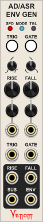
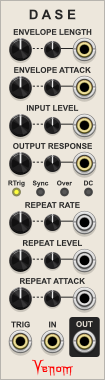
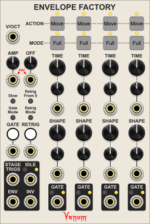
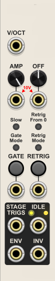
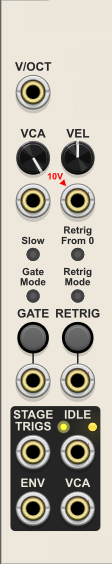
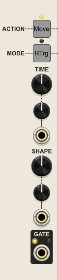
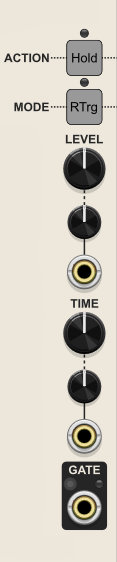
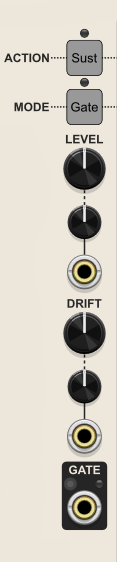

# Envelope Generators
 - [AD/ASR ENVELOPE GENERATOR](#adasr-envelope-generator)
 - [DASE - DYNAMIC AMPLIFYING SHAPING ENVELOPE](#dase---dynamic-amplifying-shaping-envelope)
 - [ENVELOPE FACTORY](#envelope-factory)

[Envelope Generators top](#envelope-generators) | [Venom top](/README.md#venom)

## AD/ASR ENVELOPE GENERATOR
  
Hybrid polyphonic AD (Attack|Decay) and ASR (Attack|Sustain|Release) envelope generator with stage gates/triggers, looping capabilities, and precise V/Oct CV control over stage lengths covering an extremely wide range.

### Summary of Features
* Separate trigger and gate inputs allow one envelope generator to support both AD and ASR behaviors simultaneously
* Wide stage length range: 0.24 msec to 48.27 min
* Stage lengths are precise with accuracy dictated by VCV sample rate
* V/Oct CV control over stage lengths with attenuverters
* Independent stage shape controls for Rise and Fall: concave up to linear to concave down
* Changing a stage shape does not alter the overall time
* Multiple modes with different retrigger options: retrigger from 0 or current level
* Configurable Rise, Fall, and Sustain stage outputs indicate different events within the envelope
* Gate outputs can be used to convert triggers into precicely timed gates or delayed gates
* Feedback from stage gates can block retrigger behavior and/or force ASR attack to rise to full value
* Loop options turn the envelope into a V/Oct LFO with CV control to start and stop the oscillation
* All inputs and outputs are polyphonic with support for audio rates

### Envelope general behavior

#### AD (Attack|Decay) envelope
* The Attack (Rise) stage always rises to a full 10V, then immediately progresses to the Decay stage
* The Decay (Fall) stage falls back to 0V

There are also options as to whether a new AD envelope can be retriggered during the Rise and/or Fall stages.

#### ASR (Attack|Sustain|Release) envelope
* The Attack (Rise) stage rises toward 10V as long as the triggering gate remains high
  * If gate goes low, then immediately jumps to the Release stage at current voltage
  * If 10V is reached then progresses to Sustain stage
* The Sustain stage maintains 10V as long as the triggering gate remains high
  * Progresses to the Release stage when gate goes low
* The Release (Fall) stage falls back to 0V

There are also options as to whether a new ASR envelope can be retriggered during the Rise and/or Fall stages.

### RISE and FALL stage times
Rise and Fall stages each have a large knob to set the base time of the stage, as well as a CV input and attenuator to dynamically modulate the time.

The total effective time for a Rise from 0 to 10 or Fall from 10 to 0 can be as short as 0.24 msec or as long as 48.27 minutes.

The small top left **SPD** (Speed) button sets the range of the time knobs:
- **Slow** ***(red)***: 0.044 to 181 seconds
- **Medium** ***(yellow, default)***: 0.0028 to 11.3 seconds
- **Fast** ***(green)***: 0.00024 to 1.0 seconds
- **Glacial** ***(purple)***: 0.707 seconds to 48.27 minutes

The knob speed can be modulated by the associated CV input with attenuator. Each positive volt of CV doubles the length of the stage. Each negative volt cuts the length in half.

The CV can modulate the effective length beyond the limits of the current time knob configuration. However, the effective length for slow, medium, and fast speeds is always clamped to between ~0.24 msec and ~3 min. The effective length for glacial speed is clamped between 31.25 msec and 48.27 minutes.

Note that floating point computations have limited precision that could cause a long envelope to stall. If using the Slow configuration and the VCV sample rate is greater than 96 kHz, then the processing is automatically under-sampled to guarantee that the envelope never stalls. If using the Glacial configuration than all sample rates are under-sampled. But if using the Medium or Fast speeds then it is possible for CV modulated long envelopes to stall if the VCV sample rate is above 96 kHz. The envelope will never stall if stage length CV is not used.

### RISE and FALL shapes
The Rise and Fall stages each have a dedicated small knob to adjust the shape or curve of the stage.
- Counter-clockwise creates a concave up J curve
- Noon creates a linear rise or fall
- Clockwise creates a convex up J curve

Changing the shape does not change the overall time for a rise from 0 to 10V, or fall from 10 to 0V.

### Envelope Triggering Events

Envelopes are always triggered on the leading edge of a trigger or gate. TRIG triggers create AD envelopes, and GATE triggers create ASR envelopes.

TRIG and GATE each have a manual push button as well as a CV input. The state of manual push buttons and CV inputs are maintained independently.

By default, the manual TRIG and manual GATE buttons maintain a high state for as long as the button is pressed.

If the small top right **TOG** (Toggle) button is enabled (yellow), then the GATE button becomes a toggle switch. The first press of the GATE button switches the gate high, and the next press switches the gate low.

Triggers for TRIG and GATE CV are based on Schmitt triggers that go high above 2V and go low below 0.2V. Voltages between 0.2V and 2V maintain the current state.

The type of envelope generated (AD or ASR) depends on which trigger is received first, TRIG or GATE. TRIG (AD) triggers take precedence over GATE (ASR) triggers in the event of a tie.

All triggers are typically ignored if any of the other triggers or gates are already in a high state.

### Modes of operation

The small top middle MODE button can alter the behavior of TRIG and GATE, and controls when and how envelopes are retriggered. It can also cause envelopes to loop, effectively turning the module into an LFO.

There are four modes to choose from:

- **Mode 1** ***(light blue, default)*** AD and ASR envelopes that can retrigger from the current value while falling
- **Mode 2** ***(dark blue)*** AD and ASR envelopes that can retrigger from 0 while rising or falling
- **Mode 3** ***(yellow)*** Looping envelopes that are started and stopped via TRIG, and a high GATE causes the oscillator to sustain 10V
- **Mode 4** ***(green)*** TRIG initiated AD envelope if GATE is low, or looping AD envelope that is reset by TRIG if GATE is high

AD/ASR Rise stages that start above 0V due to a retrigger are shortened proportionally to where they start. Likewise, ASR Fall stages that start below 10V are also shortened proportionally.

Looping envelopes can behave like a V/Oct LFO if the V/Oct control voltage is patched to both the Rise and Fall CV inputs, and both attenuverters are set fully counter-clockwise to -100%. The looping frequency can go into audio rates as high as ~2 kHz, or slow LFO rates as low as ~0.0001726 Hz (96.54 minutes per cycle).

#### Light Blue Mode 1 (AD or ASR | Retrigger from current value)

- AD Envelope
  - Leading edge of a TRIG initiates an AD envelope.
  - The envelope first rises to 10V, then falls back to 0V
  - The AD envelope can actually sustain 10V if a high GATE is received after the AD has been triggered.
  - A new envelope may be retriggered from the current voltage during the Fall stage
- ASR Envelope
  - Leading edge of a GATE initiates an ASR envelope
  - The envelope rises toward 10V for as long as the gate remains high
    - If 10V is reached, then progresses to the Sustain stage
    - If the gate goes low before 10V, then immediately jumps to the Fall stage
  - The Sustain stage remains at 10V for as long as the gate remains high
    - Progresses to the Fall stage when the gate goes low
  - The Fall stage falls back to 0V
    - A new envelope may be retriggered from the current voltage during the Fall stage

#### Dark Blue Mode 2 (AD or ASR | Retrigger from 0)

- AD Envelope
  - Leading edge of a TRIG initiates an AD envelope.
  - The envelope first rises to 10V
    - A new envelope can be retriggered from 0 during the Rise stage
    - The AD envelope can actually sustain 10V if a high GATE is received after the AD has been triggered.
  - The Fall stage falls back to 0V
    - A new envelope may be retriggered from 0V during the Fall stage
- ASR Envelope
  - Leading edge of a GATE initiates an ASR envelope
  - The envelope rises toward 10V for as long as the gate remains high
    - If 10V is reached, then progresses to the Sustain stage
    - If the gate goes low before 10V, then immediately jumps to the Fall stage
  - The Sustain stage remains at 10V for as long as the gate remains high
    - Progresses to the Fall stage when the gate goes low
  - The Fall stage falls back to 0V
    - A new envelope may be retriggered from 0V during the Fall stage

#### Yellow Mode 3 (LFO)

A short trigger at either TRIG or GATE starts the looping envelope to oscillate. Both manual buttons and CV inputs work equally well.

If the TRIG trigger lasts longer than the combined Rise and Fall time, then only a single envelope is produced and the oscillator stops.

If the GATE trigger lasts longer than the Rise time, then the oscillator rises and stalls at 10V until the gate goes low, at which point oscillation begins.

A running oscillator can be temporarily stopped at 10V by a high GATE. Oscillation will resume when the GATE goes low.

A running oscillator can be fully stopped by a high TRIG gate that remains high when the oscillator falls to 0V. Once stopped, oscillations will not resume until a new trigger is received.

#### Green Mode 4 (AD with retrigger from 0 or LFO with hard sync)

Triggers are never blocked by a high gate at TRIG or GATE

If the GATE is low, then TRIG initiates a single shot AD envelope. The AD envelope can be retriggered from 0 during both the Rise and Fall stages.

If the GATE goes high, then the Rise stage immediately starts from 0, and the envelope oscillates for as long as the GATE remains high. The oscillator may be reset (hard synced) by a TRIG trigger at any time. Oscillations stop when the GATE goes low.

### Stage Outputs

Each of the stage output ports has a small button next to the label to configure what exactly is produced at that output.

#### RISE output
- **Gate** ***(dark blue, default)*** Produces a high gate (10V) whenever the envelope is rising toward 10V, else low (0V) otherwise.
- **Start trigger** ***(green)*** Produces a 1ms trigger upon entry to the Rise stage. The trigger may be shortened upon exit from the Rise stage.
- **End trigger** ***(red)*** Produces a 1ms trigger upon exit from the Rise stage. The trigger may be shortened upon rentry to the Rise stage.

Note that a Rise trigger is not fired if the envelope is retriggered during the Rise stage.

#### SUS (Sustain) output
- **Gate** ***(dark blue, default)*** Produces a high gate (10V) whenever the envelope is sustaining 10V, else low (0V) otherwise.
- **Start trigger** ***(green)*** Produces a 1ms trigger upon entry to the Sustain stage. The trigger may be shortened upon exit from the Sustain stage.
- **End trigger** ***(red)*** Produces a 1ms trigger upon exit from the Sustain stage. The trigger may be shortened upon rentry to the Sustain stage.

#### FALL output
- **Gate** ***(dark blue, default)*** Produces a high gate (10V) whenever the envelope is falling toward 0V, else low (0V) otherwise.
- **Start trigger** ***(green)*** Produces a 1ms trigger upon entry to the Fall stage. The trigger may be shortened upon exit from the Fall stage.
- **End trigger** ***(red)*** Produces a 1ms trigger upon exit from the Fall stage. The trigger may be shortened upon rentry to the Fall stage.
- **EOC (end of cycle) trigger** ***(orange)*** Produces a 1ms trigger when the Fall stage reaches 0V. The trigger is not fired if the envelope is retriggered before reaching 0V.

### ENV (Envelope) output

The envelopes are output here. The small button beside the label configures the voltage range of the envelope.

- **Unipolar** ***(green, default)*** Normal envelope from 0V to 10V
- **Inverted unipolar** ***(orange)*** Inverts the envelope from 10V to 0V
- **Bipolar** ***(red)*** Offsets the envelope by -5V for a +/-5V range

### Alternate AD and ASR behavior via feedback

Retrigger and ASR Rise behavior can be modified by patching one or more of the stage gate outputs into the TRIG and/or GATE inputs. These configurations take advantage of VCV's stackable input ports. Note that the patched stage output(s) must be configured to produce a gate for these configurations to work.

#### Non-looping Mode 1
|Mode|Feedback|AD Trig Rise To Full|AD Trig Rise Retrigger|AD Trig Sustain At Full|AD Trig Fall Retrigger|ASR Gate Rise To Full|ASR Gate Sustain At Full|ASR Gate Fall Retrigger|
|:---:|:---|:---:|:---:|:---:|:---:|:---:|:---:|:---:|
|1|None|Yes|No|No*|From current|While gate high|While gate high|From current|
|1|RISE->GATE|Yes|No|No*|From current|Yes|While gate high|From current|
|1|RISE->TRIG FALL->TRIG|Yes|No|No*|No|While gate high|While gate high|No|
|1|RISE->GATE SUS->TRIG FALL->TRIG|Yes|No|No*|No|Yes|While gate high|No|

\* An AD envelope will sustain 10V if a high GATE is received after the AD is triggered by TRIG  

#### Non-looping Mode 2
|Mode|Feedback|AD Trig Rise To Full|AD Trig Rise Retrigger|AD Trig Sustain At Full|AD Trig Fall Retrigger|ASR Gate Rise To Full|ASR Gate Sustain At Full|ASR Gate Fall Retrigger|
|:---:|:---|:---:|:---:|:---:|:---:|:---:|:---:|:---:|
|2|None|Yes|From 0|No|From 0|While gate high|While gate high|From 0|
|2|RISE->TRIG|Yes|No|No|From 0|While gate high|While gate high|From 0|
|2|RISE->GATE|Yes|No|No|From 0|Yes|While gate high|From 0|
|2|RISE->TRIG SUS->TRIG FALL->TRIG|Yes|No|No|No|While gate high|While gate high|No|
|2|RISE->GATE SUS->TRIG FALL->TRIG|Yes|No|No|No|Yes|While gate high|No|

### Timed gate generator

The Rise gate output can be used to convert triggers into precicely timed gates.

Set the Mode to dark blue mode 2, set the Rise stage output to gate mode, and set the Rise time to the desired gate length. A trigger or gate at the Trig input will generate your gate at the Rise stage output. The Fall time is irrelevant because a trigger received during the fall stage will initiate a new envelope from 0, so the generated gate will always have the correct length.

If a second trigger is received during the rise stage, then the old gate is aborted and a new gate is begun immediately without the gate output going low.

You can prevent triggers from initiating overlapping gates by patching the Rise output to the Trig input.

### Delayed gate generator

The Fall gate output can be used to convert triggers into precicely timed delayed gates.

Set the Mode to dark blue mode 2, set the Fall stage output to gate mode, set the Rise time to your desired delay time, and the Fall time to your desired gate length. A trigger or gate at the Trig input will start the delay period, and then after the delay your desired gate will be sent through the Fall stage output.

If a subsequent trigger is received during the delay (rise) or gate (fall) period, then the current delayed gate will be aborted and a new delayed gate will be initiated.

You can prevent subsequent triggers from being received during the delay by setting the Rise stage to gate mode and patching the rise gate to the Trig input.

You can prevent all triggers from being received during the delay or gate by setting the Rise stage to gate mode and patching both the rise gate and fall gate to the Trig input. This guarantees that once a trigger is received, the full gate output will be initiated after the full delay period.

### Polyphony

All inputs and outputs are fully polyphonic with support for both low frequency and audio rates.

The total number of output channels is determined by the maximum number of channels received across all CV inputs.

Any monophonic CV input is replicated to match the output channel count.

Polyphonic CV input with fewer channels are assigned constant 0V for the missing channels.

### Standard Venom Context Menus
[Venom Themes](/README.md#themes), [Custom Names](/README.md#custom-names), and [Parameter Locks and Custom Defaults](/README.md#parameter-locks-and-custom-defaults) are available via standard Venom context menus.

### Bypass

All outputs are constant monophonic 0V when the AD/ASR Envelope Generator is bypassed.

[Envelope Generators top](#envelope-generators) | [Venom top](/README.md#venom)

## DASE - DYNAMIC AMPLIFYING SHAPING ENVELOPE
  
A novel Attack/Decay envelope generator that functions as an unusual VCA and wave shaper via audio rate modulation of the envelope shape. It also has internal modulation that can yield delay or tremolo type effects.

DASE has two active components that provide all of the functionality.

The primary component is an Attack Decay envelope. You specify the duration of the envelope, as well as the percentage of time spent in the attack stage. The decay stage is `100% - Attack%`. The main input modulates the Attack percentage at audio rates, causing the envelope shape to oscillate at the frequency of the input. The closer the phase is to the base envelope peak, the louder the output. Because the envelope is phase driven, the modulation does not alter the overall length of the envelope. The input has an attenuator to control the overall volume.

The output is typically AC coupled to give a bipolar audio output. The output waveform is affected both by the input waveform, as well as the current phase of the envelope, providing continuous timbre changes throughout the length of the envelope. The output has a shape control that defines the response curve, from concave up, to linear, to concave down. This further shapes the oscillation output, as well as the overall volume envelope shape.

The second DASE component is an internal low frequency oscillator that also modulates the envelope attack percentage. The LFO waveform can vary from a descending ramp, to triangle, to ascending ramp. There is control over modulation depth. The effect of the modulation can sound like a cross between delay and reverb with repeating distinct attacks, or like tremolo, depending on the rate of modulation, LFO shape, and depth. Not all LFO modulation sounds good, and configuration is not always intuitive, but with experimentation you can get amazing results.

Most of the inputs are fully polyphonic. The output polyphonic channel count is the maximum channel count found across all polyphonic inputs. Monophonic inputs are replicated to match the output channel count. Polyphonic inputs with fewer channels use constant 0V for missing channels. All of the LFO modulation inputs are monophonic.

All controls have both a medium size knob to set the base value, plus a CV input with a small attenuverter for modulation. The attenuated CV is always summed with the base value to establish the effective modulated value.

All inputs can be modulated at audio rates.

### Upper Envelope controls
All envelope inputs are polyphonic.

#### ENVELOPE LENGTH
Controls the total duration of an envelope. The knob ranges from 0.01325 to 32 seconds, with the default noon value at 1 second. The attenuated CV is exponential. Each positive volt doubles the time. Each negative volt halves the time. The final effective envelope length is clamped to a value between 0.01325 and 32 seconds.

#### ENVELOPE ATTACK
Controls the overall shape of the AD envelope. The knob shows the percentage of time devoted to the attack phase. The decay percentage is simply `100% - attack%`. A value of 0% yields a descending ramp, 50% a triangle, and 100% an ascending ramp. The attenuated CV is scaled at 10% per volt. The final effective attack percentage is clamped to a value between 0% and 100%.

#### INPUT LEVEL
Controls the overall output volume by attenuating the audio input to control the depth of envelope shape modulation. The attenuated CV is scaled at 10% per volt. The final effective level is clamped to a value between 0% and 100%.

#### OUTPUT RESPONSE
Controls the shape of the envelope attack and decay stages. Fully counter-clockwise is -1 representing maximal concave down. The default noon value of 0 is linear. Fully clockwise is 1 representing maximal concave up. The attenuated CV is scaled at 0.1 per volt. The final effective value is clamped to a value between -1 and 1.

### Middle Configuration buttons

#### RTrig (Retrigger) button
Controls how the envelope is retriggered.
- **From current** ***(Yellow, default)*** - The attack begins at the output level at the time of retrigger. The starting phase is computed from the starting level.
- **From 0** ***(light blue)*** - The envelope always restarts at phase 0, level 0.
- **Off** ***(dark gray)*** - Retriggering is disabled. All triggers are ignored until the envelope has completed.

#### Sync button
Controls whether the internal LFO is free-running and in phase across all polyphonic channels, or if each polyphonic channel gets its own LFO that is reset at the start of each envelope.
- **OFF** ***(dark gray, default)*** - There is a single free-running LFO that applies to all channels.
- **ON** ***(yellow)*** - Each channel has its own LFO that is reset each time the channel is triggered.

#### Over (Oversample) button
Controls the level of oversampling used to mitigate digital aliasing that may be introduced by the many non-linear transformations. This is typically not needed, but available just in case.
- **Off** ***(dark gray, default)***
- **x2** ***(yellow)***
- **x4** ***(green)***
- **x8** ***(light blue)***
- **x16** ***(dark blue)***
- **x32** ***(purple)***

#### DC output button
Controls whether the final output is AC or DC coupled
- **Off** ***(dark gray, default)*** - the bipolar output is AC coupled
- **On** ***(yellow)*** - the unipolar output is DC coupled.

### Lower LFO modulation controls
All LFO modulation inputs are monophonic. The LFO creates repeated attacks at low rates, and tremolo at high rates.

#### REPEAT RATE
Controls the frequency of the internal LFO. The knob ranges from 7.5 BPM to 1920 BPM, with the default noon value at 120 BPM (2 Hz). The attenuated CV is scaled to be V/Oct.

#### REPEAT LEVEL
Controls the depth of the LFO modulation. The knob ranges from -1 to 1, with the default noon value at 0. The attenuated CV is scaled at 0.1 per volt. The final effective level is clamped to a value between -1 and 1.

#### REPEAT ATTACK
Controls the shape of the LFO. The knob shows the percentage of time devoted to the attack phase. The decay percentage is simply `100% - attack%`. A value of 0% yields a descending ramp, 50% a triangle, and 100% an ascending ramp. The attenuated CV is scaled at 10% per volt. The final effective repeat attack percentage is clamped to a value between 0% and 100%.

### Bottom main IO ports
All IO ports are polyphonic.

#### TRIG (Trigger) input
The rising edge of a gate at this input triggers (or retriggers) the envelope. It is a Schmitt trigger that goes high at 2V and low at 0.2V.

#### IN input
This is the audio input for the VCA functionality.

#### OUT output
This is the final output for the VCA functionality.

### Standard Venom Context Menus
[Venom Themes](/README.md#themes), [Custom Names](/README.md#custom-names), and [Parameter Locks and Custom Defaults](/README.md#parameter-locks-and-custom-defaults) are available via standard Venom context menus.

### Bypass

The output is constant monophonic 0V when DASE is bypassed.

[Envelope Generators top](#envelope-generators) | [Venom top](/README.md#venom)

## ENVELOPE FACTORY
  
A highly configurable multi-stage polyphonic envelope generator supporting anywhere from 1 to 20 stages.

## *Basic Operation*
By default the Envelope Factory has four stages, but a module context menu "Stage count" option lets you select any count from 1 to 20. The module automatically expands or contracts to match the selected stage count. Modules to the right are automatically pushed right as needed when expanding. Cables attached to removed stages are automatically deleted.

Each stage can be configured independently to perform one of five actions:
- **Move** rises or falls from the current start voltage to a target voltage over a selected time interval.
- **Hold** holds a constant voltage for a selected time interval.
- **Sust** sustains a constant voltage for as long as the triggering gate remains high. Optionally a Sustain stage can drift toward the target of the next stage.
- **Rise** is the same as Move except the target is always 100% (normally 10V).
- **Fall** is the same as Move except the target is always 0% (0V).

Most actions can be configured to have one of three modes:
- **Full** The stage always proceeds to completion before the envelope progresses to the next stage. Retrigger is not allowed.
- **RTrg** Same as Full except a retrigger can abort the stage prematurely to initiate the start of a new envelope.
- **Gate** The stage proceeds to completion as long as the triggering gate remains high. If the gate goes low then the envelope proceeds to the next non-Gate stage. This is the only mode available to Sustain actions.

With these basic building blocks, a tremendous variety of envelope types may be constructed.

Envelopes start and end at 0%, with a typical range between 0 and 100%. If an envelope ends at a non-zero percentage, then the envelope output drops to 0 when the envelope becomes idle. The drop is instant if the Retrig From 0 option is enabled. Otherwise the drop is delayed by 2 samples so that looping envelopes don't have an unwanted downward spike to 0.

In addition to the standard envelope, Envelope Factory also produces an inverted form that typically starts at 100%, drops to 0%, then returns to 100%.

An amplitude control determines the voltage range between 0 and 100%, typically 10V. An offset control can shift the envelope higher or lower while preserving the overall shape, typically to make looping envelopes bipolar.

Without any CV modulation, stages can be as short as 1 msec, or as long as 2.78 hours. With CV modulation the stage lengths can be shortened or lengthened even more. Hold stages can actually be set to be nearly instantaneous (actually 1 sample), serving only to specify the target voltage of the previous Move stage.

Each stage has its own gate output that is high for as long as the stage is active. In addition, each stage can be selected to generate a trigger on a communal Stage Triggers output. There is also an Idle gate that is high whenever there is no active envelope. Additionally an end of cycle trigger can be generated at the Stage Triggers output.

#### Optional VCA

The Amplitude and Offset controls/inputs and Inverted output can be replaced by a VCA level control, audio input, Velocity input with velocity response control, and VCA output. When configured as a VCA, there is also an option to sync the envelope with the VCA input. In this case the triggers are delayed until the VCA input crosses 0. This is useful for preventing unwanted clicks when the envelope attack is extremely short.

#### Looping envelopes
Envelope Factory can function as an LFO by using the Idle gate output to trigger the envelope. When the envelope completes the Idle gate will go high which will retrigger the envelope.

There are two possible configurations for a looping envelope
- Endless loop: Patch the Idle output to the Gate input.
- Gated loop: Patch the Idle output to the Retrigger input. The envelope will loop as long as the Gate input is held high. This will only work as an LFO if the envelope does not have a Sustain stage.

There is a V/Oct input that applies to all timed stages equally, giving you V/Oct control over the LFO rate.

By using very short stage lengths, the looping envelope can be run at audio rates. However, the accuracy of stage timing is limited by the VCV sample rate, so the oscillator will not quite respond 1 V/Oct. Each stage timing can be off by as much as 1 sample, and this small error can become very significant at audio rates, especially as the pitch rises.

In addition, all CV inputs can be driven at audio rates.

Envelope Factory does not have any provision for oversampling, so audio rate outputs will be prone to digital aliasing.

#### Default configuration

The factory default for a newly placed Envelope Factory has four stages that are configured to function as either an ADSR or ADBDR envelope.

If the Sustain Drift is kept at 0, then the default configuration behaves like a typical Attack Decay Sustain Release (ADSR) envelope. The first Move stage is the Attack, the second Move stage the Decay, the third Sustain stage as itself, and the fourth Move stage is the final Release.

If the Drift is non-zero then the default configuration acts like an Attack Decay Break Decay2 Release (ADBDR) envelope. The Sustain stage defines both the Break point, as well as the Sustain's Decay2 rate. This is more like a physical piano where the note slowly decays while the sustain pedal is held down, and quickly decays once the sustain pedal is released.

#### Factory Presets
There are a number of factory presets that implement some common envelope types. There are two versions of each factory preset: Editable presets provide the stated functionality, but can be easily modified into something else entirely. Locked presets lock various parameter values so that the envelope cannot be transformed into a different type without first unlocking the parameters. The locked versions also rename all the stage knobs and ports to make it obvious what each stage does. Locked presets are a great way to gain familiarity with how the stage configuration works.

- Attack Decay Break Decay2 Release
- Attack Decay Sustain Release
- Attack Decay
- Attack Hold Decay Sustain Release
- Attack Sustain Release
- Decay
- Delay Attack Decay Sustain Release
- Timed step sequencer - 8 stages by default: A normal sequencer except each stage is timed rather than advanced by a clock
- Triggered step sequencer - 8 stages by default: The Gate button and input function as a Run control, and the Retrig button and input act as the sequencer clock

#### Polyphony
All input and output ports are polyphonic. The total number of output channels is set to the maximum channel count found across all inputs. Monophonic inputs are replicated to match the output channel count. Polyphonic inputs with fewer channels substitute 0V for any missing channels.

#### Randomization configuration
The standard module context menu Randomize action only applies to stage controls, excluding stage Action and Mode.

There is a Randomize configuration menu option that lets you specify which types of stage controls are randomized
- Stage times (Move, Rise, Fall, and Hold actions)
- Stage levels (Hold and Sustain actions)
- Stage shapes (Move, Rise, and Fall actions)
- Stage drifts (Sustain actions)
- Stage attenuverters (All knobs for all actions)
- Stage triggers (All actions)

#### Automatic termination of envelopes
All active envelopes will instantly be terminated and the envelope generator will return to an idle state if any of the following occur:
- Any stage is reconfigured to perform a different Action
- The number of stages is changed
- The Envelope Factory is bypassed

## *Global controls*

**<u>Standard Mode</u>**  

### V/OCT (Volt per octave) input
CV at this input modulates all timed stages identically. Each positive volt doubles the rate (halves the time). Each negative volt halves the rate (doubles the time). This input is particularly useful when the envelope is configured to loop, thus creating an LFO with typical V/Oct control over the rate.

### AMP (Amplitude) knob and CV input
Determines the magnitude of the final envelope. The input is attenuated and/or inverted by the knob to determine the effective 100% voltage. The knob attenuverter defaults to 100%, and the input is normalled to 10 volts, so if not patched, the envelope ranges between 0 and 10 volts (disregarding any offset).

### OFF (Offset) knob and CV input
Determines any offset that is added to the final envelope after the amplitude is applied. The input is attenuated and/or inverted by the knob to determine the effective offset. The knob attenuverter defaults to 0%, so by default no offset is applied.

### Slow (Knob time range) small button
Sets the range of all stage Time knobs
- **Fast** ***(Off, default)***: 0.001 sec - 10 sec
- **Slow** ***(Yellow)***: 0.01 sec - 100 sec
- **Crawl** ***(Orange)***: 0.1 sec - 1000 sec (16.667 min)
- **Glacial** ***(Red)***: 1 sec - 10000 sec (2.78 hr)

Stage times can be lengthened or shortened beyond the knob limits through CV modulation.

### Gate Mode small button
Controls how the manual Gate button behaves
- **Momentary** ***(Off, default)***: The Gate button remains high for as long as the button is held
- **Toggle** ***(Yellow)***: Each press of the Gate button changes the state of the button

### Retrig From 0 small button
Controls whether a retriggered envelope starts from 0
- **Off** ***(Off, default)***: A retriggered envelope starts from the current voltage rather than 0
- **On** ***(Yellow)***: Retriggered envelopes always start from 0

### Retrig Mode small button
Controls how Retrigger CV input is interpreted
- **Schmitt trigger** ***(Off, default)***: Retriggers on the leading edge of a high gate. The input goes high when rising above 2V, and low when falling below 0.2V.
- **CV change start** ***(Yellow)***: Retriggers the instant a change is detected
- **CV change end** ***(Blue)***: Retriggers when the input stops changing

The CV change modes are generally used with quantized V/Oct input so a new envelope is retriggered every time the pitch changes. The pitch CV could have glide applied, in which case the different modes specify whether the retrigger is fired at the beginning or end of the glide. If there is no glide then the two CV change modes give identical results.

### GATE button and CV input
An envelope is triggered when the Gate input rises above 2V. The gate returns to a low state when the input falls below 0.2V.

The button works by adding 10V to the CV input when the button is high.

### RETRIGGER button and CV input
This is used to enable retriggering of an envelope while the main Gate input remains high. The label is a bit misleading in that this does not retrigger an envelope directly, but rather momentarily mutes the main Gate input for one sample. So the Retrigger can only have effect when the main Gate is high.

The button always retriggers the instant it is pressed.

The CV behavior depends on the setting of the Retrig Mode button.

When configuring an envelope with retrig, it can be useful to set the manual Gate button to Toggle mode so you can set the gate high, giving you a chance to press the Retrig button.

### STAGE TRIGS (Stage triggers) output
This output can produce a 1 msec trigger at the start of each stage and/or at the envelope EOC (End Of Cycle). The small button above and to the left of each stage Gate output controls whether the stage generates a trigger or not. Similarly the global Idle output has a small button to determine whether the EOC trigger is generated. The stage triggers are especially useful if you want to use Envelope Factory as a timed sequencer.

By default the EOC trigger is enabled, and the stages triggers are disabled, making the Stage Trigs output a convenient EOC trigger. Note that EOC only triggers when an envelope proceeds to completion. Aborted envelopes do not generate an EOC trigger.

Note that consecutive triggers can merge into a single extended trigger when a stage is shorter than 1 msec.

### IDLE (Idle gate), LED light, and EOC switch
The Idle output gate is always high at 10V when the generator is idle, and low at 0V when an envelope is in progress. This output can be patched to the Gate (or Retrig input with Gate toggled high) to create a looping envelope.

The LED light above the port glows yellow when the Idle gate is high. When working with polyphony the brightness of the LED is proportional to the percentage of channels that are idle.

Above and to the left of the Idle output is an EOC trigger switch. When enabled a 1 msec trigger will be generated at the Stage Trigs output whenever an envelope proceeds to completion. Aborted envelopes never generate an EOC trigger.

### ENV (Envelope) output

The final envelope, typically with a resting voltage of 0V that typically ascends to 10V before returning to 0V.

The formula for the envelope in standard mode is ***(Envelope% x AmplitudeV) + OffsetV***

### INV (Inverse envelope) output

An inverted form of the final envelope with a typical resting voltage of 10V that typically descends to 0V before returning to 10V. 

The formula for the inverse envelope is ***((100% - Envelope%) x AmplitudeV) + OffsetV***

**<u>VCA Modes</u>**  

The module context menu has an option to enable VCA mode. The VCA mode can be standard where envelopes are triggered normally, or you can choose Synced mode where the envelope triggers are synced with the incoming audio. In sync mode the envelope trigger is delayed until the VCA input crosses zero. This is useful for preventing clicks that could otherwise appear when using extremely fast attacks.

When using a VCA mode, the Amplitude and Offset controls and inputs, as well as the Inverse output are replaced by the following:

### VCA level knob and audio input
The knob specifies the attenuation level of the VCA with 100% being full volume.  
The input is the audio to be attenuated by the envelope.

### VEL (Velocity) input and response control knob
The unipolar Velocity input is a second opportunity for attenuation that is multiplicative with the VCA Level. An input of 0V represents no output, and 10V representing 100%. The knob specifies the response curve for the velocity. The default noon value is a linear response. Counter-clockwise rotation creates a concave up response, similar to exponential. Clockwise rotation creates a concave down response, similar to logarithmic.

The Velocity level is sampled the instant the envelope is triggered and held constant throughout the duration of the envelope.

### ENV (Envelope) output
The envelope is still output at the same port as standard mode. However, the formula for the envelope is changed.

***Final Envelope = Envelope% x Level% x Velocity%ResponseAdjusted x 10V***

### VCA output
This is the audio input after it has been attenuated by the envelope and VCA.

## *Stage controls*
The module context menu has a Stages option where you specify the number of stages you want for your envelope.

The two square buttons at the top and the Gate output at the bottom have identical functionality for each stage.

### ACTION square button
Controls what action the stage performs. The configuration and labeling of the other stage controls are automatically adjusted whenever the Action is changed.

- **Move** - The envelope rises or falls from the starting level to the target level over a fixed period of time. The starting level is the current level at the start of the stage. The target level is specified by the following Hold or Sustain stage Level. If not followed by a Hold or Sustain, then the target alternates between 100% and 0%, as indicated by the yellow LEDS above and below the Action button. An LED glowing yellow above the button indicates a 100% target, and an LED glowing yellow below indicates 0%.
- **Hold** - The envelope holds the specified level constant for a fixed amount of time.
- **Sustain** - The envelope holds the specified level constant for as long as the triggering Gate remains high. If a non-zero Drift is specified then the sustain will actually drift toward the target of the next ungated stage rather than maintaining a constant level.
- **Rise** - Same as Move, except the envelope always rises to a target of 100%, and the upper LED will glow yellow.
- **Fall** - Same as Move, except the envelope always falls to a target of 0%, and the lower LED will glow yellow.

All forms of Move normally start at the current level when the stage is initiated and then progress to the target value. However, if the first stage action is Fall then the envelope starts at 100% and falls to 0. This special case enables definition of a simple Decay envelope using a single stage.

### MODE square button
Controls whether the stage length is impacted by the main Gate, and whether the envelope can be retriggered during the stage.

- **Full** - The stage always runs to completion and then the envelope advances to the next stage. Retrigger is not allowed.
- **RTrg (Retriggerable Full)** - The stage runs to completion and then the envelope advances to the next stage. However, the stage can be terminated prematurely by retriggering a new envelope. A retrigger happens when the Gate goes low before or during the stage, and then goes high during the RTrg stage.
- **Gate (Gated)** - The stage is gated, meaning the stage runs to completion unless the main Gate goes low. When the main Gate goes low the envelope immediately proceeds to the next stage that is not Gated, or else terminates if none exists.

### GATE output, trigger button, and LED light
The stage gate output is high at 10V for as long as the stage is active, otherwise it is 0V.

The small unlabeled button above and to the left of the port controls whether the onset of the stage produces a 1 msec trigger at the Gate Trigs output.

The LED light above and to the right of the port glows yellow when the stage is active. When working with polyphony the brightness of the LED is proportional to the percentage of channels that are in that stage.

### *Variable knobs and CV inputs*
The functions of the remaining stage knobs and inputs change depending on the chosen stage Action.

**<u>Move, Rise, and Fall action controls<u/>**  
&nbsp;&nbsp;&nbsp;&nbsp;&nbsp;&nbsp;&nbsp;&nbsp;&nbsp;&nbsp;  
Rise and Fall are speciall cases of Move, so all three use the same controls.

### Time knob, CV input and attenuverter
Specifies the time it takes to complete the Move action. Each positive volt of attenuverted CV doubles the time, and each negative volt halves the time.

Note that the time is for a normal full Move stage. Retriggered envelopes starting with Move can result in a shortened Move, and ungated Move after a Gate release can result in shortened or extended Moves. In such circumstances, the time will be lengthened or shortened proportionally depending on the actual Level at the time the Move starts.

If the starting voltage is already beyond the target voltage, then the envelope instantly jumps to the target voltage and advances to the next stage.

### Shape knob, CV input and attenuverter
The knob specifies the shape of the stage, with the noon value of 0 representing linear. Counter-clockwise rotation specifies concave up curvature, with -1 being the most curvature. Clockwise rotation specifies concave down curvature, with 1 being the most curvature.

The shape CV is scaled at 0.2 per Volt such that a 10V peak to peak input can cover the entire shape range from -1 to 1.

Unlike some other envelope generators, changing the shape of a stage does not alter the length of the stage.

If the envelope is looped and used as an audio source, then modulation of the Move Shapes can add interesting evolving timbres without changing the fundamental pitch.

**<u>Hold action controls<u/>**  

### Level knob, CV input and attenuverter
Specifies the Level of the Hold action, with 0% representing 0V, and 100% representing 10V.

The attenuverted CV is summed directly with the knob value, and the result is clamped to a value between 0 and 10 volts inclusive.

Typically a Hold stage is preceded by a Move stage, in which case the envelope will already be at the Hold Level at the start of the stage. If not preceded by a Move, then the envelope instantly jumps to the Hold Level at the start of the stage.

If the first envelope stage is a Hold at Level 0, and the envelope is retriggered, and Retrig From 0 is off, then Hold preserves the voltage at the time of retrigger instead of jumping to 0.

### Time knob, CV input and attenuverter
Specifies how long the Hold level is held constant before progressing to the next stage.

The knob has an exponential scale, which normally would not allow for a length of 0. However, the minimum (fully counter-clockwise) value is interpreted as 0.

Each positive volt of attenuverted CV doubles the time, and each negative volt halves the time. Any effective length <= 0.001 sec is treated as 0.

Note that a length of 0 is not truly zero - instead the stage will last exactly one sample.

**<u>Sustain action controls<u/>**  

### Level knob, CV input and attenuverter
Specifies the Level of the Sustain action, with 0% representing 0V, and 100% representing 10V.

The attenuverted CV is summed directly with the knob value, and the result is clamped to a value between 0 and 10 volts inclusive.

Typically a Sustain stage is preceded by a Move stage, in which case the envelope will already be at the Sustain Level at the start of the stage. If not preceded by a Move, then the envelope instantly jumps to the Sustain Level at the start of the stage.

If the first envelope stage is a Sustain at Level 0, and the envelope is retriggered, and Retrig From 0 is off, then Sustain preserves the voltage at the time of retrigger instead of jumping to 0.

### Drift knob, CV and attenuverter
Typically this knob is kept at zero (fully counter-clockwise) to preserve normal Sustain behavior.

If the value is non-zero then it specifies the rate at which the Sustain output will drift toward the target voltage of the next ungated stage. This feature was added to enable the stage to behave more like a sustain pedal on a piano, slowly fading until it reaches zero, or quickly dying if the pedal is released. However, the feature can be used more creatively, and can even drift to a higher level.

The Drift knob ranges from 0 to 1000 %/sec. The drift is always linear. If the target voltage is reached, then it will hold the target value throughout the rest of the Sustain stage.

The attenuverted CV is scaled at 10% per volt and summed with the knob value to establish the effective drift value. If the effective drift is 0 then the Sustain will hold the sustain level indefinitely.

### Standard Venom Context Menus
[Venom Themes](/README.md#themes), [Custom Names](/README.md#custom-names), and [Parameter Locks and Custom Defaults](/README.md#parameter-locks-and-custom-defaults) are available via standard Venom context menus.

### Bypass

All outputs are monophonic 0V while Envelope Factory is bypassed.

[Envelope Generators top](#envelope-generators) | [Venom top](/README.md#venom)

