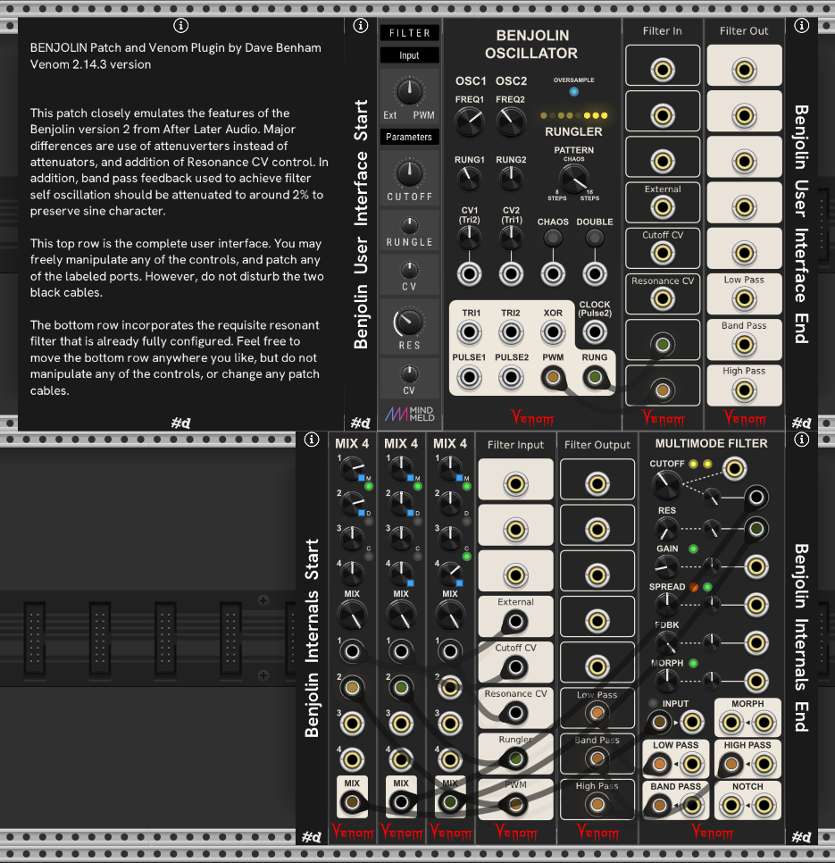
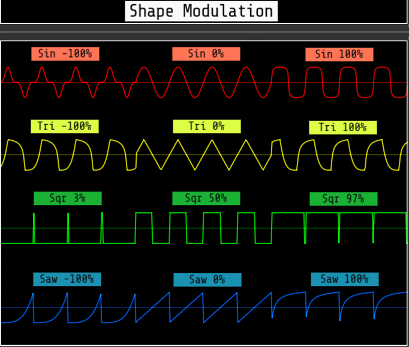
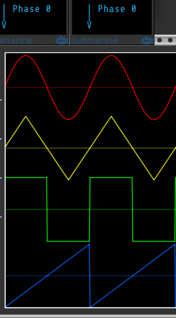

# Venom Oscillators

[Return to Table Of Contents](/README.md#venom)

## BENJOLIN OSCILLATOR
  
A complex chaotic oscillator emulating the oscillator and rungler components of a Benjolin. It produces 7 outputs: two pairs of triangle and pulse waves with exponential FM, two varying width pulse outputs, and a stepped voltage output similar to a random sample & hold. Frequency range is very wide, from slow LFO rates to high audio rates. Connect a resonant filter with excellent ping characteristics, and you have a complete functional Benjolin.

Also check out the premium [Venom Chaos Boxes Venjolin](https://github.com/DaveBenham/VenomPremium/blob/main/VenomChaosBoxes.md#venjolin) for a one module implementation of a complete Benjolin, including the filter.

The Benjolin was invented by Rob Hordijk in 2009. It is a non-traditional / experimental electronic musical instrument that uses a small number of simple circuits and a minimal number of knobs to create an astonishing range of sounds and patterns. Extensive use of feedback and cross-modulation makes the Benjolin a chaotic sound source, with the ability to create stable patterns as well.

There have been many variations of the Benjolin, but the basic functional architecture is always the same - two oscillators, a specialized shift register construct called the Rungler, and a resonant state variable filter. This module is based on the Eurorack version 2 of the Benjolin created by After Later Audio in collaboration with Rob Hordijk.

The Benjolin Oscillator is arranged in three vertical sections: OSC1, OSC2, and RUNGLER.

The oscillators are digital with triangle and pulse outputs. They are intentionally not exactly 1V/Octave.

### OSC1 (Oscillator 1)
#### FREQ1 knob
Sets the base frequency of oscillator one. Fully counterclockwise is roughly 0.03 Hz (30 seconds per cycle). The oscillator cannot be modulated below this minimum frequency. The oscillator remains in LFO territory up through noon at about 15 Hz. A bit above that and it transitions to audio rates, with a maximum fully clockwise frequency of around 7.8 kHz without any modulation. With modulation the oscillator maximum frequency is about 12.5 kHz.

#### RUNG1 (Rungler 1) knob
Controls how much the rungler signal modulates oscillator 1 frequency. The knob is a bipolar attenuverter ranging from -1 (100% inverted) to 1 (100%), with the default noon value of 0 (no modulation).

#### CV1 (Control Voltage 1) knob and input
Bipolar input with a bipolar attenuverter to modulate oscillator 1 frequency. The attenuverter ranges from -1 (100% inverted) to 1 (100%), with the default noon value of 0 (no modulation).

The CV1 input is normalled to the Oscillator 2 triangle output.

#### TRI1 (Triangle 1) output
Triangle waveform bipolar output for oscillator one, ranging from -5 to 5 volts.

#### PULSE1 output
Pulse waveform bipolar output for oscillator one, ranging from -5 to 5 volts.

### OSC2 (Oscillator 2)
#### FREQ2 (Oscillator 2 Frequency) knob
Sets the base frequency of oscillator two. Fully counterclockwise is roughly 0.03 Hz (around 30 seconds per cycle). The oscillator cannot be modulated below this minimum frequency. The oscillator remains in LFO territory up through noon at about 15 Hz. A bit above that and it transitions to audio rates, with a maximum fully clockwise frequency of around 7.8 kHz without any modulation. With modulation the oscillator maximum frequency is about 12.5 kHz.

#### RUNG2 (Rungler 2) knob
Controls how much the rungler signal modulates oscillator 2 frequency. The knob is a bipolar attenuverter ranging from -1 (100% inverted) to 1 (100%), with the default noon value of 0 (no modulation).

#### CV2 (Control Voltage 2) knob and input
Bipolar input with a bipolar attenuverter to modulate oscillator 2 frequency. The attenuverter ranges from -1 (100% inverted) to 1 (100%), with the default noon value of 0 (no modulation).

The CV2 input is normalled to the Oscillator 1 triangle output.

#### TRI2 (Triangle 2) output
Triangle waveform bipolar output for oscillator two, ranging from -5 to 5 volts.

#### PULSE2 output
Pulse waveform bipolar output for oscillator two, ranging from -5 to 5 volts.

### OVERSAMPLE switch
This small color coded switch controls how much oversampling is applied to reduce aliasing artifacts in the outputs.
- Off (gray)
- x2 (yellow)
- x4 (green)
- x8 (light blue - default)
- x16 (dark blue)
- x32 (purple)

Aliasing might not be noticeable with chaotic and/or low frequency outputs. But the aliasing can become painfully obvious when producing high frequency coherent output unless oversampling is used. But oversampling is rather CPU intensive, so you want to use the minimum amount that gives good results. An oversample value of x8 uses reasonable CPU with VCV running at 48 kHz, and provides clean output in all but the most extreme cases.

There is also a context menu option to select the quality of the filters used for oversampling.

See [Anti-aliasing via oversampling](/README.md#anti-aliasing-via-oversampling) for more information.

Due to float arithmetic limitations, the oscillators would stall at the lowest frequency if the VCV sample rate is set above 48 kHz and high oversample rates are used. To compensate, the maximum allowed oversampling is reduced as the VCV sample rate increases. This enables the oscillators to cover their full range regardless what VCV sample rate is used.

### RUNGLER
The Rungler consists of an eight step shift register driven by a clock and a data input, along with comparators, logic gates, and a digital to analog converter (DAC). The rungler data input is always derived from the oscillator 1 triangle output. The clock input defaults to the oscillator 2 pulse output, but may be overridden at the clock input. When a bit shifts out of the shift register, it is XORed with the data input and fed back into the low bit of the ASR. The Rungler produces multiple output signals. Depending on configuration and the incoming data, the rungler output may be chaotic, or it may have a readily recognized pattern.

By default the Benjolin Oscillator DAC is configured to use bits 2,4,7 in order to maximize the number of available Rungler patterns. There is a module context menu option to use Rob Hordijk's original design of bits 6,7,8.

Above the Rungler label are eight LEDs representing the shift register bits. The DAC LEDs glow bright yellow when high. The remaining LEDs glow dim yellow when high.

#### PATTERN knob
Controls whether the Rungler repeats a pattern or is chaotic. When fully anticlockwise, the Rungler produces an 8 step pattern. When fully clockwise it produces a 16 step pattern, with the first 8 steps being a mirror image of the second 8 steps. At noon the rungler output is chaotic.

Below is a technical discussion of how it works.

The Pattern knob range is from -1 to 1, with a default of 0 at noon. The raw internal triangle signal also ranges from -1 to 1. If the Pattern value is greater than the instantaneous incoming triangle value, then the rungler input is high (1), else the input is low (0). The input is XORed with the recycled shift register bit. So a high input inverts the recycled bit, and a low input preserves the recycled bit.

When the Pattern knob is fully counterclockwise, the input is guaranteed to be zero, the recycled bit is preserved, and an 8 step pattern is established.

When the Pattern knob is fully clockwise, the input is guaranteed to be 1, the recycled bit is inverted, and a 16 step pattern is established.

At noon there is a roughly 50-50 chance of 0 or 1, so the rungler output is at its most chaotic, typically with no recognizeable pattern.

#### CHAOS button and input
If enabled, the Pattern knob is ignored, and the rungler output is always chaotic. Each press of the button toggles the state of the chaos button. The leading edge of a trigger at the input will also toggle the button state.

The Chaos button works by converting the 8 step shift register into a 127 step linear feedback shift register, and by ignoring the Pattern knob and always comparing against 0, so there is always a 50% chance of inversion of the recycled bit.

If Chaos is off, then the rungler may fall into a pattern over time, even if the Pattern knob is at noon. The Chaos button is useful for re-introducing chaos into the output.

#### DOUBLE button and input
If enabled, the Rungler is triggered at double the rate. Normally the Rungler is triggered by the leading edge of a clock gate. When in Double mode the Rungler is triggered by both the leading and trailing edges of a clock gate.

Each press of the Double button toggles the state of the button. The leading edge of a trigger at the input will also toggle the button state.

#### CLOCK input

This is the input that triggers the Rungler. It expects a bipolar clock input, with a high state detected above +1V, and a low state below -1V.

If oversampling is enabled, then interpolation of square unipolar clock input will have enough "bounce" to reset to a negative state. But square unipolar clocks will not work if oversampling is off. Nor will unipolar sine or triangle waves work regardless of oversampling status. There is a "Unipolar clock input" module context menu option available to work with any unipolar clock input.

The Clock input is normaled to the Oscillator 2 pulse output.

#### XOR output

This is simply the first bit of the Rungler shift register, scaled and offset to be bipolar +/-5V.

#### PWM output

Although this is under the Rungler section, it actually has nothing to do with the Rungler. This bipolar +/-5V output is produced by a comparator that outputs 5V when the TRI2 signal is greater than TRI1, and -5V otherwise. This is the signal that traditionally gets sent to the Benjolin filter input. It was called PWM by Rob Hordijk because it produces a series of variable width pulses, reminiscent of a pulse wave with pulse width modulation.

#### RUNG (Rungler) output

This output is also bipolar varying between +/-5V. It is a stepped voltage signal with 8 possible values created by the digital to analog converter in the Rungler.

### Module Context Menu
The original release of the Benjolin Oscillator had CV1, CV2, and Clock normalled values that were 20% of what they should have been. This bug has been fixed, but just in case there are existing patches that depended on the original normalled values, there is a module context menu option "Original release normalled values" that uses the old values when enabled. Patches with the Benjolin Oscillator that were created using the original release will default to having this option enabled.

### Patching a Complete Benjolin
A minimal complete Benjolin can be patched simply by pairing the Benjolin Oscillator with a resonant filter with good ping characteristics. The Venom Multimode Filter works extremely well. Simply patch the PWM output to the filter input, and the Rungler output to the filter cuttoff input.

A Benjolin should not self oscillate unless given feedback from the filter band pass output. So ideally the cutoff frequency and resonance amount should be constrained so as to prevent self oscillation. Other things to consider are a crossfade module to allow a mix of PWM and external CV (or self patched CV) as input to the filter. Also a mixer would be good to allow a mix of external (or self patched) CV and Rungler input to the Cutoff frequency.

The patch below closely emulates the features of the Benjolin version 2 from After Later Audio. A version of the patch wired up to show a fun example sound is available at https://patchstorage.com/venom-2-14-3-all-venom-benjolin/.

### Standard Venom Context Menus
[Venom Themes](/README.md#themes), [Custom Names](/README.md#custom-names), and [Parameter Locks and Custom Defaults](/README.md#parameter-locks-and-custom-defaults) are available via standard Venom context menus.

### Bypass

All outputs are constant monophonic 0V when the Benjolin Oscillator is bypassed.

[Return to Table Of Contents](/README.md#venom)

## BENJOLIN GATES EXPANDER
  
Adds additional Rungler gate outputs to the Benjolin Oscillator.

Any number of Gates expanders may be used. All expanders must be placed to the right of the Benjolin Oscillator in a contiguous chain. The upper left LED glows yellow when the expander is successfully connected to a base module.

Note the gate outputs do not participate in oversampling.

### MODE (Gate Mode) button
This color coded button controls the timing and length of the gate outputs:
- **Gate** (white, default) - The gate is high as long as the gate logic is true
- **Clock gate** (yellow) - The gate is high when the gate logic is true and the Rungler clock is high
- **Inverse clock gate** (orange) - The gate is high when the gate logic is true and the Rungler clock is low
- **Trigger** (green) - A trigger is sent when the gate logic transitions to true
- **Clock rise trigger** (light blue) - A trigger is sent when the Rungler clock transitions to high while the gate logic is true
- **Clock fall trigger** (dark blue) - A trigger is sent when the Rungler clock transitions to low while the gate logic is true
- **Clock edge trigger** (purple) - A trigger is sent when the Rungler clock tranitions to high or low while the gate logic is true

Triggers are high for 1 msec. But if using a clocked trigger and the clock goes low before the trigger has completed, then the trigger immediately goes low.

### POLAR (Polarity) button
This color coded button controls the polarity of the gates
- **Unipolar** (green, default) - Low = 0V and high = 10V
- **Bipolar** (purple) - Low = -5 V and high = 5 V

### 8 Gate outputs
The LED in the upper right corner of each output port glows yellow whenever the output gate is high.

Each output port has a context menu to specify which Rungler bits are used, and what logic operator to use. By default the gate logic is used for the port name, and displayed as a label above the port.

#### Gate bits
You may select up to 4 bits. Once 4 have been selected you cannot select another without first unselecting one.

#### Gate logic
You must select one of three options:
- **AND** (&) - The gate logic is true if all selected bits are high
- **OR** (|) - The gate logic is true if at least one selected bit is high
- **XOR** (^) - The gate logic is true if exactly one selected bit is high

If only one bit is selected, then all logic operations give the same result - the logic is true if the selected bit is high.

### Factory Presets
There are four factory presets that default to mode = Gate and polarity = Unipolar
- All Bits - There is one gate for each Rungler bit
- AND Gates - AND logic is used with bits 1&2, 2&4, 4&7, 1&2&4&7, 2&3, 3&5, 5&8, 2&3&5&8
- OR Gates - OR logic is used with bits 1|2, 2|4, 4|7, 1|2|4|7, 2|3, 3|5, 5|8, 2|3|5|8
- XOR Gates - XOR logic is used with bits 1^2, 2^4, 4^7, 1^2^4^7, 2^3, 3^5, 5^8, 2^3^5^8

### Standard Venom Context Menus
[Venom Themes](/README.md#themes), [Custom Names](/README.md#custom-names), and [Parameter Locks and Custom Defaults](/README.md#parameter-locks-and-custom-defaults) are available via standard Venom context menus.

### Bypass

All outputs are constant monophonic 0V when the Benjolin Gates Expander is bypassed.

[Return to Table Of Contents](/README.md#venom)

## BENJOLIN VOLTS EXPANDER
  
Adds an additional Rungler CV output to the Benjolin Oscillator. It works as a configurable digital to analog converter.

Any number of Volts expanders may be used. All expanders must be placed to the right of the Benjolin Oscillator in a contiguous chain. The upper left LED glows yellow when the expander is successfully connected to a base module.

Note the output does not participate in oversampling.

### SNAP button
If on (white), then the Bit knobs snap to powers of 2. If off (gray) then the knobs can be freely set to any decimal value betwen 0 and 128.

### Bit knobs 1-8
Each knob represents a Rungler bit. The knob assigns a value to the bit between 0 and 128. Knobs (bits) set to 0 do not participate in the digital to analog conversion. The assigned values for all high Rungler bits are summed, and then scaled and offset to a bipolar +/- 5V range (10 VPP).

### RANGE knob
Scales the peak to peak range of the output to any value between 0 and 10V.

### OFFSET knob
Offsets the output by any value between -10V and 10V. The Offset is applied after the Range.

### OUT port
The final computed voltage is ouput here.

### Standard Venom Context Menus
[Venom Themes](/README.md#themes), [Custom Names](/README.md#custom-names), and [Parameter Locks and Custom Defaults](/README.md#parameter-locks-and-custom-defaults) are available via standard Venom context menus.

### Bypass

The output is constant monophonic 0V when the Benjolin Volts Expander is bypassed.

[Return to Table Of Contents](/README.md#venom)

## BOUNDED VCO
  
An implementation of Peter Blasser's Bound/Bounce oscillation that constrains an oscillator with variable slopes between variable upper and lower bounds. This concept was used in his Ciat-Lonbarde Sidrax, Tetrax, and Quadrax organs, as well as the Ieaskul F. Mobenthey Fourses, Denum, and Swoop Eurorack modules.

There are two ways to control the frequency of a Bounds/Bounce oscillation that have an inverse relationship. The frequency can be increased by either increasing the absolute value of the Bounce slopes or decreasing the distance between the upper and lower Bounds. Of course changing the distance between the bounds also changes the oscillation amplitude.

[Return to Table Of Contents](/README.md#venom)

## VCO LAB

A polyphonic oscillator with a robust array of features for the mad scientist sound designers amongst us, including available oversampling to give clean anti-aliased output regardless which functions are combined.

### Summary of features

- Modes for audio, low frequency, and 0 Hz carrier linear FM
- The audio and low frequency modes can also be setup for triggered, retriggered, or gated one shot mode
- The triggered one shot mode can generate the undertone/subharmonic series
- Oversampling options to control aliasing
- Simultaneous outputs for Sine, Triangle, Square, and Saw waveforms, plus a highly configurable Mix
- Each waveform has controls/inputs for shape, phase, offset, and level
- The mix also has controls/inputs for shape (saturation or folding), global phase, offset, and level
- Even waveform (fundamental + even harmonics) available via saw morphing shape mode
- All inputs can be driven at audio rates, and nearly all can be oversampled
- All inputs support polyphony
- Level controls with configurable VCAs support AM and ring mod.
- Independent controls/inputs for exponential FM and true linear through 0 FM
- Linear FM input defaults to AC coupled, with an option for DC coupled
- Audio rate modulation of phase provides functionality often incorrectly referred to as through 0 linear FM.
- Independent inputs for hard sync (reset phase to 0), and soft sync (reverse waveform)
- Octave control
- Square pulse width range can be 0-100% or 3-97%
- Optional DC offset removal for the outputs

Watch this [demo/tutorial video from Omri Cohen](https://www.youtube.com/watch?v=iTE15_leyXQ) for an introduction to many of the VCO Lab features. It uses a slightly older version of VCO Lab, but it is still instructive.

Global controls and inputs are generally to the left.

The grid of controls, inputs, and outputs to the right control each waveform as well as the overall mix. One major exception is the Mix Phase controls on the far right are actually global phase controls.

### Polyphony
VCO LAB is fully polyphonic - All inputs can process polyphonic signals.

The number of output channels is the maximum number of channels found across all inputs.

Monophonic inputs are replicated to match the number of output channels. Polyphonic inputs that have fewer channels use constant 0V for missing channels.

### Reset Poly (Reset Polyphony count) button
Momentarily forces all outputs to be monophonic - useful when the input polyphony count is reduced while the VCO Lab has feedback. The reset forces the correct output poly count to be computed. Without the Reset Poly button it would require temporary removal of all feedback to restore the correct poly count.

### FRQ (Frequency Mode) button
This color coded button controls the overall mode of the oscillator
- **Audio frequency** (white - default)
- **Low frequency** (orange)
- **0 Hz carrier** (yellow)
- **Triggered audio one shot** (light blue)
- **Retriggered audio one shot** (dark blue)
- **Gated audio one shot** (green)
- **Retriggered LFO one shot** (pink)
- **Gated LFO one shot** (purple)

In 0 Hz carrier mode the oscillator is stalled if there is no bias, and requires linear FM input or phase CV input to produce a signal. Some of the controls and inputs have alternate behavior in this mode (labeled in an alternate color). Exponential FM has no effect unless the bias is non-zero.

Phase distortion synthesis can be explored via the 0 Hz carrier mode. Setting the phase input attenuator to 40% will cause a 10V phasor change to exactly produce one wave cycle. The smoothest results will be achieved if all anti-aliasing is disabled for both the driving phasor, as well as the VCO Lab in 0 Hz carrier mode. For VCO Lab this means turning oversampling off, and disabling DPW anti-alias suppression.

If using any of the one shot modes, then the oscillator will not produce any output until it receives a trigger or gate at the Sync input.
 - Triggered one shots will output exactly one complete cycle and then stop until the next trigger is received. If the cycle has not yet completed when a sync trigger is received, then the trigger is ignored. This works well for creating undertone or subharmonic series!
 - Retriggered one shots will output one complete cycle and then stop until the next trigger is received. If another trigger is received before the cycle completion, then the wave will be reset to phase 0 and retriggered.
 - Gated one shots work the same as retriggered except they only output as much of a single wave cycle as fits within the high gate period.

Regardless what mode is chosen, the full oscillator frequency range is accessible via CV modulation.

Whenever the frequency mode changes, the oversample rate is initialized to a default value. LFO modes always default to oversampling off. Audio and 0 Hz carrier modes initially default to x4 oversampling. A module context menu option is available to change the default audio and 0 Hz carrier oversample rate.

### Frequency limits

Like any digital oscillator, there is a hard upper frequency limit at 50% of the sample rate called the Nyquist frequency. However, VCO Lab does not limit any V/Oct voltage, so the oscillator may attempt to produce higher frequencies. If oversampling is not enabled, then the high frequencies are reflected back below the Nyquist frequency. If oversampling is enabled, then the amplitude of high frequencies is attenuated dramatically as the Nyquist frequency is approached.

Similarly, the module does not limit the low frequencies either. But here again there is a practical limit due to the limitations of single precision floating point numbers. When at very low frequencies, the oscillator may stall and cease oscillating. The stall point varies depending on the VCV engine sample rate, and the amount of oversampling. The stall point rises as the engine sample rate rises and/or as the oversampling rises.

### OVR (Oversample) button
This color coded button controls how much oversampling is applied to control aliasing of audio output.
- **Off** (dark gray - low frequency mode default)
- **x2** (yellow)
- **x4** (green - initial audio mode and 0 Hz carrier mode default)
- **x8** (light blue)
- **x16** (dark blue)
- **x32** (purple)

There is also a context menu option to select the quality of the filters used for oversampling.

See [Anti-aliasing via oversampling](/README.md#anti-aliasing-via-oversampling) for more information.

Note that oversampling is CPU intensive, so best to use the lowest amount of oversampling that gives satisfactory results.

To further reduce CPU usage, oversampling may be disabled for individual inputs that are not being modulated at audio rates. Inputs that support oversampling have a context menu option to enable or disable oversampling, and an LED next to the port to indicate the current oversampling state:
- dark gray indicates that oversampling is off, or there is no input, so the current port setting is not applicable
- yellow indicates the input is being oversampled
- red indicates the input is not being oversampled

### DPW alias supression
Square and Saw waves have the most high frequency harmonic content that can lead to more aliasing. To further reduce aliasing, VCO Lab uses DPW (Differentiated
Polynomial Waveforms) when generating saw or pulse waves in audio mode.

DPW does not work well at low frequencies due to single precision floating point limitations, so DPW processing is automatically disabled when producing low frequency audio. This point varies depending on the sample rate and amount of oversampling.

DPW is always disabled when using any of the LFO modes, regardless the frequency. DPW is also disabled if the shape modulation is set to a morphing waveform, or one of the rectify modes.

There is a context menu option to disable DPW entirely for all audio modes.

### DC (DC block) button
This color coded button controls whether a high pass filter is applied to remove DC offset from all outputs
- **Off** (dark gray - default)
- **On** (yellow)

### FREQ/BIAS (Frequency/Bias) knob
Sets the base frequency of the oscillator. The knob range varies depending on the Frequency Mode and the current selected Octave. Normally the knob uses an exponential scale, but in 0 Hz carrier mode it is a linear Bias with a very small range.

There is a module context menu option to measure the frequency in BPM (beats per minute) instead of Hz when using any of the LFO modes.

Below are the knob ranges by mode when the Octave is at 0. Note that the Octave does not modify the bias frequency when in 0 Hz carrier mode.

|Mode|Minimum|Default|Maximum|
|---|---|---|---|
|Audio frequency|16.352 Hz (C0)|261.63 Hz (C4)|4186 Hz (C8)|
|Low frequency|0.125 Hz (7.5 BPM)|2 Hz (120 BPM)|32 Hz (1920 BPM)|
|0 Hz carrier bias|-8 Hz|0 Hz|8 Hz|

When in 0 Hz carrier mode, a 0 Hz bias produces a static linear FM sound. A non 0 bias provides a rhythmic motion to the sound - the higher the bias magnitude, the faster the rhythm.

### Octave/FM Range knob
When in audio or low frequency mode, the Octave knob adds or subtracts octaves to the Frequency knob.

When in 0 Hz carrier mode the knob sets the range for the linear FM depth. Low frequency modulation requires a smaller range, and higher frequency modulation a higher range to achieve the same degree of FM "folding"

### Soft Sync input
The small unlabeled button to the right of the Soft Sync label controls the mode of soft sync.
- **Trigger mode** ***(off, default)*** - The leading edge of an incoming trigger reverses the current direction of the waveform. A hard sync always resets the direction to forward. 
- **Gate mode** ***(yellow)*** - A high gate puts the waveform in reverse mode. A low gate puts the waveform in forward mode. A hard sync never changes the direction.

The trigger and gate detection is implemented as a Schmitt trigger that goes high above 2V and goes low below 0.2V. Those thresholds allow for both unipolar and bipolar trigger signals to be used. A module context menu option allows you to change to a 0V high threshold and -2V low threshold, which only works for bipolar inputs, but synchronizes the trigger with the 0 crossing point.

This port supports oversampling that can be disabled via the port context menu.

### Exp FM (Exponential frequency modulation) knob
This knob sets the depth of exponential frequency modulation.

### Exp FM (Exponential frequency modulation) input
This input is for exponential FM CV.

This port supports oversampling that can be disabled via the port context menu.

### Exp FM (Exponential frequency modulationi) Depth input
This bipolar input can attenuate the Exp FM depth. A value of 10V represents 100%, and -10V inverts the depth at 100%.

This port does not support oversampling.

### Lin FM (Linear frequency modulation) knob
This knob sets the depth of through 0 linear frequency modulation

### Lin FM (Linear frequency modulation) input
This input is for linear FM CV.

By default this input is AC coupled. There is a port context menu to enable DC coupled mode, which can save a small amount of CPU if you know that your input does not have any DC offset. A small LED to the lower right glows red when the input is DC coupled.

By default the linear FM is through-zero. There is a port context menu to disable through-zero mode. A small LED to the lower left glows red when the through-zero is disabled. Note that 0 Hz carrier frequency mode ignores this setting - it is always through-zero.

This port supports oversampling that can be disabled via the port context menu.

### Lin FM (Linear frequency modulation) Depth input
This input can attenuate the Lin FM depth. A value of 10V represents 100%, and -10V inverts the depth at 100%

This port does not support oversampling.

### V/Oct / Bias input
When in Audio or Low Frequency mode this input modulates the oscillator frequency at a scale of 1 volt per octave.

When in 0 Hz Carrier mode the input modulates the linear Bias at 2 Hz per volt.

This port does not support oversampling.

### Sync (Hard Sync) input
The Sync input resets the master oscillator phase to 0 upon the leading edge of an incomming trigger.  
If using any of the one shot modes, the Sync is used to trigger the start of a wave cycle.

The trigger detection is implemented as a Schmitt trigger that goes high above 2V and goes low below 0.2V. Those thresholds allow for both unipolar and bipolar trigger signals to be used. A module context menu option allows you to change to a 0V high threshold and -2V low threshold, which only works for bipolar inputs, but synchronizes the trigger with the 0 crossing point.

This port supports oversampling that can be disabled via the port context menu.

### Waveform and Mix Grid

The grid to the right contains columns of controls, inputs, and outputs for the four waveforms (sine, triangle, square, saw), and the mix.

The grid rows consist of Shape modulation, Phase modulation, Offset modulation, Level modulation, and Output.

For each modulation there is a base control knob plus a CV input and bipolar attenuator knob (attenuverter). The base modulation value is summed with the attenuated CV to get the final modulation amount.

All grid inputs support oversampling that can be disabled via the port context menu.

#### Waveform Shape Modulation
All four waveforms get different shape modulation. Each has a color coded Shape Mode button to determine the type of modulation used.

##### Sin Shape Mode button
- **log/exp** (yellow - default)
- **J-curve** (orange)
- **S-curve** (purple)
- **Rectify** (light blue)
- **Normalized Rectify** (dark blue)
- **Morph SQR <--> SIN <--> SAW** (pink)
- **Limited PWM 3%-97%** (green)
- **Skew** (red)

##### Tri Shape Mode button
- **log/exp** (yellow - default)
- **J-curve** (orange)
- **S-curve** (purple)
- **Rectify** (light blue)
- **Normalized Rectify** (dark blue)
- **Morph SIN <--> TRI <--> SQR** (pink)
- **Limited PWM 3%-97%** (green)
- **Skew** (red)

##### Sqr Shape Mode button
Controls the range of pulse width modulation, or the type of waveform morphing
- **Limited PWM 3%-97%** (yellow - default)
- **Full PWM 0%-100%** (orange) Values of 0% or 100% yield constant low or high output, with no oscillation
- **Morph TRI <--> SQR <--> SAW** (purple)

##### Saw Shape Mode button
- **log/exp** (yellow - default)
- **J-curve** (orange)
- **S-curve** (purple)
- **Rectify** (light blue)
- **Normalized Rectify** (dark blue)
- **Morph SQR <--> SAW <--> EVEN** (pink)
- **Limited PWM 3%-97%** (green)
- **Full PWM 0%-100%** (red)

J-curve and S-curve are based on sigmoidal functions. The J-curve uses only half (positive or negative portion) of the sigmoidal function.

Rectify yields only 5 volts peak to peak (5 VPP) when shape is 100% or -100%.

Normalized Rectify attempts to keep the output 10 VPP regardless the shape value. It also shifts the output to keep it bipolar, prior to applying any offset.

The even waveform with the Saw Morph option is the same as what is produced by the Befaco Even module. It consists of the fundamental plus even harmonics.

The PWM percentages for sine, triangle, and saw waveforms represent the relative width of the positive portion of the bipolar waveform. The negative width always grows or shrinks in the opposite direction such that positive width plus negative width always adds to 100%, and the overall frequency remains constant.

##### Sin, Tri, Saw Shape CV inputs
The initial release of VCO Lab required 20 volts peak to peak CV to cover the entire shape range for Sin, Tri, and Saw. Starting with V 2.9.0 these ports now default to 10 volts peak to peak covering the entire range. These ports have a context menu option to revert to old behavior.

Below is a summary of the wave shaping when using the default (yellow) mode for all four waveforms.

|Waveform|Negative modulation|No modulation|Positive modulation|
|---|---|---|---|
|**Sine**|exponential response|mathematical sine|logarithmic response|
|**Triangle**|exponential rise, logarithmic fall|linear triangle|logarithmic rise, exponential fall|
|**Square**|< 50% pulse width|50% pulse width|> 50% pulse width|
|**Saw**|exponential ramp|linear saw|logarithmic ramp|

#### Mix Shape Modulation button
The mix also has a color coded Shape Mode button
- **Sum (No shaping)** (yellow)
- **Saturate Sum** (orange - default)
- **Fold Sum** (purple)
- **Average (No shaping)** (light blue)
- **Saturate Average** (green)
- **Fold Average** (dark blue)

Summed shaping is best for smooth bipolar shape modulation and maximum shaping effect

Average shaping is best for maintaining 10V peak to peak output, as well as consistent unipolar output when applying Mix offset.

#### Waveform Phase Modulation
The image below shows the phase relationship between the four waveforms when no phase modulation is applied.  

The phase of each waveform can be modulated relative to the other waveforms. This can have a dramatic impact on any resultant mix.

Each waveform can also be independently modulated at audio rates to achieve what is commonly mislabeled as linear through 0 frequency modulation. The effect is similar to, but definitely not the same as true through 0 frequency modulation.

When in 0 Hz carrier mode, phase modulation can be used to explore the world of phase distortion synthesis. Set the attenuator to 40% so that a 10V phasor delta equates to exactly one waveform cycle. Anti-aliasing on either the incoming phasor or the 0 Hz carrier will lead to unwanted distortion at phase discontinuities. So to get smooth results, oversampling should be off and DPW disabled when doing phase distortion synthesis.

#### Global (Mix) Phase Modulation
The Mix phase modulation is actually a global modulation that is applied to all waveforms prior to mixing.

Adjusting the global phase can have a profound impact on the sound of soft sync.

Of course the global phase can be modulated at audio rates so that all waveforms get the same phase modulation.

#### Waveform Offset Modulation
Each waveform may be offset by as much as +5 or -5 volts, typically to achieve a unipolar output. Note that waveform offsets are only applied to the individual waveform outputs - they are not included in the mix output.

Offsets are applied before any level adjustment.

#### Mix Offset Modulation
The mix also can be offset by as much as +5 or -5 volts, again typically to achieve a unipolar output. If trying to obtain a consistent unipolar output, it is often best to use one of the average options for the Mix Shape mode.

The offset is applied before any level adjustment

#### Waveform and Mix Level control

The sum of the Level knob and the attenuated CV is clamped to +/- 100% by default via hard clipping. There is a module context menu option to disable the limit for the entire module.

Each Level CV port has two context menu options in addition to the "Disable oversampling" option
- **VCA unity = 5V**: By default this option is disabled, and 10V equates to 100%. If enabled, then 5V equates to 100%. This is especially useful for ring modulation. The LED above and left of the port glows yellow when this option is enabled.
- **Bipolar VCA (ring mod)**: By default this option is disabled, and the VCA is unipolar, meaning negative CV is ignored. If enabled, then the VCA responds to both negative and positive CV, which allows for ring modulation. The LED below and left of the port glows yellow when this option is enabled.

#### Waveform Level Assignment
Each waveform has a color coded Lvl Asgn (Level Assign) button that controls how the waveform level attenuation is applied.
- **Mix Output** (yellow - default) - The level determines how much of the waveform is added to the mix. The waveform output will be unattenuated.
- **Waveform Output** (dark blue) - The level attenuates the waveform output, and the waveform is excluded from the mix.
- **Both Waveform and Mix Output** (green) - The level determines how much of the waveform is added to the mix, and also attenuates the waveform output.

#### Outputs
Each waveform has its own dedicated output, plus there is a Mix output.

### Standard Venom Context Menus
[Venom Themes](/README.md#themes), [Custom Names](/README.md#custom-names), and [Parameter Locks and Custom Defaults](/README.md#parameter-locks-and-custom-defaults) are available via standard Venom context menus.

### Bypass
All outputs are monophonic 0V if the module is bypassed.

[Return to Table Of Contents](/README.md#venom)

## VCO UNIT
  
A smaller version of VCO Lab with only one waveform output at a time, without any mixing.

A Wave switch is added to select between Sine, Triangle, Square, and Saw.

The behavior of Shape modulation changes depending on the waveform selected. When Square waveform is selected, the three shape mode options are replicated cyclically for a total of 8 options, like all the other waveforms. This was done so that when cycling through the waveforms, the shape option does not change when you return to the original waveform.

Pretty much all other VCO Lab functionality is the same, except there is no mix, level assignment, or mix shaping.

[Return to Table Of Contents](/README.md#venom)

## XM-OP
  
Polyphonic synth voice with selectable waveform, modulation and feedback types (linear through-zero frequency, phase, ring, amplitude), and integer frequency ratios.

XM-OP includes an ADSR (Attack, Decay, Sustain, Release) envelope generator, audio rate VCO, and VCA. The VCO output is always processed by the VCA.

XM-OP is very much inspired by the Bogaudio FM-OP, offering most of the same features, but with the following differences/enhancements:
- VCO waveform can be sine, triangle, square, or saw rather than being fixed at sine
- Level VCA response is linear by default, with a context menu option for exponential (the FM-OP default)
- Envelope generator has a stage shape knob that cross-fades between linear and curved
  - Rising curves are concave down and falling curves are convcave up
- Each ADSR stage has an attenuverter for a shared modulation input rather than only having CV control over sustain
  - Attenuated CV values are summed with the base knob values
- Frequency ratio is specified by separate integer multiplier (numerator) and divisor (denominator) controls rather than a single continuous ratio control
  - This is very conveninent for establishing a wide range of musical ratios
- The ratio multiplier, divisor, and detune can be CV controlled via three attenuverters with a shared CV input
- VCO external modulation and VCO feedback have selectable modulation types rather than being fixed at phase modulation
  - Through zero linear frequency modulation (AC or DC coupled)
  - Phase modulation (called through zero linear FM by Bogaudio)
  - Ring modulation
  - Amplitude modulation with options
    - raw modulation input
    - rectified modulation input
    - modulation input offset by 5V
- Feedback is pre level by default , with a context menu option to use post level feedback (FM-OP always uses post level feedback)
- Envelope may be normal or inverted when applied to level, modulation depth, and/or feedback depth
- Level, mod depth, and feedback depth knob values (optionally attenuated by envelope) are summed with independent CV inputs with attenuverters
- The envelope (normal or inverted) is available as a separate output
- A configurable trigger input that can either sync the VCO, retrigger the envelope during decay or sustain, or both

Watch [this Omri Cohen video](https://www.youtube.com/watch?v=0dWUHg-dJ_0) for some lovely XM-OP voice examples that introduce many of module's features.

### WAVE button
Selects the waveform for the VCO
- **SIN** (default) sine
- **TRI** triangle
- **SQR** square
- **SAW**

### XMOD (variable modulation type) button
Selects the modulation mode used for the XMOD input
- **FM AC** (default) AC coupled linear through-zero frequency modulation for audio CV only
- **FM DC** DC coupled linear through-zero frequency modulation for audio or LFO CV
- **PM** Phase modulation
- **RM** Ring modulation - the waveform is multiplied by the XMOD using a 4 quadrant VCA
- **AM** Amplitude modulation - the waveform is multiplied by the XMOD using a 2 quadrant VCA, so negative XMOD values are treated as 0
- **AM RECT** Amplitude modulation with the XMOD fully rectified to positive values before multiplying
- **AM OFF** Amplitude modulation with the XMOD offset +5V before multiplying

Note that the RM and various AM assume the XMOD input is bipolar +/- 5V. The modulation is scaled such that the result is also bipolar +/- 5V (before hitting the VCA).

### FDBK (feedback type) button
Selects the modulation type used for feedback. The options are the same as for the XMOD type.

### Envelope generator general behavior
Upon receipt of a high gate, the generator starts the attack stage and rises from 0% to 100% as long as the gate remains high. Once 100% is reached, it proceeds to the decay stage.

The decay stage falls from 100% to the sustain level as long as the gate remains high. Once the sustain level is reached it proceeds to the sustain stage.

The sustain stage maintains the sustain level as long as the gate remains high.

The envelope immediately jumps to the release stage whenever the gate goes low. This could happen during the attack, decay, or sustain stage. The release stage falls from the current value back to 0%.

The generator can be retriggered during the decay and release stages, in which case the attack stage is re-started from the current level instead of 0%.

### CURVE knob
Establishes the shape of the envelope attack, decay, and release stages. Fully counter-clockwise is linear, and fully clockwise has the most severe curvature. The knob is scaled to show the amount of curvature.

Curves are concave down for the attack phase, and concave up for the decay and release phases.

Changing the curvature does not change the stage times.

### ATK (envelope attack time) knob
Establishes the time it takes the attack stage to rise from 0% to 100%. The knob range is 0.98 msec to 11.3 sec.

If the envelope is retriggered, then the attack stage can start above 0%, in which case the attack time is shortened proportionally.

### DEC (envelope decay time) knob
Establishes the time it takes the decay stage to fall from 100% down to the sustain level. The knob range is 0.98 msec to 11.3 sec.

### SUS (envelope sustain level) knob
Establishes the level of the sustain stage. The knob range is 0% to 100%.

### REL (envelope release time) knob
Establishes the time it takes the release stage to fall from the sustain level to 0%. The knob range is 0.98 msec to 11.3 sec.

If the gate goes low before the sustain stage is reached, then the release start level will not be the sustain level. If the release start is below the sustain level, then the release time will be decreased proportionally. If the release start is above the sustain level, then the release time will be for the release start down to 0%.

### SMOD (envelope stage modulation) input
This is a shared input that can be used to modulate any of the envelope stages. Each stage has its own attenuverter to attenuate and/or invert the SMOD CV. The attenuated CV is summed with the knob value.

The attack, decay, and release stages scale the CV such that for each positive volt of CV, the time is doubled, and for each negative volt the time is halved. The stage times can be modulated beyond the knob values. The absolute minimum stage time is 0.24 msec, and the maximum is 181 seconds.

The sustain level CV is scaled at 10% per volt, and the effective sustain level is clamped between 0% and 100%.

### VCO frequency ratio
XM-OP is intended to be used as a modulation operator, where one XM-OP modulates another. When performing modulation, the most musical results occur when there is an integral ratio relationship between the frequencies of the two operators. There are three controls to establish this ratio. XM-OP also has a V/Oct input where 0V always represents 261.63 Hz, or C4. There isn't any general tuning knob or octave knob. If there were, then it would disturb the ratio relationships.

### MULT (frequency multiplier) knob
Establishes the numerator of the frequency ratio. The knob ranges from 1 to 64.

### DIV (frequency divisor) knob
Establishes the denominator of the frequency ratio. The knob ranges from 1 to 64.

### QUANT (quantize ratio) button
Controls whether the multiplier and division values are quantized to integer values or not. The default is On (quantize enabled).

### DTUNE (detune) knob
Allows you to detune the ratio from the perfect integral ratio. The knob ranges from -100 cents to 100 cents.

### RMOD (frquency ratio modulation) input
This is a shared input that can be used to modulate any of the frequency ratio parameters. MULT, DIV, and DTUNE each have their own attenuverter to attenuate and/or invert the RMOD CV. The attenuated CV is summed with the knob value.

MULT and DIV CV are scaled at 1 integer per 0.1 volt. The Mult and Div values cannot be modulated below 1.

DTUNE CV is scaled at 10 cents per volt. The CV can modulate the detune amount beyond the knob limits.

### LEVEL (VCA level) knob and CV input
The knob establishes the base level of the internal VCA output. It ranges from 0% to 100%.

By default the Level VCA responds linearly. An exponential response is available via the context menu "Exponential level response" option.

See [Level and Depth Modulation](/README.md#level-and-depth-modulation) for information on the associated Env button, CV input, and attenuverter.

### DEPTH (XMOD modulation depth) knob and CV input
The knob and CV establish the depth of the XMod modulation. It ranges from -100% to 100%. The knob and CV value are summed. The type of modulation is controlled by the square **XMOD** button at the top.

The FM and PM  depth scaling is fairly tame. A "High XM depth for FM & PM" context menu option exists that multiplies the depth by a factor of 5. This only applies to XM frequency and phase modulation.

See [Level and Depth Modulation](/README.md#level-and-depth-modulation) for information on the associated Env button, CV input, and attenuverter.

### FDBK (feedback modulation depth) knob and CV input
The knob establishes the depth of the feedback modulation. It ranges from -100% to 100%. The type of modulation is controlled by the square **FDBK** button at the top.

By default the feedback source is the raw internal waveform, before any Level is applied. The context menu "Post level feedback" option uses the internal waveform after the Level has been applied.

See [Level and Depth Modulation](/README.md#level-and-depth-modulation) for information on the associated Env button, CV input, and attenuverter.

### Level and Depth modulation

The Level, Depth, and Feedback controls each have an associated Envelope mode button above, and CV input below with attenuverter.

#### CV input and attenuverter
The CV input is scaled at 10% per volt. The value is attenuated and/or inverted by the small attenuverter knob, and the effective CV value is summed with the parent knob value. The final value is clamped to values between 0% and 100% for the Level. The final value is unconstrained for the XMod and Feedback depths.

#### ENV (envelope mode) button
Controls how the internal envelope further modulates the control
- **Off** (dark gray, default) The envelope is not used
- **Knob** (yellow) The envelope attenuates the larger control knob value
- **CV** (blue) The envelope attenuates the effective CV value
- **Both** (green) The envelope attenuates both the larger control knob and the effective CV value
- **Knob Inverted** (red) The inverted envelope (computed as 100% - EnvelopeValue) attenuates the larger control knob value
- **CV Inverted** (purple) The inverted envelope (computed as 100% - EnvelopeValue) attenuates the effective CV value
- **Both Inverted** (orange) The inverted envelope (computed as 100% - EnvelopeValue) attenuates both the larger control knob and the effective CV value.

### OVER (oversample amount) button
Modulation can introduce unwanted inharmonic audio aliasing that can be mitigated by oversampling. The OVER button provides for the following oversampling levels
- **Off** (dark gray)
- **x2** (yellow)
- **x4** (green, default)
- **x8** (light blue)
- **x16** (dark blue)
- **x32** (purple)

Note that only the XMOD input is upsampled to the oversample rate. The other inputs can be driven at audio rates, but they are not upsampled.

See [Anti-aliasing via oversampling](/README.md#anti-aliasing-via-oversampling) for more information.

### GATE (envelope gate) input
The internal envelope is triggered on the leading edge of a gate. The envelope proceeds through the attack, decay, and sustain stages for as long as the gate remains high. The gate may also sync the VCO depending on how the SYNC/RTRG input is configured.

### SYNC/RTRG (VCO sync or envelope retrigger) input and mode button
This trigger input has different behavior depending on the small mode button below the label
- **VCO sync** (blue, default) - The VCO is hard synced
- **Envelope retrigger and VCO sync** (green) - The envelope can be retriggered during the decay and sustain stages while the gate remains high, at which point the VCO is also hard synced. The gate input also hard syncs the VCO.
- **Envelope retrigger, No VCO sync** (yellow) - The envelope can be retriggered during the decay and sustain stages while the gate remains high.

### V/OCT (volt per octave) input
Establishes the base frequency of the VCO before applying any frequency ratio, XMOD or feedback modulation. 0V represents 261.63 Hz, or C4.

### XMOD (variable modulation) input
This is the CV that modulates the VCO, with the type of modulation controled by the square XMOD button at the top. Typically audio signals are used.

### ENV (envelope) output
The 0-10V envelope is output here. The mode of the output is controlled by the small button beside the label.
- **Normal** (dark gray, default) - The envelope starts at 0V and rises to 10V.
- **Inverted** (red) - The envelope is 10V at rest and falls to 0V during the attack stage.

### OUT output
The output of the VCA is output here. This is the modulated VCO output, after being attenuated by the VCA.

### Standard Venom Context Menus
[Venom Themes](/README.md#themes), [Custom Names](/README.md#custom-names), and [Parameter Locks and Custom Defaults](/README.md#parameter-locks-and-custom-defaults) are available via standard Venom context menus.

### Bypass

If XM-OP is bypassed then all outputs are constant monophonic 0V.

[Return to Table Of Contents](/README.md#venom)
