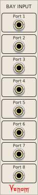
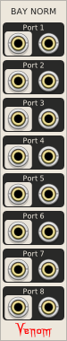
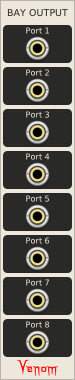
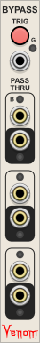

# Patch Management

[Return to Table Of Contents](/README.md#venom)

## BAY MODULES
 &nbsp; &nbsp;  
Bay Input, Bay Norm, and Bay Output are polyphonic transmitter and receiver modules with user defined labels for making clean, self documenting patch bays. They are a great companion for the MindMeld PatchMaster user interface modules.

None of the Bay modules are particularly useful on their own - Each Bay Input should be paired with at least one Bay Output and/or Bay Norm. Each input on a Bay Input is transmitted to the corresponding output on the Bay Output or Bay Norm. Each Bay Norm output has a corresponding Normal input that is used when the source Bay Input is not patched.

Signal Transmission is instantaneous - there is no sample delay introduced between a Bay Input and the linked Bay Output/Norm.

### Module Name / Label
Each Bay module has a context menu option to specify a unique name for the module instance that appears as a label at the top of the module.

### Output Source
Bay Output and Bay Norm each have a context menu option to specify the Bay Input source for that instance. A Bay Output or Bay Norm can only have a single source. But a Bay Input can be the source for multiple Bay Outputs/Norms

The Bay Input source is identified by the numeric VCV module instance ID, shown within parentheses in the context menu. The user defined Bay Input name is displayed before the numeric ID, and makes it easier to keep track of which Input is linked to which Output/Norm. Changing the name of a Bay Input does not break the link.

### Port Names / Labels
Each port on a Bay Input/Output/Norm can be given a user defined name via the [standard Venom port context menu](/README.md.md#custom-names). The port name is displayed as a label above the port. The label for a Bay Norm output is taken from the output port. The normal input port name only appears in the hover text - it does not appear as a label.

#### Bay Input default port names
The factory default input port name is always "Port " followed by the port number.

#### Bay Output, Bay Norm default output port names
The factory default output port name depends on whether the module has been linked to a source:
- Linked default: Inherits the current name from the source Bay Input port
- Unlinked default: "Port " followed by the port number

#### Bay Norm default normal input port names
The factory default is always the current output port name with "normal" appended.

### 0 Channel outputs
Bay Output and Bay Norm have an "Enable 0 Channel output" context menu option. If this option is enabled, then a Bay Output output will have 0 channels if the source Bay Input is not patched or there is no link. A Bay Norm output will have 0 channels if both the source input and the normal input are not patched or if there is no link.

If the option is not enabled then the output would be constant monophonic 0 volt instead.

Cables with 0 channels act as though there is no patch cable at all, so normalled inputs at the destination input are preserved.

### VCV Rack Pro within a DAW
The Bay modules work fine when used with Rack Pro running as a plugin within a DAW. However, Bay Output and Bay Normal can only link to Bay Input sources within the same plugin instance. They cannot link across multiple plugin instances, whether they be in the same or different tracks.

### Recommended configuration
#### Patch Bay Input
Place the Bay Input in your patch bay with a name of "Input n" where n is a sequential number.

Give each of the Bay Input ports a descriptive name designating the use for the port.

Place the destination Bay Norm in the "operational guts" of your patch, and give it a name of "Target n".

Map the Target n source to the corresponding "Input n" in your patch bay.

Leave all Bay Norm ports with factory default names so the labels are automatically inherited from the source.

Patch the output ports to the correct inputs in your operational patch. Patch the default values to the normal inputs.

#### Patch Bay Output
Place a Bay Input near the operational guts of your patch and give it a name of "Source n", where n is a sequential number.

Give each of the "Source n" ports a descriptive name designating the use of the patch bay output.

Patch each signal source in your operational patch to the appropriate input port in your "Source n"

Place a Bay Output in your patch bay and give it a name of "Output n" where n matches the number of the source.

Map the output to the corresponding "Source n" in your operational patch.

Leave all patch bay output ports with their factory default names so they inherit the name from the source.

### Selection dulicate/paste/import behavior

Custom module and port names are always preserved when duplicating, pasting or importing a selection set.

If duplicating, pasting, or importing a linked pair of modules, then the output modules are linked to the copied sources.

If duplicating, pasting, or importing linked output modules without the sources, then an attempt is made to link the outputs to the original uncopied sources.

### Bypass Behavior

No values are teleported from a Bay Input to a Bay Output/Norm if either module is bypassed.

All Bay Output ports will be constant monophonic 0 volts if the Bay Output is bypassed or the source Bay Input is bypassed.

The Bay Norm output will be the normal input if the source Bay Input is bypassed. The Bay Norm output will be monophonic constant 0 volts if the Bay Norm is bypassed.

[Return to Table Of Contents](/README.md.md#venom)

## BLOCKER
  
Blocks expander chains for modules like Venom Bypass and Stoermelder Strip.

Both Venom Bypass and Stoermelder Strip can operate on contiguous neighbor modules to the left and/or right, up until there is a gap. They locate neighbors via the VCV expander mechanism. Blocker works by hiding itself from the expander mechanism, so Bypass and Strip think there is a gap. Even when Blocker is bypassed, it still blocks expansion.

Blocker uses virtually no CPU, so it also works well as a 1hp blank.

[Return to Table Of Contents](/README.md.md#venom)

## BYPASS MODULE
  
Bypass (disable) one or more modules at the end of patched cables via CV control or a manual button press.

The Bypass module has input/output pairs that simply pass through all channels appearing at the input. However, the Bypass module also has the ability to virtually transmit a message through each cable to bypass the module (or group of modules) at the end of the cable.

The Bypass module maintains its own state, indicating whether it thinks remote modules are bypassed or not. The actual bypass state of the remote module may or may not match the Bypass state because users can directly change the remote module bypass state without using the Bypass module. The Bypass module only changes the remote module bypass state when the Bypass module state changes.

### TRIG (Trigger) button
This button glows red when the Bypass state is active (meaning the controlled modules are disabled).

By default, each time the button is pressed, it toggles the current Bypass state.

If the Momentary button is active, then the button temporarily inverts the current Bypass state while it is held, and restores to the previous state when released.

### M (Button Momentary mode) button
This color coded button controls whether the trigger button acts as a toggle trigger, or a momentary inverting gate.
- **Off (gray)** (default) - The button toggles the Bypass state each time it is pressed
- **On (yellow)** - The button momentarily inverts the current Bypass state while it is pressed, and reverts to the prior state when released

### G (CV Gate mode) button
This color coded button controls whether trigger CV input acts as a gate or a toggle trigger.
- **Off (gray)** (default) - Input is a trigger
- **On (green)** - Input is a gate
- **Invert (red)** - Input is an inverted gate

### TRIG (Trigger) CV input

If the Gate mode is Off, then the leading edge of a trigger at the CV input will toggle the bypass state on or off.

If the Gate mode is On, then a high gate at the input turns the bypass on, and a low gate turns the bypass off. The gate functions as a Schmitt trigger, going high at 2V, and low at 0.1V. Regardless whether the CV gate is high or low, the Trig button will always toggle the Bypass state.

If the Gate mode is Invert, then a high gate at the input turns the bypass off, and a low gate turns the bypass on. The gate functions as a Schmitt trigger, going high at 2V, and low at 0.1V. Regardless whether the CV gate is high or low, the Trig button will always toggle the Bypass state.

### Pass Thru input/output pairs

There are three input/output pairs that simply pass any input values through to the output, with full support for polyphonic cables.

Each output port is a bit unusual in that any patched cable will have 0 channels if the corresponding Bypass input port is unpatched. This allows for Bypass to control the bypass state of remote modules, without disturbing any normal value for the remote module input port. The remote module will act as though the cable is not there, yet Bypass will still be able to bypass the remote module.

### Port Bypass mode buttons
Each input port has a Bypass mode button above it, and each output port has a Bypass mode button below it. The Bypass mode dictates whether the Bypass module controls the bypass state of the module(s) at the end of patched cables at either port. The Bypass mode buttons are color coded. 

Each input Bypass mode button has the following available options:
- **Dark gray** (default) - Off  (no modules are bypassed)
- **Purple** - Source (Only the input source modules are bypassed)
- **Blue** - Source and left neighbors (The input source modules and all contiguous neighbors to the left are bypassed)
- **Yellow** - Source and right neighbors (The input source modules and all contiguous neighbors to the right are bypassed)
- **Green** - Source and all neighbors (The input source modules and all contiguous neighbors on both sides are bypassed)

Each output Bypass mode button has the following options:
- **Dark gray** - Off  (no modules are bypassed)
- **Purple** (default) - Target (Only the output target modules are bypassed)
- **Blue** - Target and left neighbors (The output target modules and all contiguous neighbors to the left are bypassed)
- **Yellow** - Target and right neighbors (The output target modules and all contiguous neighbors to the right are bypassed)
- **Green** - Target and all neighbors (The output target modules and all contiguous neighbors on both sides are bypassed)

Every time the Bypass changes state, the relevant remote modules at the end of each cable are set appropriately.

### Limiting neighbor chains
A neighbor chain always terminates at any one of the following
- A gap in the chain
- A Bypass module. The Bypass is not part of the chain.
- A Venom [Blocker](#blocker). The Blocker is not part of the chain.

### Standard Venom Context Menus
[Venom Themes](/README.md.md#themes), [Custom Names](/README.md.md#custom-names), and [Parameter Locks and Custom Defaults](/README.md.md#parameter-locks-and-custom-defaults) are available via standard Venom context menus.

[Return to Table Of Contents](/README.md.md#venom)

## NULL CABLE
  
Nullify a cable by setting it to 0 channels via manual or CV control. A cable with 0 channels functions as if the cable is not even there. This is different than a mute where the output is set to constant 0 volts.

The module has three identical sections that function independently, each with a Gate button and associated monophonic Gate CV input at the top, a polyphonic input in the middle, and polyphonic output at the bottom.

All channels at the polyphonic input are copied to the output whenever the gate button glows white. The output is nullified (set to 0 channels) whenever the gate button glows red.

The behavior of the Gate button and Gate CV input depends on the value of the Gate Mode in the module context menu:

|Gate Mode|High CV gate|Low CV gate|Button without CV input|Button with CV input|
|---|---|---|---|---|
|Nullify (default)|Nulls output|Passes output|Toggles state|Inverts state while held|
|Pass|Passes output|Nulls output|Toggles state|Inverts state while held|
|Toggle|Toggles state|No change|Toggles state|Toggles state|

CV gates are Schmitt triggers that go high at 2V and go low at 0.2V.

Note that the output will always be a null cable (0 channels) if there is no input.

### Standard Venom Context Menus
[Venom Themes](/README.md.md#themes), [Custom Names](/README.md.md#custom-names), and [Parameter Locks and Custom Defaults](/README.md.md#parameter-locks-and-custom-defaults) are available via standard Venom context menus.

### Bypass

When Null Cable is bypassed the outputs continue to function as they did before the module was bypassed.

[Return to Table Of Contents](/README.md.md#venom)

## THRU
  
A simple utility module with 5 polyphonic input/output pairs suitable for unity mixing of stacked inputs, and/or introduction of sample delays.

### Unity Mixing
Nothing special here - just taking advantage of VCV Rack's built in capability to stack input cables. But it can be convenient if you need to distribute the unity mix to multiple destinations.

### Add Sample Delays
Each input starting with the 2nd is normalled to the output above, with a delay of 1 sample added. So an input at port 1 with an output at port 5 will yield 4 sample delays, plus the delay introduced by the module itself, for a total of 5.

### Standard Venom Context Menus
[Venom Themes](/README.md.md#themes), [Custom Names](/README.md.md#custom-names), and [Parameter Locks and Custom Defaults](/README.md.md#parameter-locks-and-custom-defaults) are available via standard Venom context menus.

### Bypass
Each input is passed to the output below when the module is bypassed. However, the inputs are ***not*** normalled to the output above when bypassed.

[Return to Table Of Contents](/README.md.md#venom)

## VENOM BLANK
  
A 3hp blank with standard Venom themes.

[Return to Table Of Contents](/README.md.md#venom)

## WIDGET MENU EXTENDER
  
Extend context menus to support parameter/port renaming and parameter custom defaults.

Custom names and defaults are stored with the patch and restored upon patch load as long as the Widget Menu Extender remains with the patch.

Factory names and defaults are restored whenever the Widget Menu Extender is removed from the patch.

Note that custom names and defaults are built into all of the Venom plugin modules (except for Rhythm Explorer). Widget Menu Extender brings that functionality to modules from foreign plugins (as well as Rhythm Explorer). The Venom module custom names and defaults are mainained independently from Widget Menu Extender.

### ENABLE button
Controls whether extended context menus are enabled or not. The button is bright blue when extended menus are On.

Extended context menu options will only be available if the Enable button is On.

Any existing custom names and defaults remain in effect when the extended menus are Off.

### Custom Names
When enabled, the context menu for every foreign input port, output port, and parameter control is extended with an option to rename the parameter or port with a custom name. Once set, the custom name only appears in hover text and context menus - it does not update the module faceplate.

If a parameter or port has been given a custom name, then an additional menu option is added to restore the factory name.

If a module dynamically updates the parameter or port name, then that overrides any custom name from Widget Menu Extender.

Do not include "input" or "output" in your custom port name - VCV will automatically append input or output to the name you provide.

### Custom Defaults
When enabled, the context menu for every foreign parameter control is extended with an option to set the default value to the current value. The parameter is set to the default value whenever it is initialized, whether by double click, or menu option, etc.

If a custom default value has been established, then an additional menu option is added to restore the factory default value.

If a module dynamically updates the parameter default value, then that overrides any custom default value from Widget Menu Extender.

### Multiple Instances
Only one instance of Widget Menu Extender can be active per patch. If another instance is inserted, then it will be permanently disabled and the Enable button will be bright red. Since permanently disabled Widget Menu Extenders serve no purpose, they probably should be deleted from the patch.

If using VCV Pro within a DAW, each instance of the VCV plugin is regarded as a separate patch, and can have its own active Widget Menu Extender.

When importing a selection set containing Widget Menu Extender, custom names and defaults are preserved as long as the patch does not already have an active Widget Menu Extender. But if an active Widget Menu Extender already exists, then the selection set Widget Menu Extender will be permanently disabled, and selection set custom names and defaults will be lost.

### Bypass
When bypassed, Widget Menu Extender behaves the same as if the Enable button is off - the extended context menu options will not be available, but existing custom names and defaults are preserved.

[Return to Table Of Contents](/README.md.md#venom)

