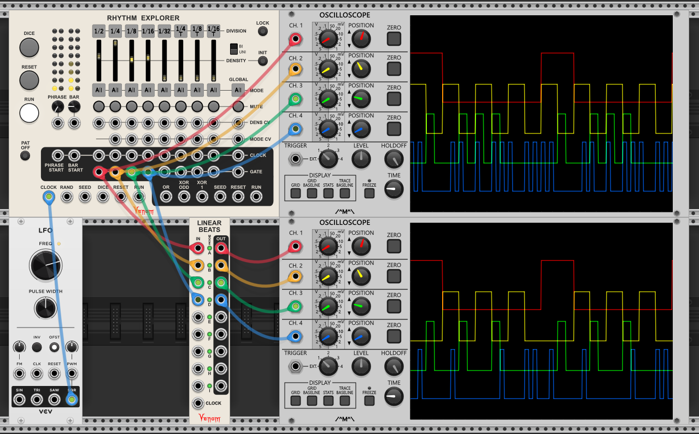

# Sequencers
- [LINEAR BEATS](#linear-beats)
- [LINEAR BEATS EXPANDER](#linear-beats-expander)
- [LINEAR MERGE](#linear-merge)
- [LINEAR MERGE EXPANDER](#linear-merge-expander)
- [RHYTHM EXPLORER](#rhythm-explorer)
- [RHYTHM EXPLORER CV EXPANDER](#rhythm-explorer-cv-expander)

[Sequencers top](#sequencers) | [Venom top](/README.md#venom)

## LINEAR BEATS
  
Only allow one trigger/gate to strike at a time across multiple incoming trigger/gate channels, thus converting coincident drum triggers into a linear drumming pattern.

Lower lettered inputs (toward the top) take precedence over higher lettered inputs (toward the bottom). Linear Beats is polyphonic, and lower numbered polyphonic channels take precedence over higher numbered channels.

A gate/trigger appearing at the input may or may not be passed through to the output depending on the channel mode, and whether or not a higher precedence channel transitioned to high at the same time. A lower precedence channel in Linear mode may strike a new gate while higher precedence gates are high as long as none of those higher precedence gate transitions are coincident.

For example, in the image below the top oscilloscope shows gate patterns with coincident gates. The bottom oscilloscope shows the effect of Linear Beats - lower precedence gates with coincident transitions to high are removed. Note that Rhythm Explorer has linear beats capabilities built in that this example does not use. The Linear Beats module just brings that functionality to a stand-alone module.  

Each channel has four possible modes controlled by a color coded button:
 - **Linear (green)** - Any gate will not pass through if a higher precedence gate transitioned to high at the same time. Any gate that does pass through will block lower precedence gates.
 - **All (off, dark gray)** - All gates will pass through, regardless whether higher precedence channels transitioned to high at the same time. All gates will block lower precedence gates.
 - **Non-blocking Linear (orange)** - Any gate will not pass through if a higher precedence gate transitioned to high at the same time. Gates that do pass through will ***not*** block lower precedence gates.
 - **New All (white)** - All higher precedence gates are forgotten and a new linear drumming group is started. All gates will pass through and also will block lower precedence gates.
 
There does not exist a Non-blocking All mode. If you want to allow gates through that do not block lower precedence channels, then simply put that channel toward the top and start a new linear drumming group with a New All mode below.

A channel mode applies identically to all polyphonic channels on a given lettered channel.

All inputs are Schmitt triggers that transition to high when the level rises to 1V or above, and transition to low when the level falls to 0.1V or lower. The outputs are 10V for high, and 0V for low.

If Linear Beats is not clocked, then it is dependent on all trigger/gate transitions being exactly in sync down to the sample level.

If the input gates are not guaranteed to be in sync, then you can add a clock input to effectively force all triggers/gates to be in sync with the timing "grid" of the clock. Inputs are only checked for transition to high or low whenever the clock transitions to high. The clock should be delayed at least as much as the most delayed input. If you want outgoing gates to be 50% duty cycle, then the clock should run at least twice as fast as your fastest incoming channel.

If Linear Beats is bypassed, then all inputs are passed through unchanged to the outputs.

[Sequencers top](#sequencers) | [Venom top](/README.md#venom)

## LINEAR BEATS EXPANDER
  
Add bypass and input/output mutes to Linear Beats.

The Linear Beats expander can be placed to the left or right of a Linear Beats module. Left expanders apply mutes to the inputs, so that muted channels never block lower precedence channels. Right expanders apply mutes to the outputs so that muted channels can still block lower precedence channels.

If an expander is sandwiched between two Linear Beats, then it will preferentially connect to the right as an input mute.

A single Linear Beats can make use of both input and output mutes simultaneously.

Two small LEDs at the top of the expander indicate which direction, if any, the expander is connected. The LED glows yellow when connected.

A channel is muted whenever the mute button glows red. Pressing a mute button is guaranteed to toggle the mute state. Each mute can also be controlled via CV. An "Expander CV toggles button on/off" context menu option ***on the main Linear Beats module*** controls how the CV operates.
 - If enabled, then the corresponding button toggles on or off whenever the CV input transitions to high.
 - If disabled (default), then the corresponding button is turned on (muted) when the CV transitions to high, and turned off (unmuted) when the CV transitions to low.

In addition to mutes, the expander has a Disable button / CV input pair that turns off linear drumming, allowing all input triggers/gates to pass through, without syncing to any clock.  The Disable CV operates the same as for the mutes. If a Linear Beats has both an input and output expander, then disabling either side will disable the linear drumming. Note that disabling Linear Beats is not quite the same as bypassing Linear Beats because the expander mutes are still active when Linear Beats is disabled.

An expander is ignored if it is bypassed.

[Sequencers top](#sequencers) | [Venom top](/README.md#venom)

## LINEAR MERGE
  

[Sequencers top](#sequencers) | [Venom top](/README.md#venom)

## LINEAR MERGE EXPANDER
  

[Sequencers top](#sequencers) | [Venom top](/README.md#venom)

## Rhythm Explorer
  
Rhythm Explorer is a trigger sequencer that stochastically generates repeating patterns on demand. It is heavily inspired by the [Vermona randomRHYTHM Eurorack module](https://www.vermona.com/en/products/modules/product/randomrhythm/), though no attempt was made to exactly replicate that module's features.

### Basic Operation
Rhythm Explorer looks complicated, but it is very simple to quickly begin creating interesting rhythms. Starting from the default initial settings, patch a 24 PPQN clock into the CLOCK input, and patch any combination of the GATEs, OR, XOR ODD, or XOR 1 outputs to your favorite drum modules. Adjust some of the sliders to something greater than 0, but less than 100, and press the RUN button. A repeating rhythm should emerge, which can be modulated by adjusting the sliders. Each time you press the DICE button you will get a brand new pattern that can be modulated via the sliders.

### Basic Principles
Random Rhythm uses a pseudo Random Number Generator (RNG) to establish a sequence of seemingly random numbers. However, the "random" sequence is dictated by a seed number - every time the RNG is reseeded with the same number, it generates the exact same sequence. With the initial setup, the reseed occurs after each set of 4 quarter notes, thus establishing a pattern. When the DICE button is pressed, a new seed number is generated, so the pattern will change.

Each division has its own density slider ranging from 0 to 100%, and each division also gets its own sequence of "random" numbers. Assuming all divisions are set to All mode, then when the slider value is greater than the current random number for that division, then the high gate will be issued for that beat. If the density is at 100%, then all beats will be played. If at 0%, then no beats will be played. The values in between do not specify the precise density for any given pattern, but rather specify the average frequency across all possible patterns.

### Triggers and Gates
All trigger and gate inputs have a transition to high threshold of 2 volts and transition to low threshold of 0.1 volts.

Trigger and gate high outputs are 10 volts, and low outputs 0 volts.

### CLOCK Input
The Rhythm Explorer will not run properly until a 24, 48, or 96 PPQN (pulses per quarter note) clock is patched into the CLOCK input. By default Rhythm Explorer expects 24 PPQN. The "Clock input PPQN" option within the module context menu gives options for 24, 48 or 96 PPQN. 

### RUN
If the RUN input is not patched, then every press of the RUN button will toggle the run state on or off. The RUN button will be brightly lit while running, and off (actually very dimly lit) when not running.

Alternatively, the module run status can be controlled by patching CV into the RUN input. A high gate turns the run status on, and a low gate off. Again, the RUN light indicates the run status. When controlled by CV, the RUN button becomes momentary, and inverts the current run status. If currently running, then pressing the RUN button stops the module for as long as it is held down. Releasing the button starts the sequence again. Conversely, if the sequencer is stopped, then holding the button down starts the sequence, and releasing stops it again.

The RUN output gate will be high when the sequence is running, and low when stopped.

The sequence is reset to restart at the beginning of the phrase pattern every time the sequencer starts. A 1 ms trigger is also sent to the RESET output.

If you want to pause the sequencer, and then pick up where you left off without resetting, then externally mute the incoming clock instead of stopping the sequencer.

The run state is preserved across sessions, and stored with each patch and preset. If the module is running when inserted or loaded, then it will immediately perform a reset and begin running.

### RESET

Pressing the RESET button or sending a CV trigger to the RESET input arms the sequencer to perform a reset and restart the phrase pattern from the beginning. The RESET button will glow brightly while in an armed state. By default the reset action will wait until the leading edge of the next clock pulse. For typical tempos, a 24 PPQN clock is fast enough that the reset is perceived as nearly instantaneous. The module context menu has a Reset Timing option where you can specify a different value for when the reset is applied:
- Clock
- Bar
- 1/2
- 1/4
- 1/8
- 1/16
- 1/32
- 1/2 Triplet
- 1/4 Triplet
- 1/8 Triplet
- 1/16 Triplet
- 1/32 Triplet
- Dotted 1/2
- Dotted 1/4
- Dotted 1/8
- Dotted 1/16
- Dotted 1/32 (Not available for 24 PPQN clock)

A 1 ms trigger is sent to the RESET output upon every reset action.

### DICE and SEED

Pressing the DICE button or sending a CV trigger to the DICE input causes the sequencer to immediately sample a new seed value to establish a new pattern. The new seed value will not take effect until the start of the next phrase, whether due to a RESET, or reaching the end of the phrase and cycling back. The DICE button glows brightly while waiting for the new seed value to take effect. If you want the DICE to immediately take effect, then send a trigger to both the RESET and DICE inputs.

Typically the seed value is sampled from an internal RNG. Alternatively, you can provide your own unipolar CV seed value at the SEED input. The input is clamped to 0-10V. A sample and hold is used to save the seed value at the time of the dice action.

A user supplied value of 10V forces Rhythm Explorer to use the internally generated seed value instead.

Wherever the seed value comes from, the sampled value is continuously sent to the SEED output.

The current seed value is preserved across sessions, and is saved with each patch and preset.

### PAT OFF and 0V Seed

If the PAT OFF button is activated, then the RNG will never be reseeded, so the resultant output will be constantly changing, without any pattern.

If using CV SEED input, then the same effect can be achieved by using a 0V SEED input.

Note that the internal RNG will never generate a 0V seed value.

### RAND

Normally the patterns are established by an internal RNG that has been seeded with the sampled seed value. Alternatively, any unipolar varying CV betweem 0V and 10V can be patched into the RAND input to override the internal RNG. Each division will sample the RAND signal at the appropriate time to establish the next "random" value to compare against the division slider threshold. Note that the seed value has no effect when using an external RAND source.

If the RAND input is monophonic, then all divisions will sample the same RAND input. But if you provide a polyphonic input with 8 channels, then each division will get its own "random" input. Note that if you patch a polyphonic input with fewer than 8 channels, then the missing channels will get constant 0V.

The result when using external RAND may or may not have a pattern, depending on the RAND signal. You may be able to patch the Rhythm Explorer PHRASE START output to your random source reset or sync input to establish a pattern that repeats at the beginning of each phrase.

### BAR and PHRASE

The BAR knob sets the number of 1/4 notes that make up 1 bar or measure, with a value ranging from 1 to 16. The PHRASE knob sets the number of bars that make up one phrase, also with a range from 1 to 16. Upon completion of a phrase, the sequencer cycles back to the beginning of bar 1, and the pattern is reset. Each knob has a set of 16 lights above to show both the current count setting, as well as where in the cycle the sequencer is at.

Both BAR and PHRASE can be modulated via bipolar CV at the inputs below the knobs, which is added to the knob value. The scale is linear, with 0V representing 1, and 10V representing 16. The result is clamped to 0 - 10V (1 - 16 count).

### BAR START and PHRASE START

The BAR START output issues a high gate lasting one clock pulse at the start of every bar. Likewise the PHRASE START output issues a gate at the start of each phrase.

The phrase start pulse is also sent to channel 9, and the bar start pulse to channel 10 of the GLOBAL polyphonic clock output.

### 8 Division Matrix

There is a matrix with 8 columns, each column representing a single division. Each division column consists of a mixture of controls, inputs, and outputs arrayed vertically. The behaviour of each control/input/output is the same for each division.

#### DIVISION Button

The square division button at the top of each column indicates the currently selected division value for that column. Pressing the button cycles through the 15 available values, and right clicking presents a menu allowing you to directly select one of the values. The available values are
- 1/2 Note
- 1/4 Note
- 1/8 Note
- 1/16 Note
- 1/32 Note
- 1/2 Note Triplet
- 1/4 Note Triplet
- 1/8 Note Triplet
- 1/16 Note Triplet
- 1/32 Note Triplet
- Dotted 1/2 Note
- Dotted 1/4 Note
- Dotted 1/8 Note
- Dotted 1/16 Note
- Dotted 1/32 Note - Automatically disables (mutes) column if clock is 24 PPQN

Note that you may reuse the same division for multiple columns. Also note that the order of the columns can make a difference in the result depending on the mode selection (described later)

Some divisions will give irregular intervals if the division does not divide evenly into the total phrase length (phrase x bar)

Some 50% or 100% clock or gate widths will be incorrect and/or inconsistent if the clock PPQN is not high enough. (Gate/Clock widths are described later)

The table below lists the divisions with special requirements for regular intervals and/or consistent widths.

|Division|Total Phrase Length|Clock PPQN|
|---|---|---|
|1/2|Multiple of 2|Any|
|1/32|Any|48 or 96 PPQN|
|1/2 Triplet|Multiple of 4|Any|
|1/4 Triplet|Multiple of 2|Any|
|Dotted 1/2|Multiple of 3|Any|
|Dotted 1/4|Multiple of 3|Any|
|Dotted 1/8|Multiple of 3|Any|
|Dotted 1/16|Multiple of 3|48 or 96 PPQN|
|Dotted 1/32|Multiple of 3|96 PPQN|

#### DENSITY Slider
Each slider specifies a threshold at which any given division beat is likely to issue a high gate. Typically the values are unipolar ranging from 0 to 100%. Each density can be modulated by the division density CV input, and/or the Global density CV input.

The density slider knob blinks bright yellow each time the beat fires for that division. Note that the mode logic used for OR, XOR ODD, and XOR 1 outputs can be different then what is used for the individual division outputs, so the blinking sliders may not match the OR, XOR ODD, or XOR 1 outputs.

#### MODE Button
The mode can influence whether a given beat will fire. Pressing the square button cycles through the available values, and right clicking provides a menu to directly select any one value.
- ALL - All beats that meet the random threshold will fire. Note that the left most division is fixed at ALL because it cannot be influenced by any other divisions.
- LIN - Linear mode, meaning that the beat will be blocked if one of the divisions to its left is firing at the same time. If all divisions are set to LIN (disregarding the 1st one of course), then there will never be more than one division playing at a time, the definition of linear drumming.
- OFF - Offbeat mode, meaning that the beat will be blocked if one of the divisions to the left coincides with this division's beat, regardless whether the left division actually fires or not. This is a special case of linear drumming. For example, if division 1 is 1/4 note, and division 2 is 1/8 note with OFF mode, then the 1/8 will never fire with the 1/4 beats - it will fire only on the "and" of each beat.
- --- Global default, meaning the division will inherit the mode that is specified at the global level.
- ALL - RESET (dashed square bracket) - Same as ALL, except the linear and offbeat computations are reset such that divisions to the left do not effect linear or offbeat divisions to the right.
- ALL - NEW (solid square bracket) - Same as ALL - RESET, except an additional polyphonic channel is added to the OR, XOR ODD, and XOR 1 outputs, and this division and those to the right are assigned to the new channel.

The mode can be overridden by division Mode CV.

#### MUTE Button

Pressing the mute button toggles between muting and unmuting the division GATE output. Note that a muted division will never block any division to the right that is set to LIN mode. There is no mute CV - use the density CV if you need to effectively mute via CV.

#### DENS CV input

This bipolar CV input modulates the division density at a rate of 10% per volt. It is additive with the density sliders and the global density CV. The sum of slider plus global CV is clamped to 0-10V prior to adding the division CV, so a CV of -10V is guaranteed to effectively mute the division.

#### MODE CV input

The division mode CV input overrides the value set by the button. The CV actually sets the column's mode button to match so you get a visual indicator of the active mode.

The mode values are as follows:
- 0V = ALL
- 1V = LIN (linear)
- 2V = OFF (offbeat)
- 3V = --- (global default)
- 4V = ALL - RESET
- 5V = ALL - NEW

The CV value is rounded to the nearest integer, and clamped to be within the valid range.

#### CLOCK output

Each division outputs an appropriately divided clock division for that division. Each division clock is also sent to one channel in the GLOBAL CLOCK poly output.

#### GATE output

For each issued beat, a gate is sent to the GATE output. Each division gate is also sent to one channel in the GLOBAL GATE poly output.

#### CLOCK and GATE width options

By default both the CLOCK and GATE output gate widths match the input clock gate. The module context menu has options to select alternate widths.

- **Clock output width**
  - Input clock pulse
  - 50%

- **Gate output width**
  - Input clock pulse
  - 50%
  - 100% (consecutive high gates are tied together)

Some divisions have special requirements for total phrase lengths and/or minimum clock PPQN in order to achieve correct and consistent widths. See the Division Button section above.

### GLOBAL Column

To the right of the 8 division matrix is a global column that can serve multiple purposes

#### GLOBAL MODE Button
The global mode has the same values as the division mode, except there are no --- (global default), ALL - RESET, or ALL - NEW values available.

The global mode serves two purposes:
- It defines the mode used to compute the OR, XOR ODD, and XOR 1 outputs.
- If a given division has its mode set to --- (Gobal Default), then the global value also defines the mode for that division.

#### GLOBAL MUTE Button
The global mute button mutes all the division gate outputs, as well as the OR, XOR ODD, and XOR 1 outputs. Each press toggles between muting and unmuting the outputs.

#### GLOBAL DENS CV
The global density CV can modulate the density for all divisions. If the input is monophonic, then the value is applied to all divisions. If the input is polyphonic, then each channel is directed to the appropriate division. The global CV can be bipolar, with each volt representing 10%. The global CV value is summed with the division density slider value and then clamped to a valid range before any division CV is applied.

#### GLOBAL MODE CV
The global mode CV overides the global button mode value. If monophonic, then it is applied to all divisions. If polyphonic then each channel is directed to the appropriate division mode. The only way to have different modes for divisions used in the OR output is via the GLOBAL MODE CV. Note that channel 1 is for the first (left most) division, even though the 1st division does not have mode CV input - it simply ignores any value there.

The voltage values are the same as for the Division Mode CV input, except the value is capped at 2V.

The Global Mode CV updates the value of the Global Mode button, showing the value that is assigned to channel 1. You can see the global modes that are assigned to all 8 divisions by hovering over the Global Mode button.

#### GLOBAL CLOCK output
The global clock output is polyphonic with 10 channels
- Channels 1 through 8 are for the clocks for divisions 1 through 8
- Channel 9 is for the Phrase Start clock
- Channel 10 is for the Bar Start clock

#### GLOBAL GATE output
The global gate output is polyphonic with 8 channels, one for each division.

### DENSITY Slider Polarity switch
The vertical slider switch controls whether the division density sliders are unipolar from 0% to 100%, or bipolar from -100% to 100%

Normally the sliders are set to unipolar. But if controlling the density via CV, then you may want to manually modulate the density up or down during performance, hence the bipolar mode.

When in normal unipolar mode, the sum of the slider value and global value is clamped to a range of 0 to 100 before being added with the division CV input.

But when in bipolar mode, the slider and global sum is clamped to a range of -100 to 100 before being added with the division CV input. Only then is the final density value clamped to a range of 0 to 100.

### DENSITY INIT Button
The density Init button will reset all division density sliders to 0%

### LOCK button
The Lock button will lock the division values, division and global modes, and the density polarity to their current values so as to prevent inadvertant changes while manipulating the density sliders during a performance.

### OR, XOR ODD, and XOR 1 summed outputs

In addition to the individual division gate outputs, there are three outputs where the individual division gates are combined into one stream of gates.

The OR output simply combines all gates, with simultaneous beats across two divisions resulting in one beat.

The XOR ODD output only allows the beat through if there are an odd number of simultaneous beats. An even number of simultaneous beats effectively cancel each other out.

The XOR 1 output only allows a beat through if there is only one beat across all divisions - all simultaneous beats are blocked.

In addition, the GLOBAL MODE further defines which beats are allowed through, using the same logic as for the individual gates. Note that if all the global modes are set to linear or offbeat mode, then the OR, XOR ODD, and XOR 1 will all emit identical patterns since by definition, those modes don't allow simultaneous beats.

These outputs are normally monophonic, combining the beats of all 8 divisions. But the outputs become polyphonic if one or more divisions are assigned ALL - NEW mode. The total number of channels equals 1 + the number of ALL - NEW modes.

### Factory Preset

There is a Vermona randomRHYTHM preset available that configures the Rhythm Explorer to make it easy to get a flavor of what it would be like to actually use the Vermona hardware. The Phrase is set to 1 and Bar to 4, like the Vermona 4/4 time. It configures the divisions as 1/4, 1/8, 1/16, 1/4T, 1/4, 1/8, 1/16, 1/4T. All divisions are assigned mode ALL except division 5 is assigned ALL - NEW. It also sets the Global Mode to Offset so the OR output will behave like the Vermona. In this way there are effectively two rhythm generators configured like the Vermona, exept they both share a common clock, dice, and reset. The OR output is polyphonic - an external split module is needed to separate the OR output into separate outputs for each rhythm generator. 

### Context menu options

#### Clock input PPQN
Specifies the number of incoming clock Pulses Per Quarter Note
- 24 PPQN
- 48 PPQN
- 96 PPQN

#### Clock output width
Specifies the width of each division clock pulse
- Input clock pulse - matches the width of the driving clock pulse
- 50% - one half the division width

#### Gate output width
Specifies the width of each division gate pulse
- Input clock pulse - matches the width of the driving clock pulse
- 50% - one half the division width
- 100% - full division width, meaning consecutive gates are tied together

#### Reset timing
Specifies when reset actions are taken. Resets are delayed until the start of the next occurrence of the selected division
- Input clock pulse
- Bar
- 1/2
- 1/4
- 1/8
- 1/16
- 1/32
- 1/2 Triplet
- 1/4 Triplet
- 1/8 Triplet
- 1/16 Triplet
- 1/32 Triplet
- Dotted 1/2
- Dotted 1/4
- Dotted 1/8
- Dotted 1/16
- Dotted 1/32

#### Fixed 1/4 bar division
This should normally be enabled so that the Bar Count uses 1/4 divisions regardless what PPQN clock is used. 

If disabled then Rhythm Explorer reverts to bugged Bar count behavior that was introduced in version 2.4.0 in 2023 and not fixed until version 2.15 in 2026.
- 48 PPQN clocks cause the Bar Count to use 1/8 divisions
- 96 PPQN clocks cause the Bar Count to use 1/16 divisions

Patches that were created during the bugged period default to disabling the fix so the patches preserve their old behavior.

#### Add Rhythm Explorer CV Expander
Adds a [Rhythm Explorer CV Expander](x#rhythm-explorer-cv-expander) to either the left or right of the Rhythm Explorer. Each expander provides three channels of randomly generated stepped CV for each division. The randomly generated CV repeats in a pattern the same way as the Rhythm Explorer division gates. Up to two expanders can be added, one on either side, for a total of 6 CV channels per division.

#### Standard Venom Context Menus
[Venom Themes](/README.md#themes) are available via standard Venom context menus. But Rhythm Explorer has its own design for limited parameter locking, so the standard parameter locking menus are not available. Neither are custom default options available for parameters.

### Bypass
All outputs are monophonic 0V when the module is bypassed.

[Sequencers top](#sequencers) | [Venom top](/README.md#venom)

## RHYTHM EXPLORER CV EXPANDER
  
Adds three channels of stepped CV output for each division of the parent Rhythm Explorer. All three channels for a division are updated each time the division fires, and the randomly generated CV repeats in a pattern the same way as the Rhythm Explorer division gates. The Rhythm Explorer module supports one expander on either side, so each division can have as many as 6 channels of CV.

### Unlabled direction button
Determines which direction the expander looks for the parent Rhythm Explorer
- **Left** ***(yellow, default)***
- **Right** ***(orange)***

The upper corner LED on the chosen side will glow yellow if the connection is successful, or red if not successful.

### RNGn (Range for channel n) knob
Specifies the voltage range that the channel output can span. The value ranges from 1 to 10 volts, with 1 being the default.

### OFFn (Offset for channel n) knob
Specifies the minimum voltage for the channel output. The value ranges from -10 to 10 volts. The maximum output value will be the offset plus the range.

### RNDn (Random for channel n) input
Normally each channel will sample output voltages from the Rhythm Explorer internal random number generator. This is true even if the Rhythm Explorer RAND input has been patched.

The RNDn input lets you override the random number generator with your own voltage values. The input should have 8 polyphonic varying voltage channels so each division has its own voltage to choose from. If the input is monophonic than all divisions will be sampling from the same value. If the input is polyphonic with fewer than 8 channels than constant 0V will be used for all missing channels.

Typically the source is a polyphonic oscillator with its reset or hard sync input patched to the Rhythm Explorer Phrase Start output so that the oscillator provides repeatable patterns. Ideally each channel of the oscillator should be running at a different rate so each division gets a different voltage.

The RNG and OFF knobs are ignored if the RNDn input is patched, meaning the input value is used directly, without any scaling or offset.

### CVn (CV for channel n) outputs
Each channel has eight CV outputs, one for each division in the Rhythm Explorer. The outputs going top to bottom correspond with the Rhythm Explorer divisions going from left to right.

Every time a division fires, each channel output for that division is updated with a new voltage from the RNDn input if available, or else the Rhythm Explorer internal random number generator.

Note that division CV outputs are not updated if the division is muted on the Rhythm Explorer.

### Standard Venom Context Menus
[Venom Themes](/README.md#themes), [Custom Names](/README.md#custom-names), and [Parameter Locks and Custom Defaults](/README.md#parameter-locks-and-custom-defaults) are available via standard Venom context menus.

### Bypass
All outputs are monophonic 0V when the module is bypassed.

[Sequencers top](#sequencers) | [Venom top](/README.md#venom)
